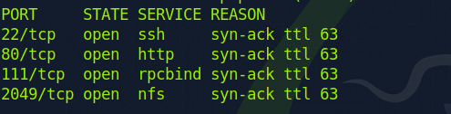

NFS here.

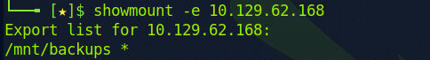

A backup folder.

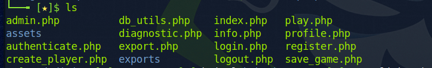

All the source code of the website.

Play the game little while. We can save the game.

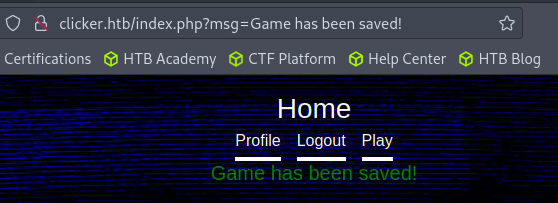

Looks like the msg will be reflected on the site. And indeed.

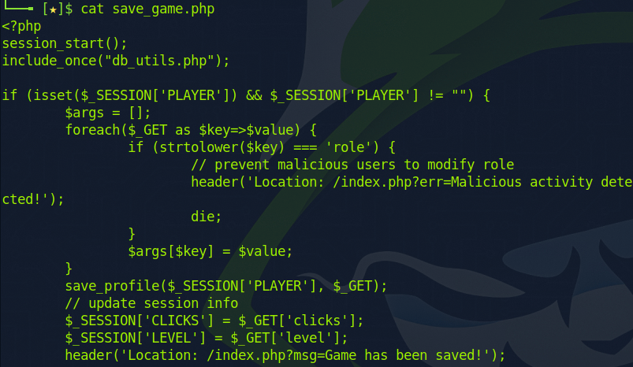

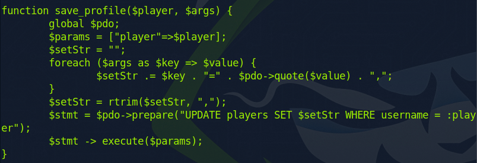

Look through the code. Seems like we can update our role through a parameter. But there is a check.

But since it requires a full equal (===). Maybe we can add some useless char.

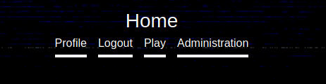

Now we can see the admin panel.

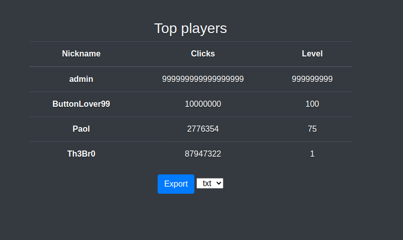

Looks like we can export the data.

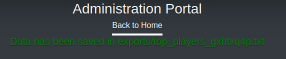

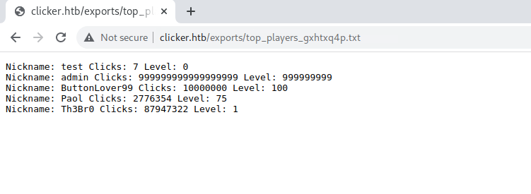

Looks like a very good point for webshell.

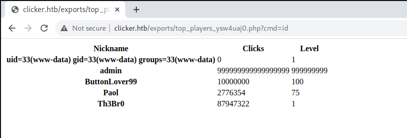

So it works. Time for rev shell.

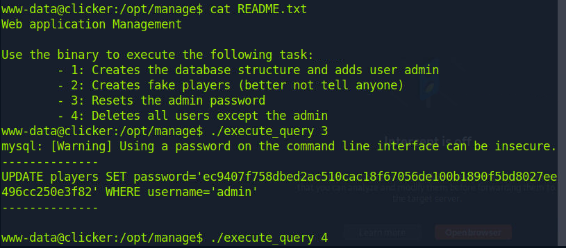

There is a manage tool in the /opt folder. So we play with it.

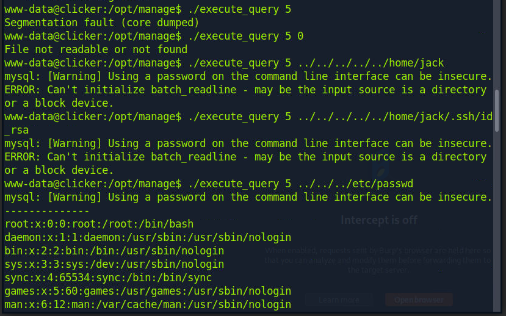

A hidden fifth choice. We can get the private key of the user.

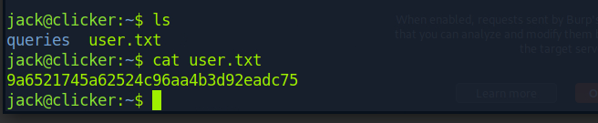

Get user. Time for PE.

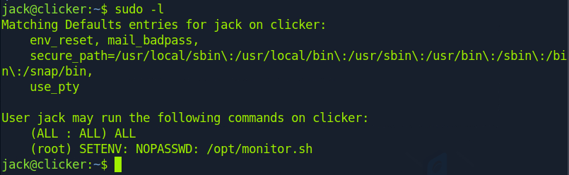

Oh? SETENV here. So it likely to be relevant with env variable.

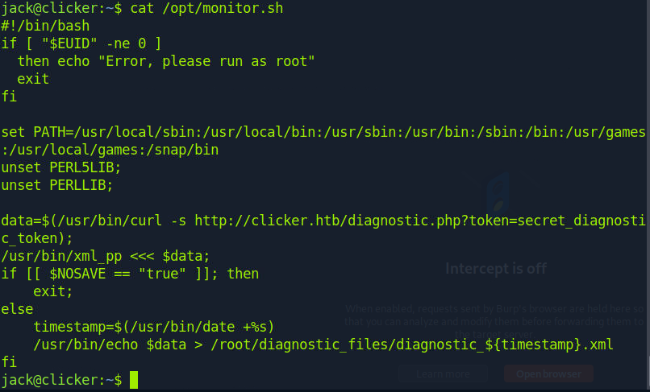

xml_pp is a Perl script. So we can instruct the Perl to execute our code first by env.

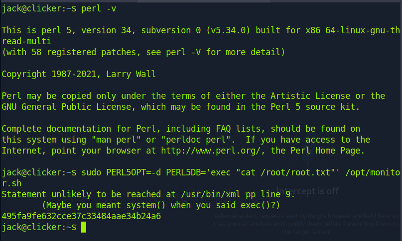

