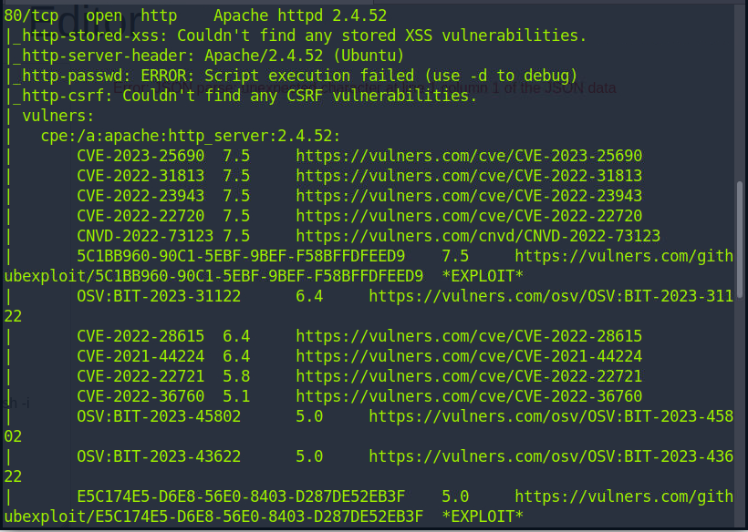

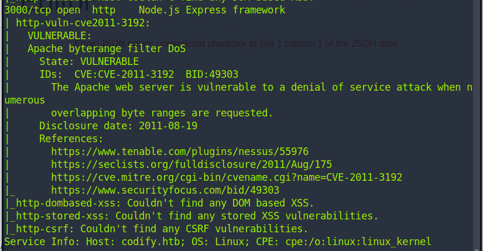

We have a Node.js framework. Looks like we can execute some code.

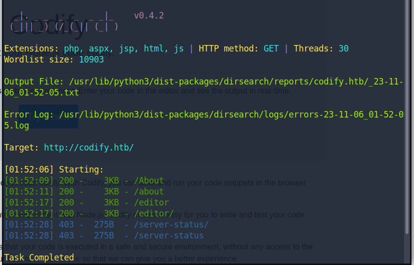

Normal.

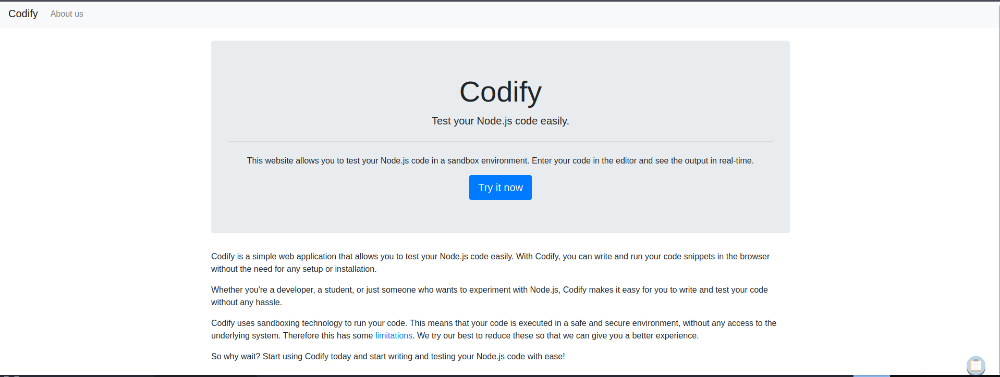

The main page tells it is a sandbox environment with some restrictions.

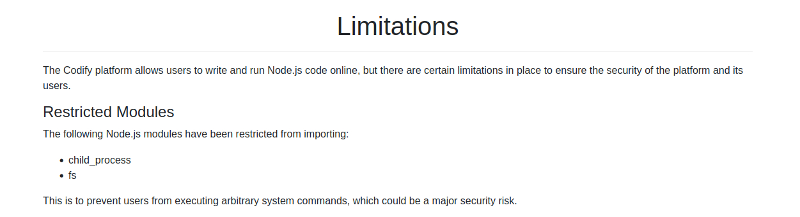

No child_process.

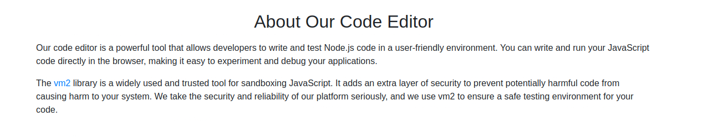

It use vm2 as its sandbox. And point to the Ver 3.9.16

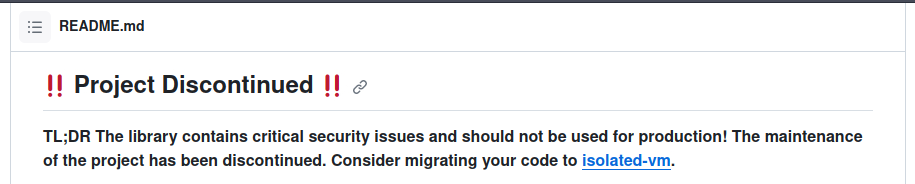

Oh. The project have been deprecate since critical security issues.

We can easily find the PoC to get a reverse shell.

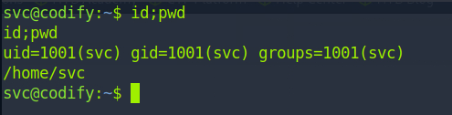

Then we land as a web user I think. Try to find something to be a normal user.

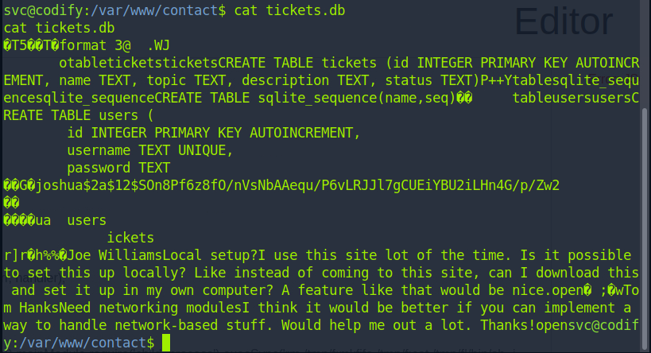

Looks like the shadow hash. Crack it.

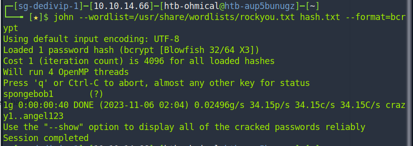

Well. Sponge Bob!

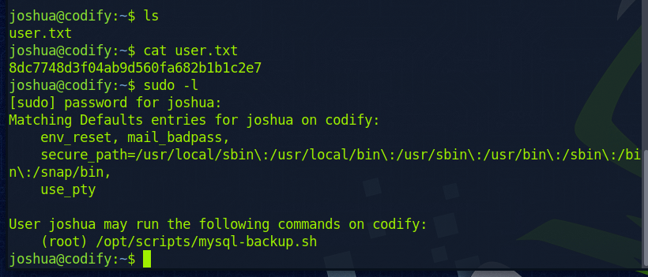

Get the user flag. And find out we can execute some script as root. Unfortunately, we cannot edit it.

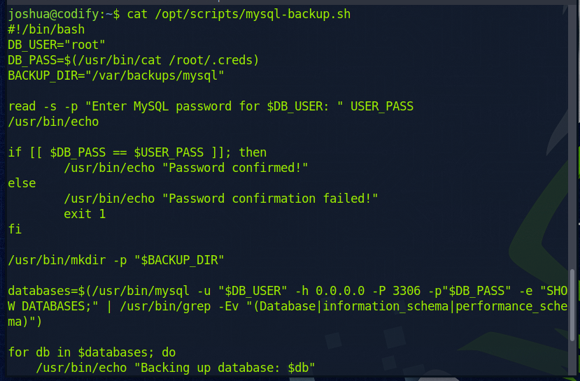

Looks like we need to know the db password. We also cannot visit the backup file.

Later I find the only way is to brute force. And kindly the password only contains lower case and number.

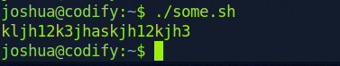

Since it is easy mode, I believe it to be the root password. And indeed it is.

