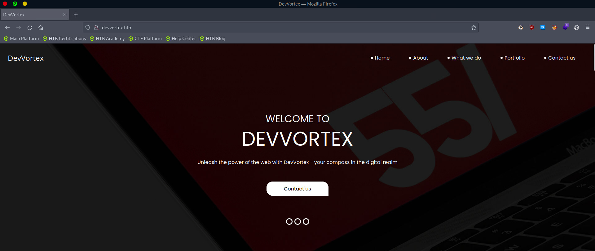
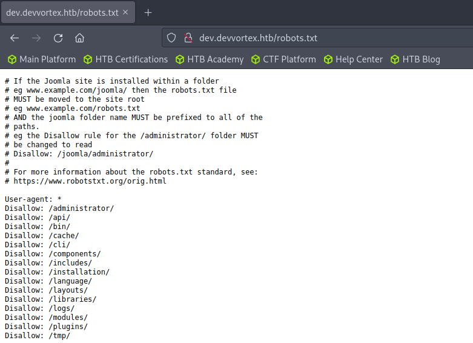
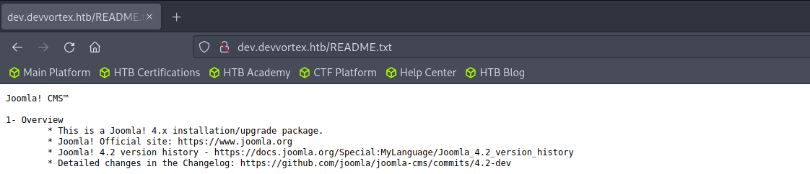
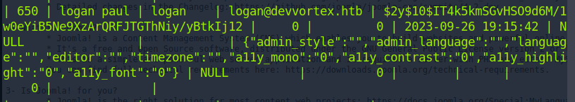
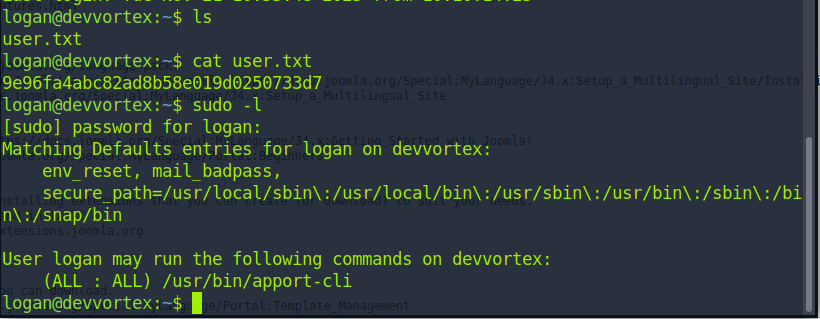
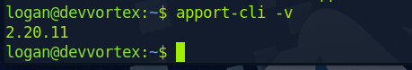

Not so hard to find only 22 and 80 open.

The main site contains nothing interesting. Though it has a form, it is no use. Bust the vhost can reveal the true dev site.

So we have the Joomla now. This CMS do not have default creds so we have to find it manually.

First always the version of the CMS. And luckily we can find a ruby script to extract the site creds. Once login, we can make use of template to get the webshell. We need to switch to user before we get the user.txt

So it is database now.

We can find the hash. And john can crack it for us.

Actually the first time I have seen this in sudo.

The version looks vulnerable for CVE-2023-1326.

And yes indeed. So just generate a fake report to get root. 