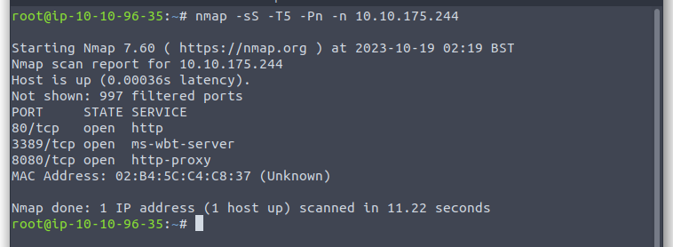
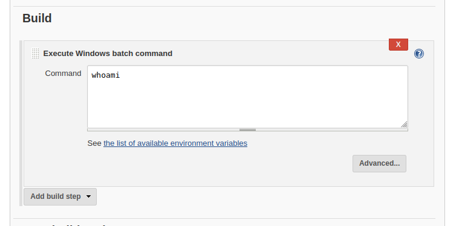
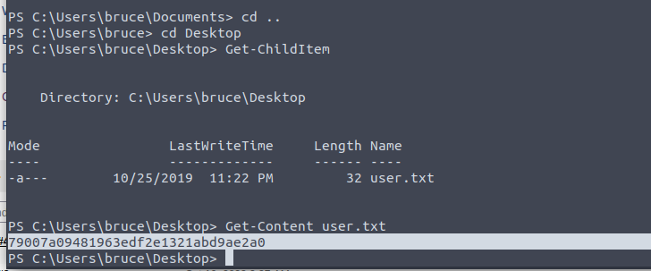
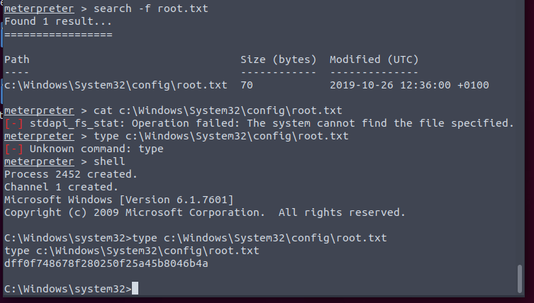

Looks like 2 web server. The 80 port one is useless.

And we can login into Jenkins using admin:admin. Great. I know it is a CI/CD platform. So must be somewhere it can execute command on target machine.

Yeah. It is great. Then just trigger the build and we have the shell.

Powershell command is really long.

So why not upgrade to use meterpreter.

Check the user's privilege, we can see the user can impersonate other user. So just impersonate to the SYSTEM. Migrate to a system process and everything is done.

