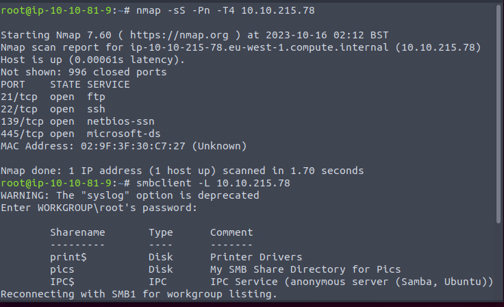

Have a SMB, allow anonymous login.

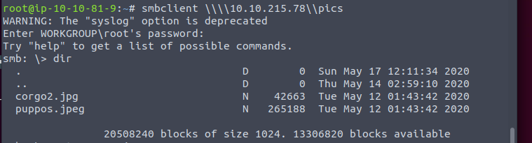

Get 2 pics.

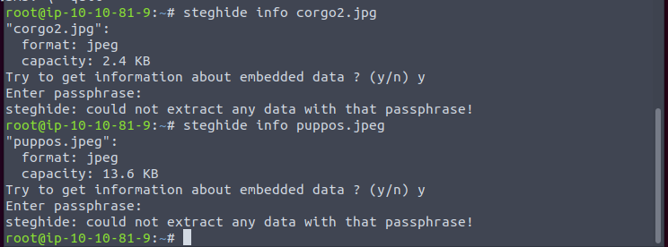

Either no steg or require password.

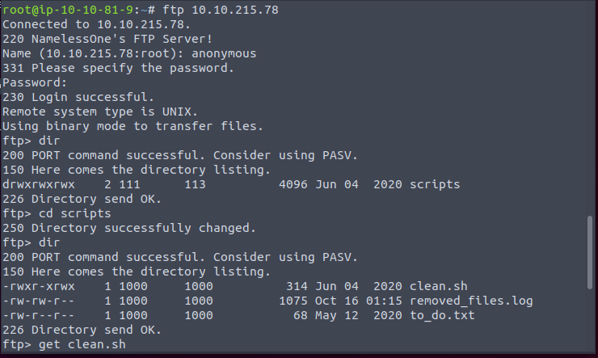

The FTP allow anonymous login same.

Attention that we have edit permission to the script. Maybe we can upload the reverse shell to wait for cron job.

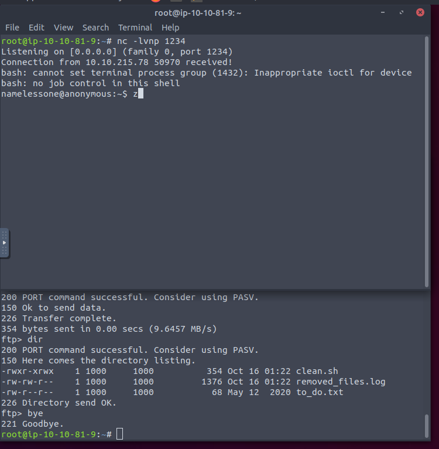

It works.

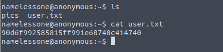

The pic folder is the SMB folder.

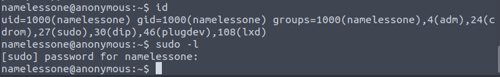

The user is member of sudo group, but we do not have the password.

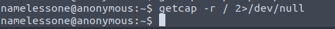

No cap exist.

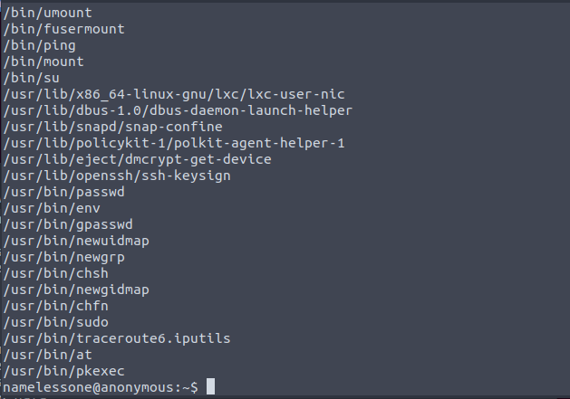

Lots of file have SUID. 

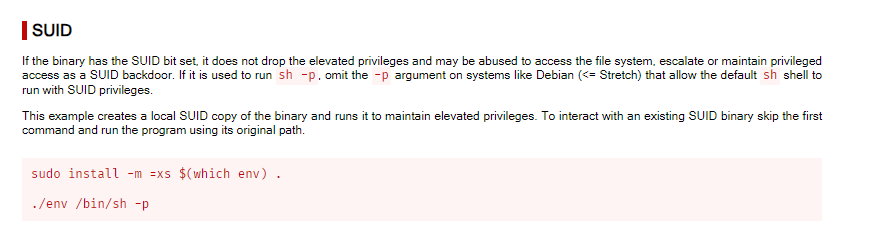

Well. The env looks like exploitable.

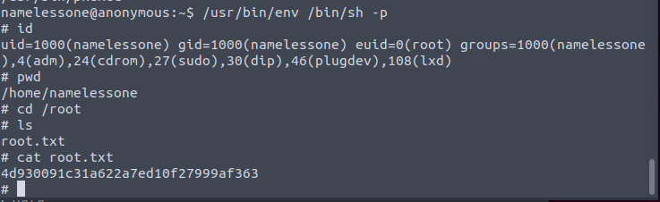

Works.

