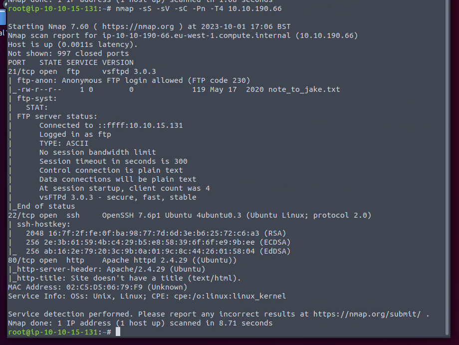
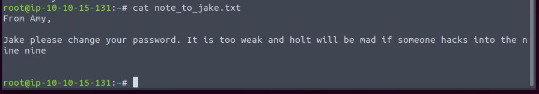
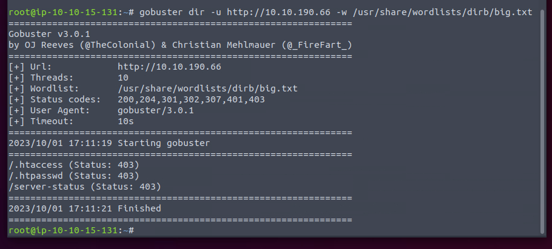
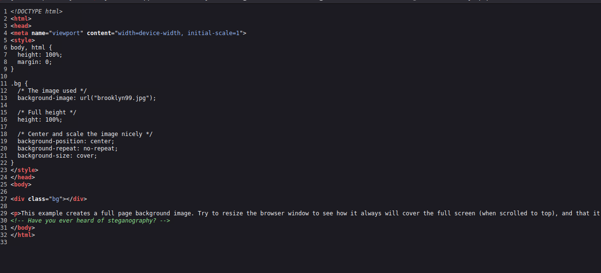
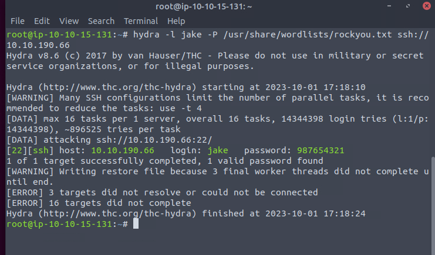
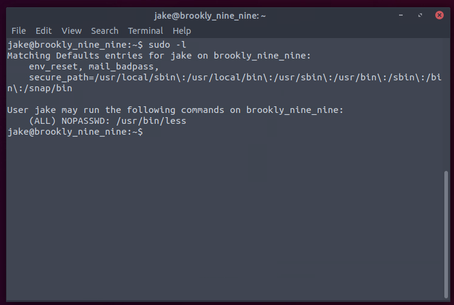
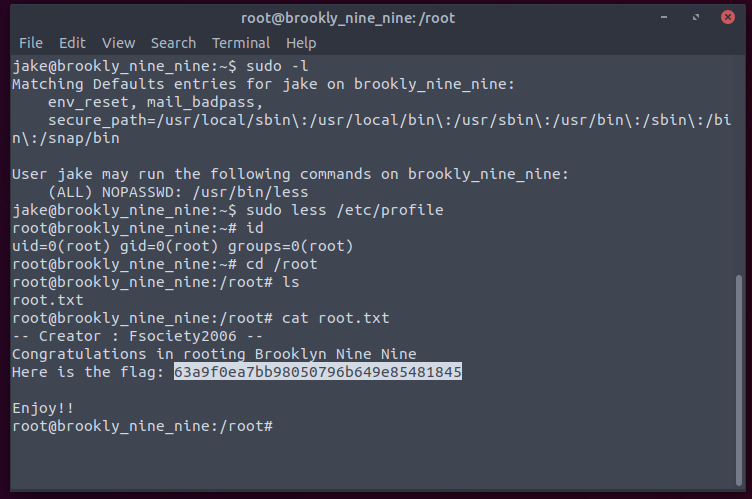

FTP contains file and have a website.

Looks like the password is bruteable.

The website seems like contains nothing.

Should consider whether something hide in the high ports.

Well. Looks like some info hide in the pic.

The pic requires password. So I choose to hydra first.

Indeed a weak password.

The user.txt is located in holt home folder and can be read directly.

We can sudo the less even passwordless.

Done.