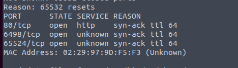

Those higher ports are quite weird.

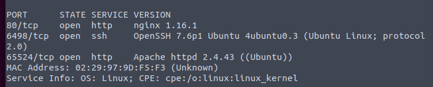

2 web servers.

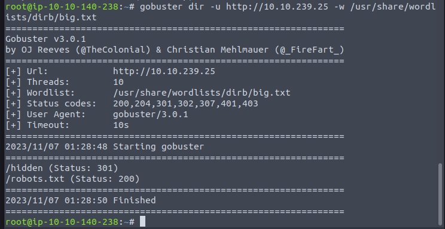

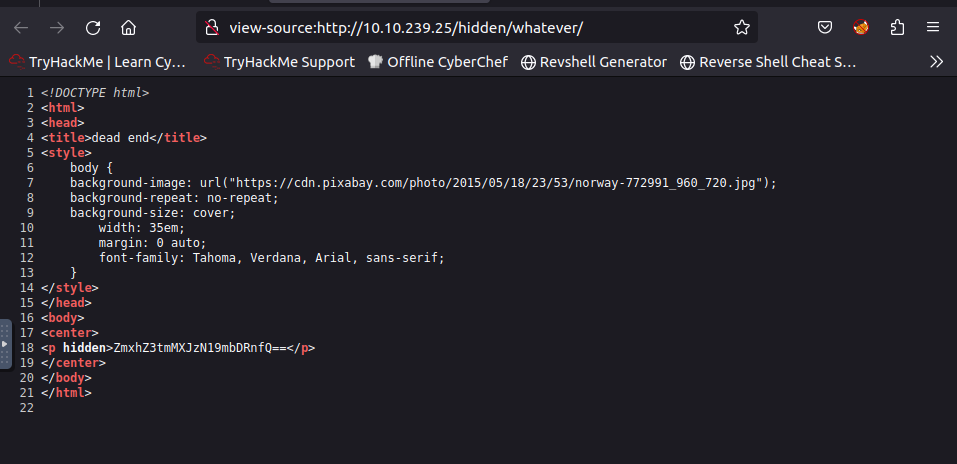

1st flag get.

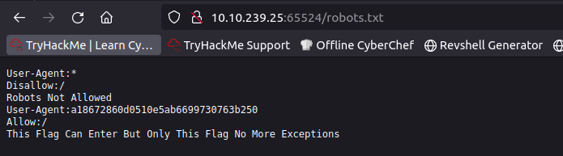

md5 hash. Since it is a flag, find a website to crack it.

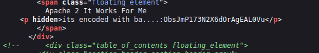

base64? However, it is base62. Get a directory name.

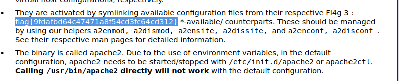

Just scroll down to get 3rd flag.

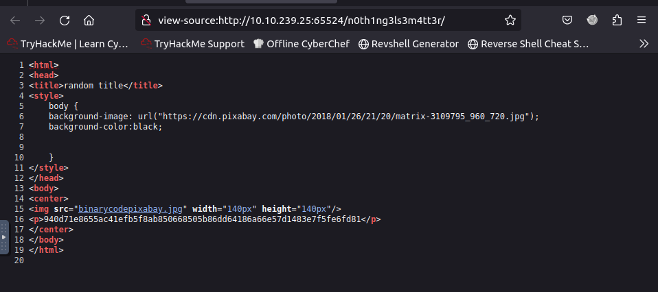

Another hash.

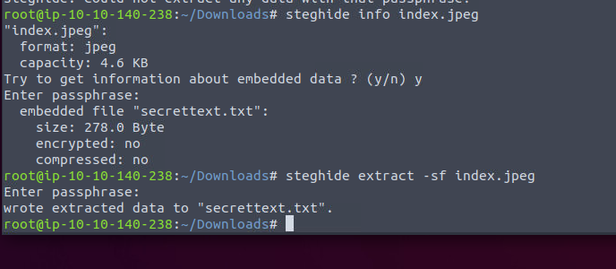

Using the password above, we can extract a txt.

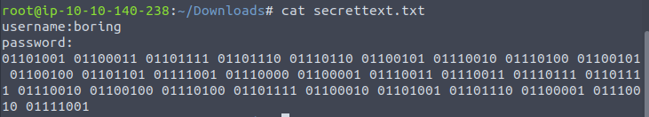

Boring binary.

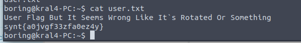

It is rotated.

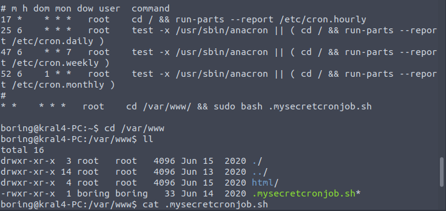

Owned by root, editable by user. Done.

