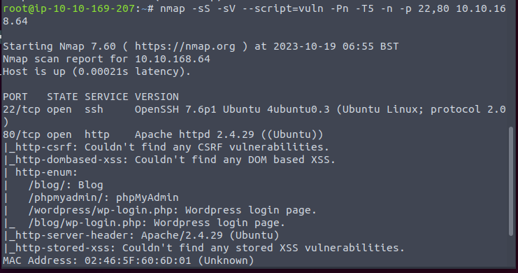

It is a WordPress. Looks very vulnerable.

However, I would like to scan all ports again.

Nevermind. So just focus on the web.

Looks like a old version. Wonder whether some exploit exist.

However, it seems a secure version. So the last resort I think is brute force.

Well. Not much time to find the correct one.

I think then we can edit the theme or else to a webshell. Just try it.

Yes. The old way.

We can see a user folder. But unfortunately, we need more permission.

Maybe we can checkout the web folder, hopeful some install credential would be left there.

So secure. It use a dedicated WordPress user.

Something listen to the 8080 port? But we do not find it on the initial Nmap scan. Looks like we need a tunnel inside.

(After refer to other WP. The tunnel thought is right. But actually there is a txt left in the /opt folder which contains the credentials of the user.)

So the 8080 port likely to be Jenkins.

Now we can visit the Jenkins. But default credential and the user credential do not work.

Do we need to brute again?

Well. According to Google and the forum, hydra will produce false positive if using attack machine. So I will just skip this.

Looks like Java. Nevermind, just search for reverse shell online.

/opt again.

Root credenti

