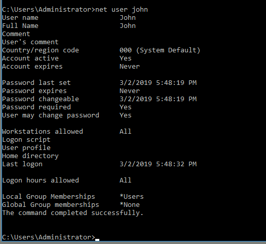
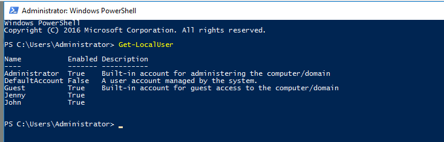
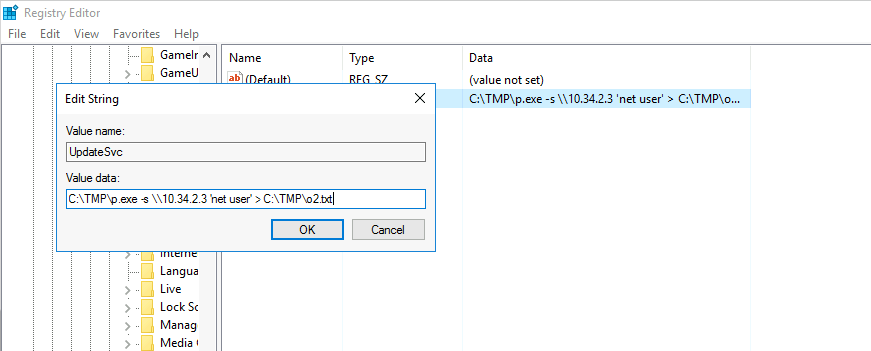
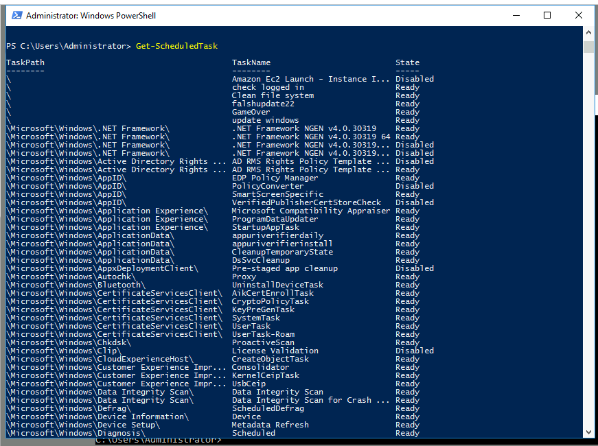
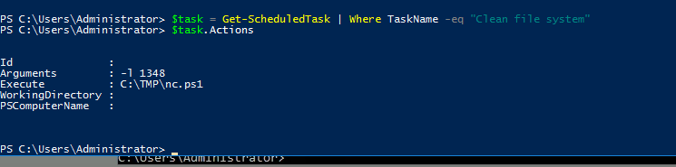

More like learning though.

winver for version.

Event Viewer to view logs. 

Event ID: 4624: successful login

To view a user.

Get all user so view them for permission.

Startup program.

Get all schtask.

List specific task.

Attacker may hide there server behind a normal DNS by changing the hosts file.

