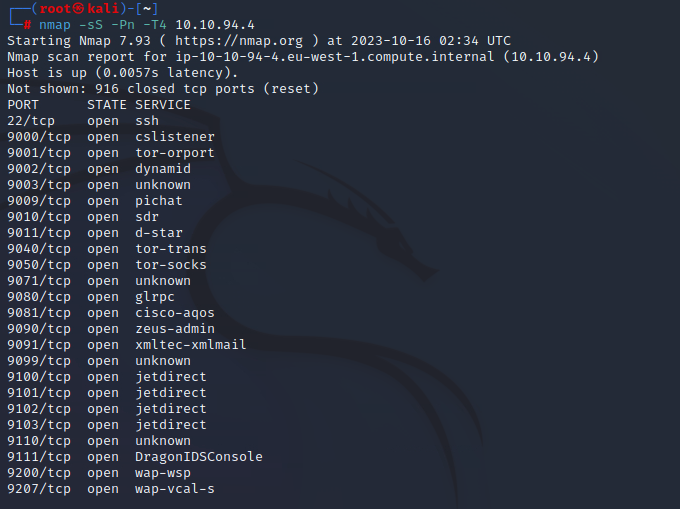

So much port opened. Strange.

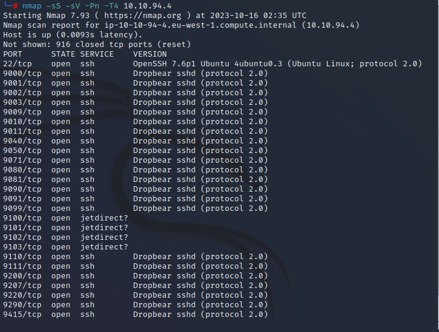

Those higher ports run sshd.

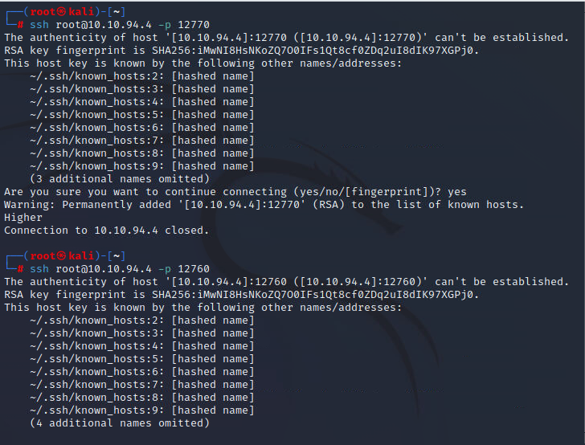

While connecting those higher ports, it will displayed whether its higher or lower.

Using binary search method, we can easily find out the true port.

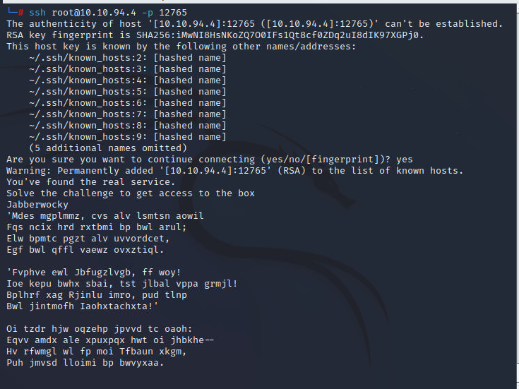

So finally we have a challenge. Some very strange string. It must have some meaning.

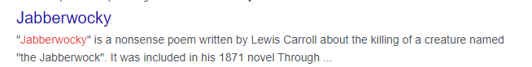

The first line suggests that the following strange text maybe a poem.

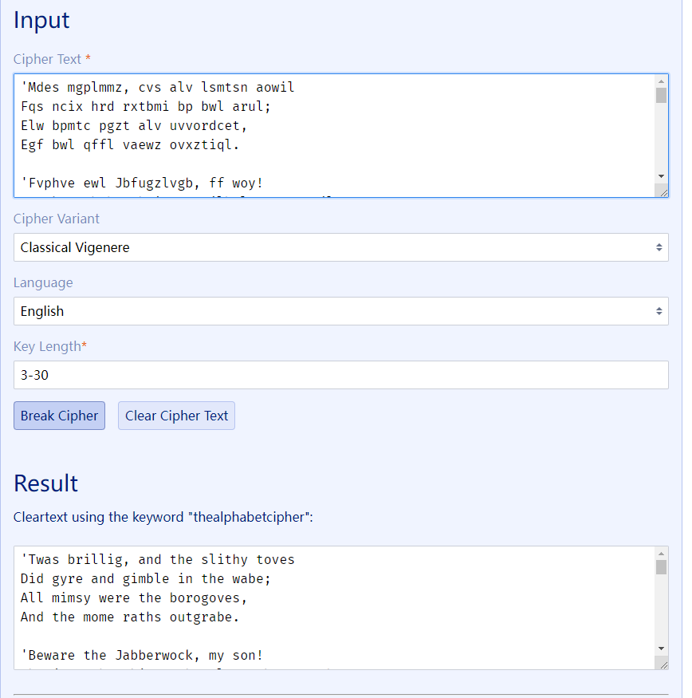

Crack it using Vigenere Cipher.

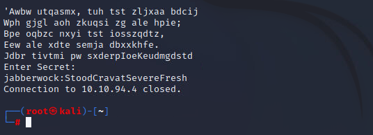

This time looks like ssh credential to 22 port.

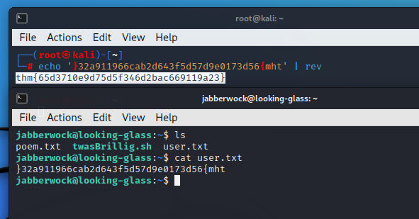

Reversed.

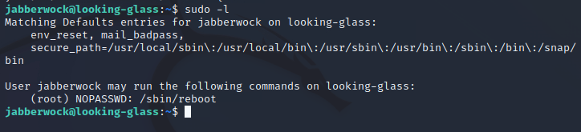

We can sudo the reboot. It is useless unless we can control some startup program.

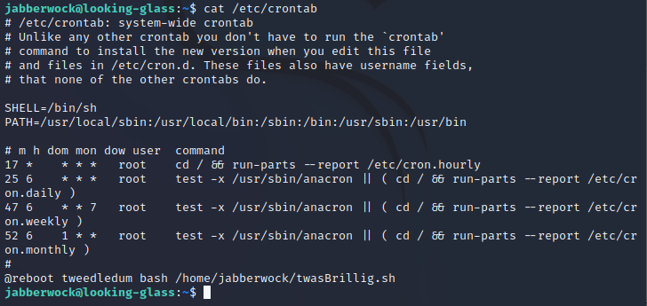

Oh. The script is in our folder.

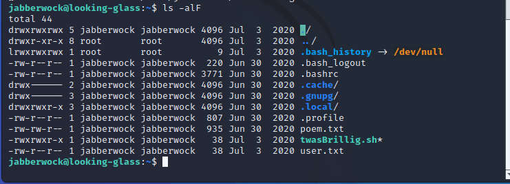

We can edit it. So time for shell.

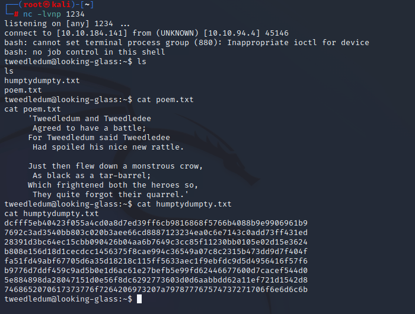

Get something like hash.

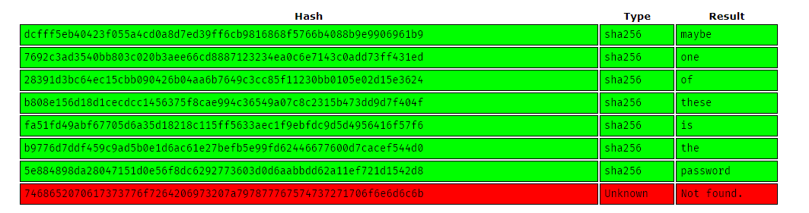

Hmm. Looks like the last one is the possible password.

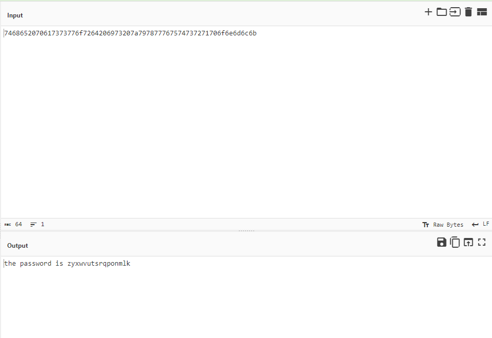

The chef did well.

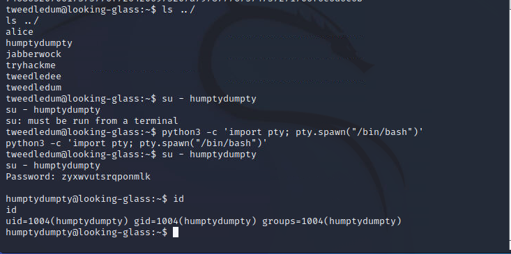

Switch to another user.

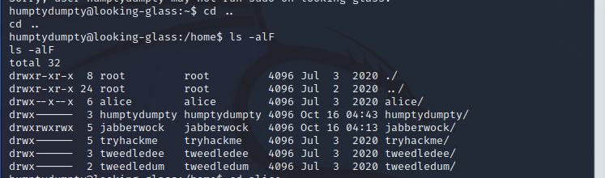

The alice folder is little bit strange. There is execute permission for everyone.

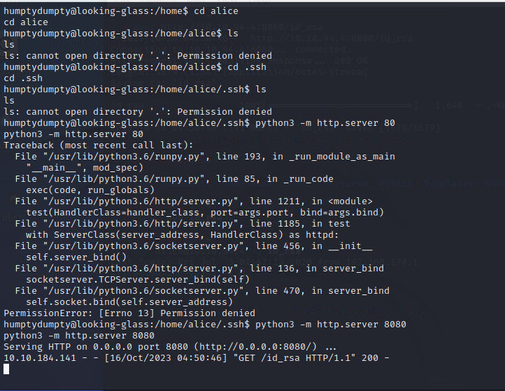

Although cannot list anything, we can host the ssh key to web.

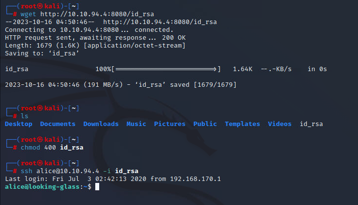

We do not have the password so cannot use command to check for sudo.

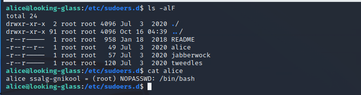

But we indeed have a file in the directory.

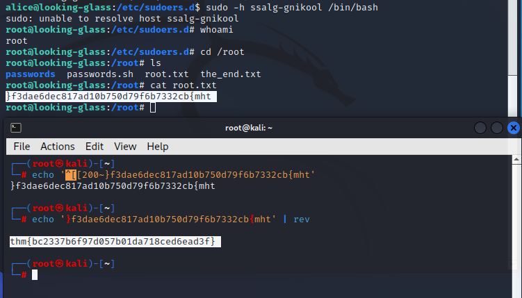

