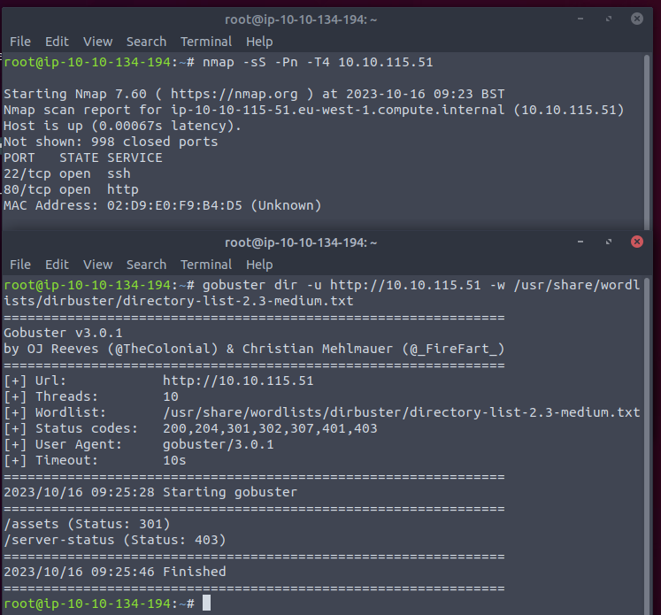

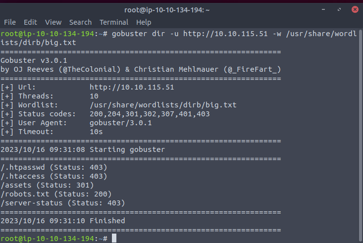

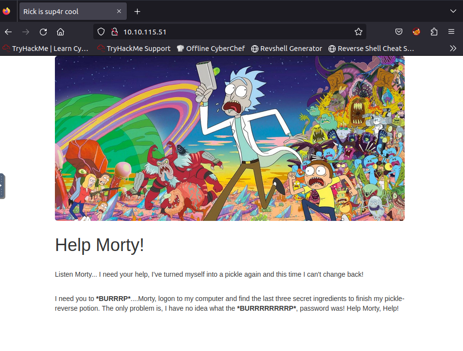

Some background. 

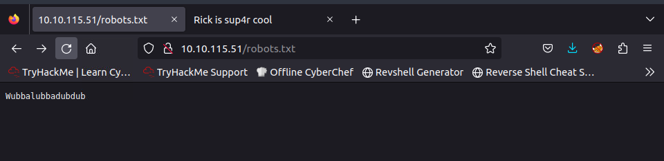

Not a normal robots file.

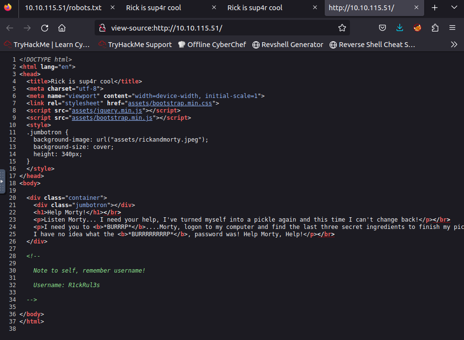

Well. So the above robots maybe the password.

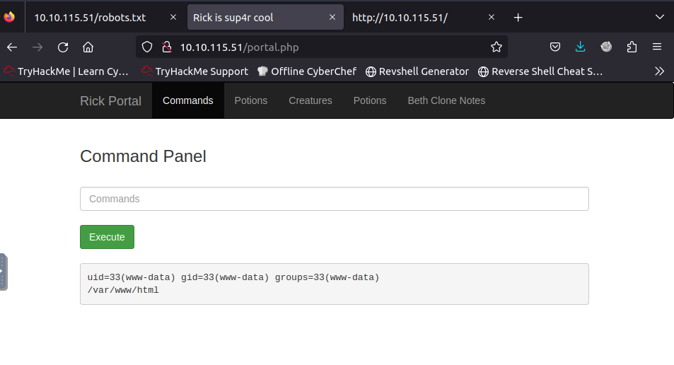

So a easy webshell. But browse other contents now.

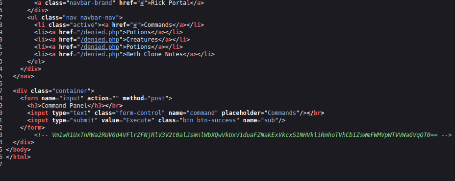

Others are directed to the same deny file. And notice that a strange string at the bottom.

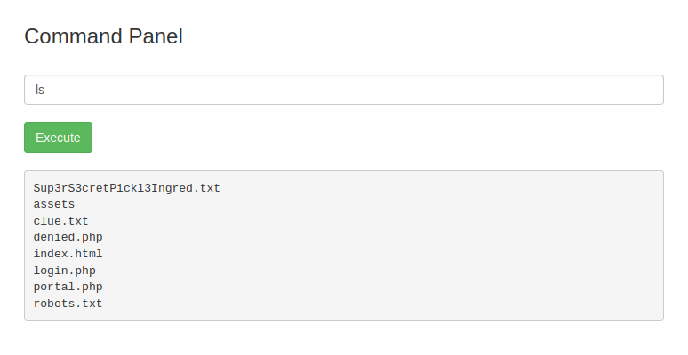

The first ingredient is in the first file.

Our next step is iterate the file system hopes to find more clue.

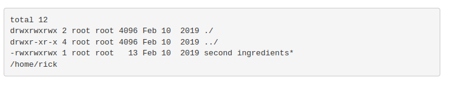

We find the second but it is a executable file.

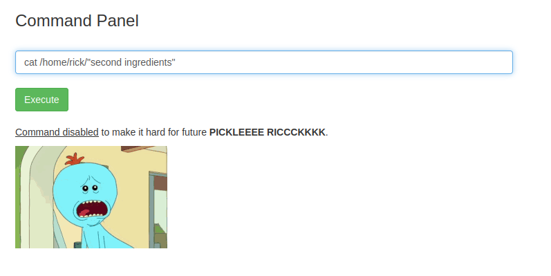

cat is disabled. Would like to try head/less.

Alright the less is useable.

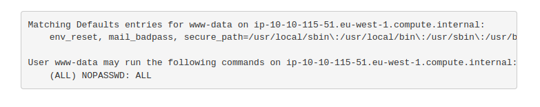

What the hell. The user can sudo as root. Then everything is done.

