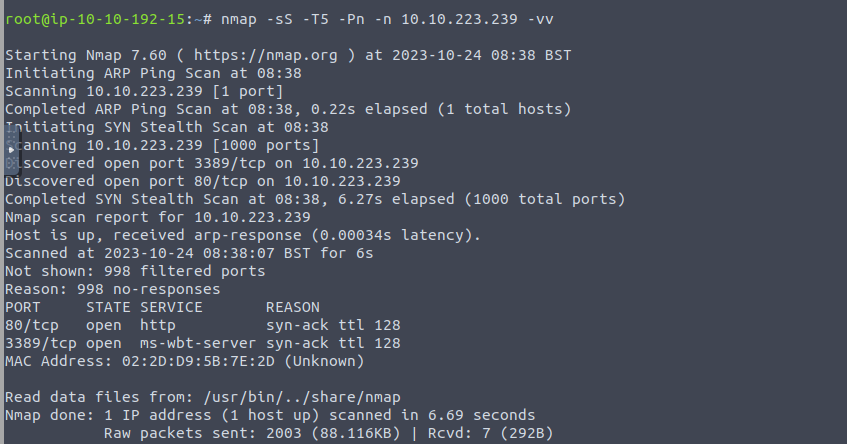
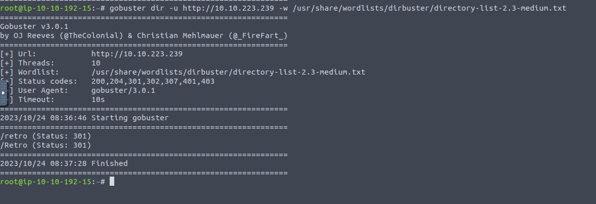
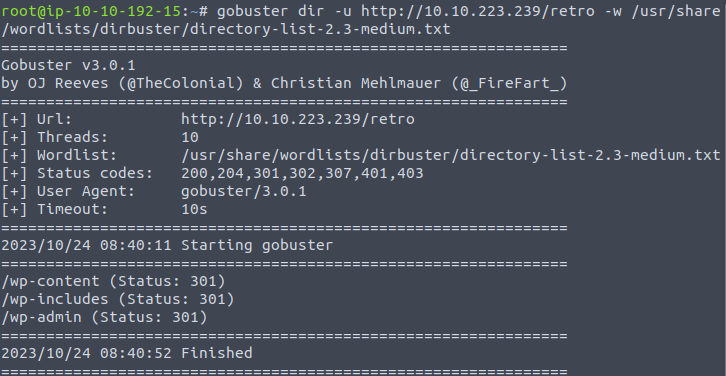
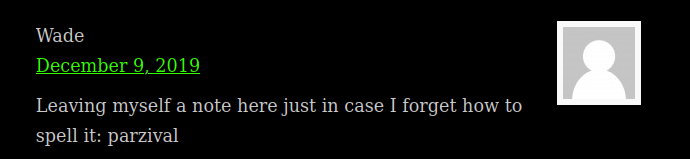
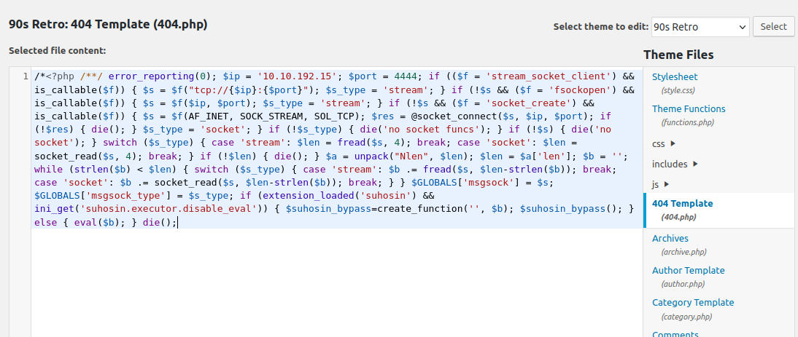
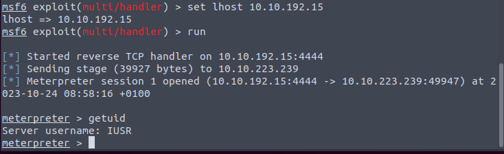
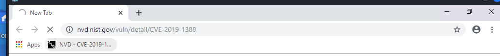
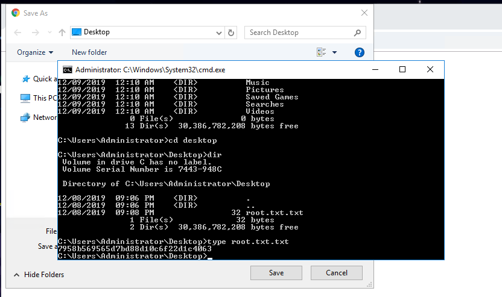

Web and RDP.

R and r?

A WordPress.

Looks like user/pass. And indeed it is.

Normal way to change the 404.php and get the shell.

The shell do not work. It is a rabbit hole indeed.

So use the RDP connection.

The user.txt is on the desktop. And if we look into the chrome. There is a CVE in the bookmark, which looks vulnerable to this machine.

Get.