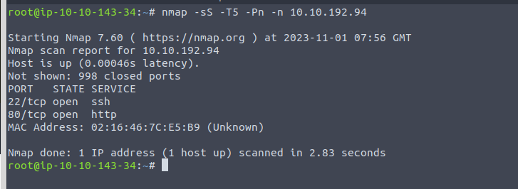
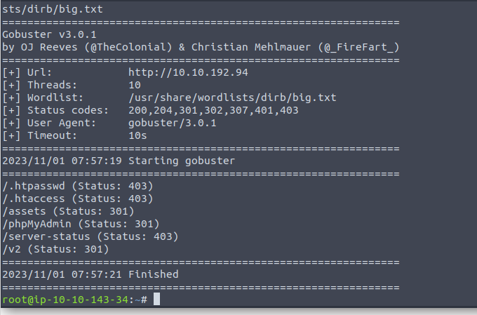
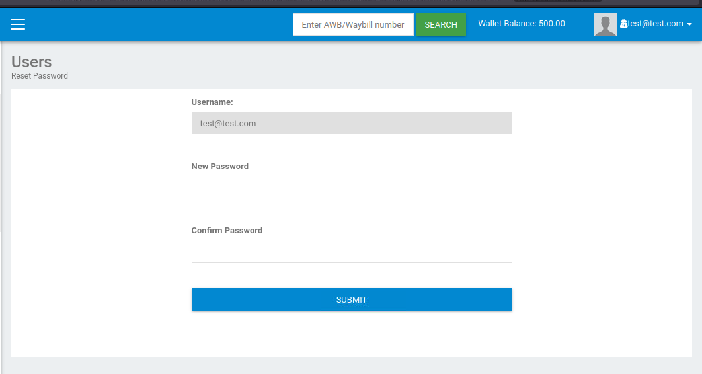
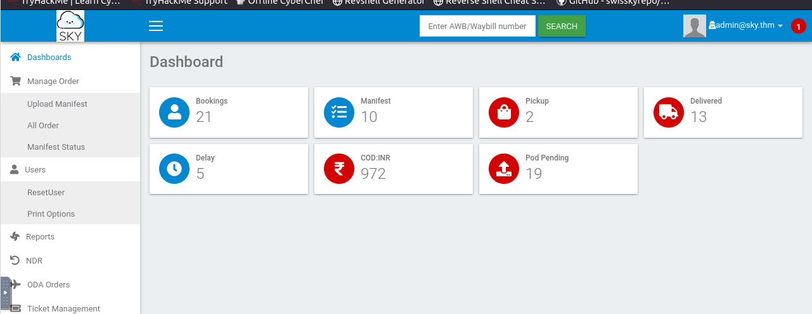
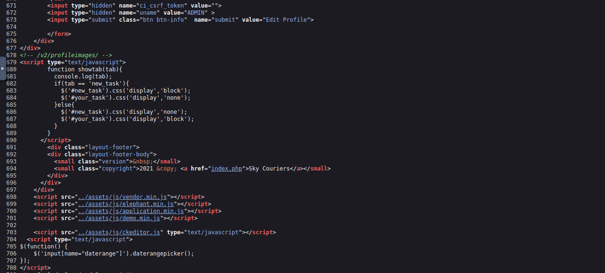
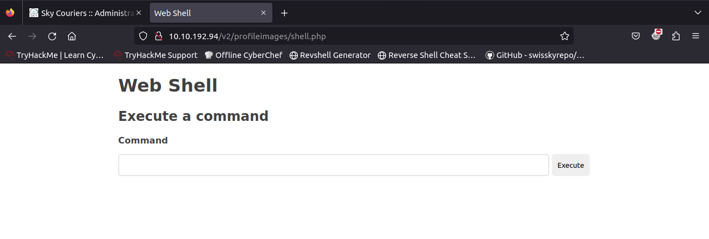
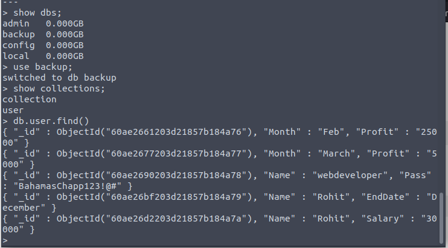
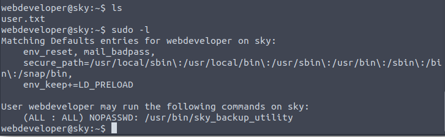
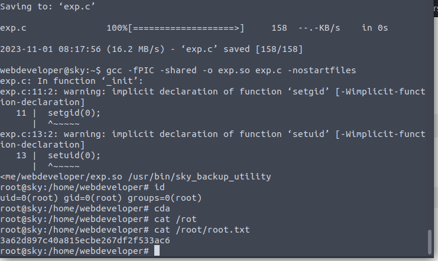

22 and 80.

A login panel.

Register a new account to what we can find.

From the profile page we can get the mail of admin.

And this system kindly provide a easy way to *reset* the password.

Then we are able to login as admin.

The source code provides the folder where the images would be stored. So it is time to wonder whether we can upload some shell.

Well. It do not have any filter.

We can get the user password in the mongo db.

Interesting. The env_keep means we can use our own lib.

Done.

