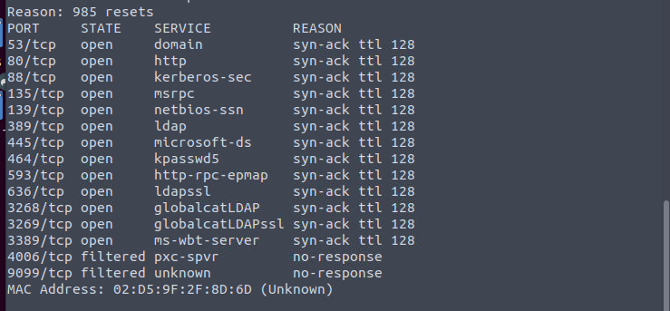
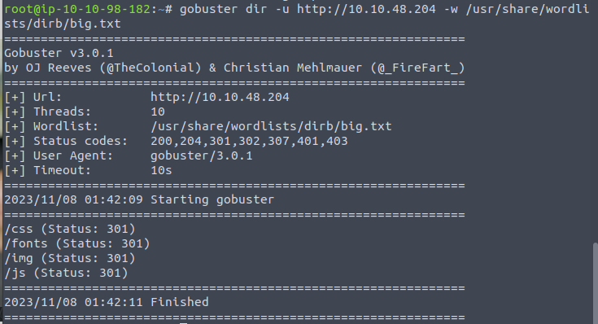
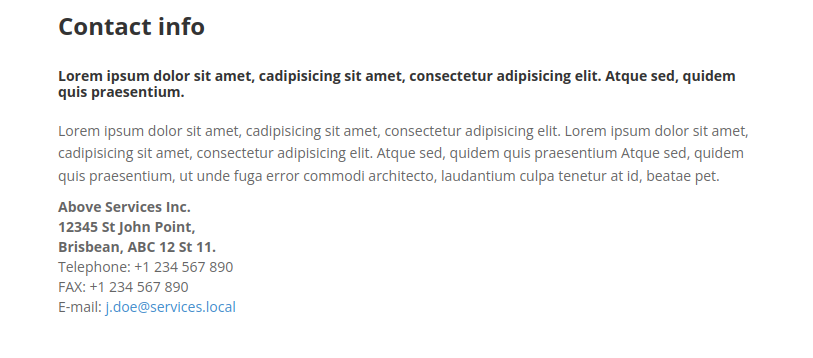
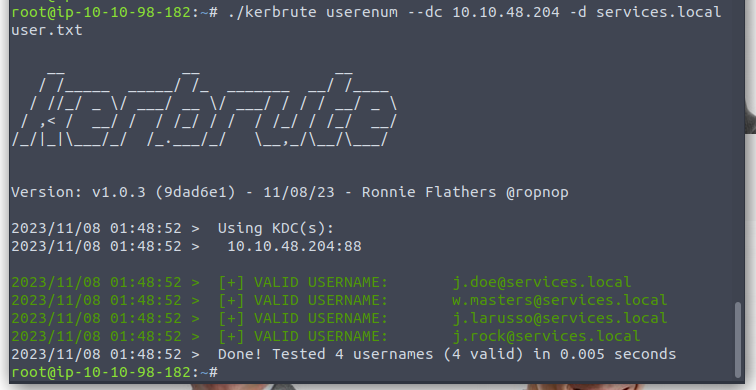
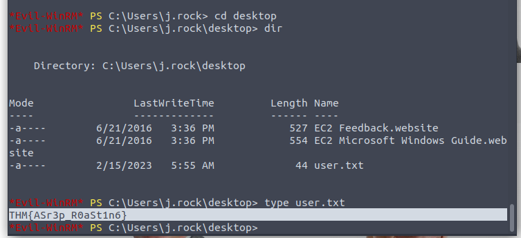
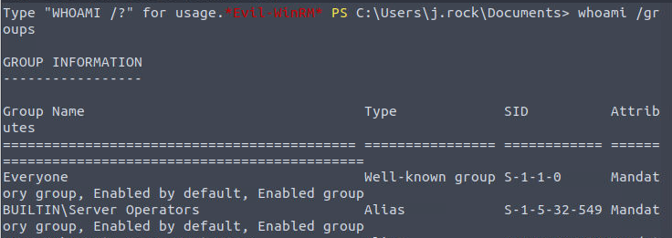
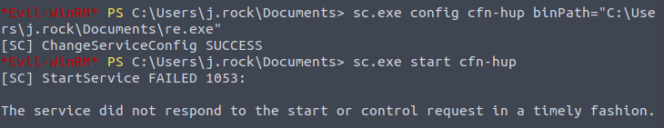
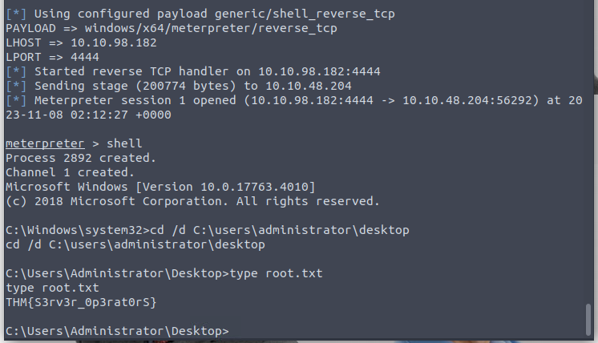

Have LDAP and Kerberos. Looks like a DC. 

Not very valuable.

And the SMB do not allow anonymous login.

I think the point is Kerberos now. But we need to find some username first.

The contact page reveals their email pattern.

Since we can get 4 name in the about page. Kerbrute it.

All valid.

And the IT Staff have pre-auth enabled. And the password is easy to crack.

Operators are somehow privileged.

