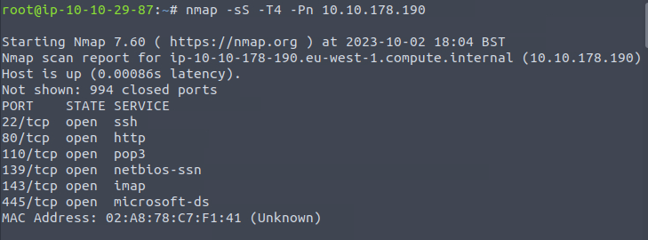

We have HTTP and SMB. Even a mail server.

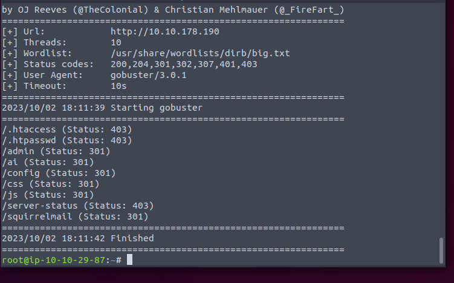

Only the last can visit. But we require credentials to login.

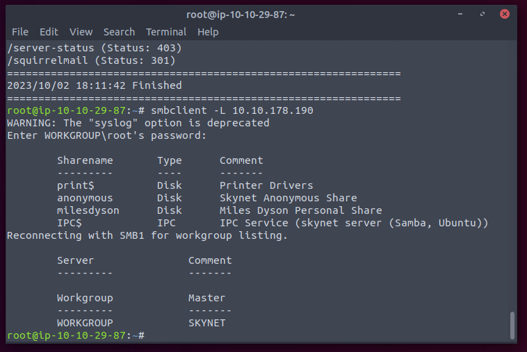

Seems like there is a share we can look to.

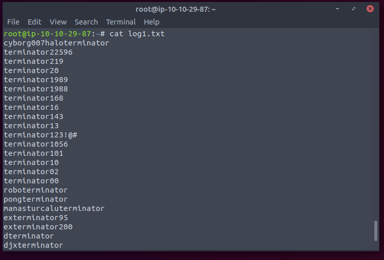

Looks like potential password.

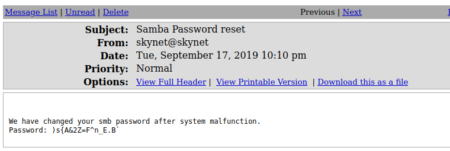

Now get the SMB password.

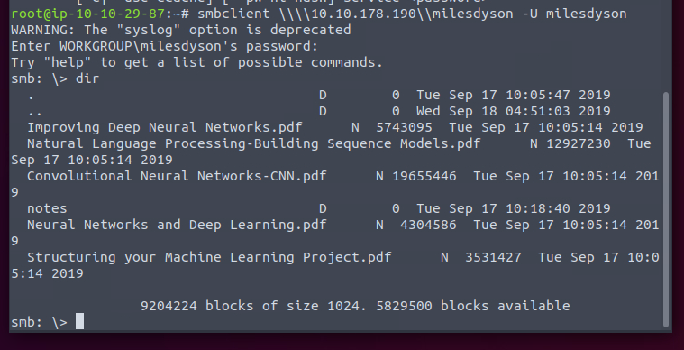

Some AI/ML docs.

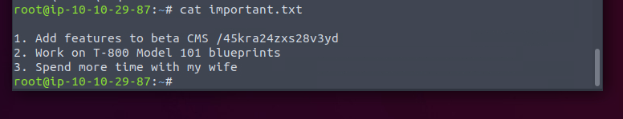

Really important.

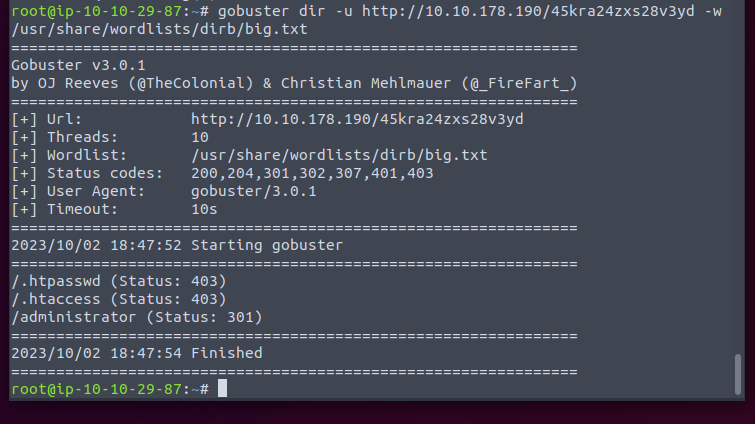

Admin panel again.

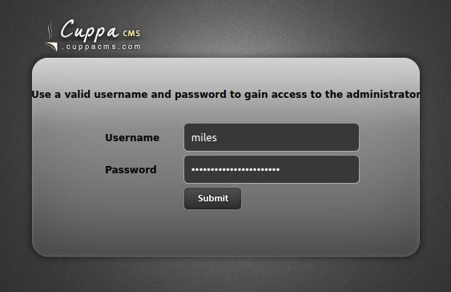

The credentials used before did not work here. So might be some exploit of the CMS itself.

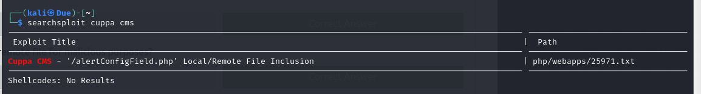

It works. So we can host the reverse shell on attack machine.

After the user flag

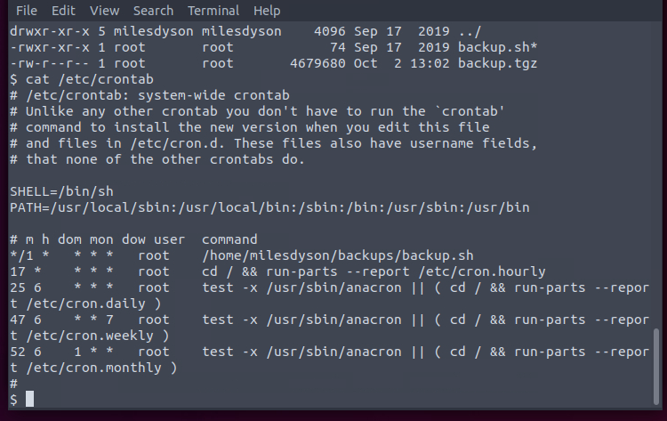

Seems like we can exploit the script.

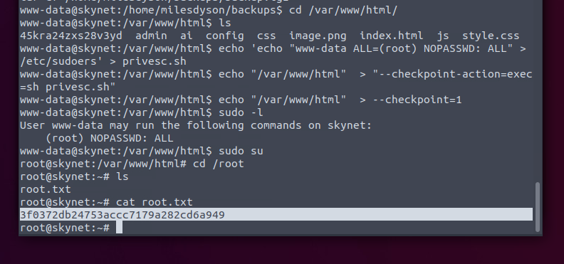

