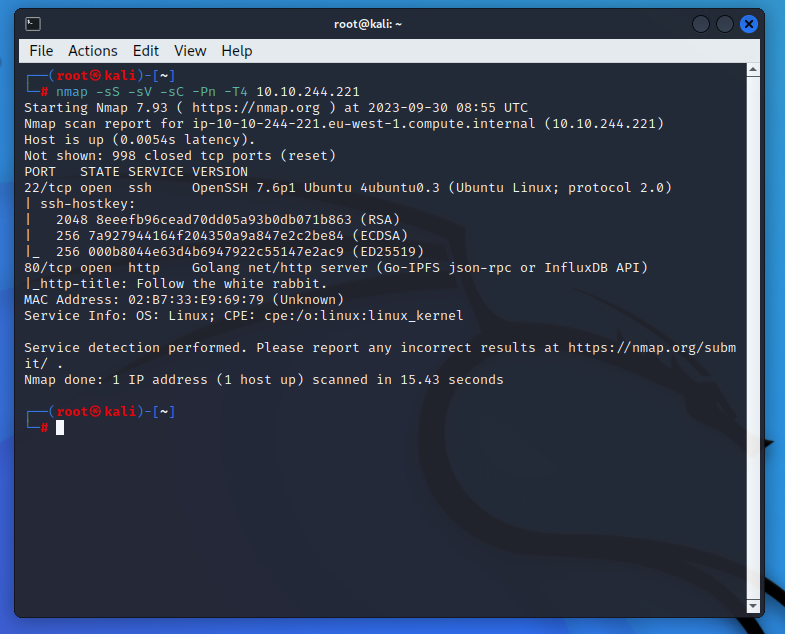

Looks like can only rely on HTTP.

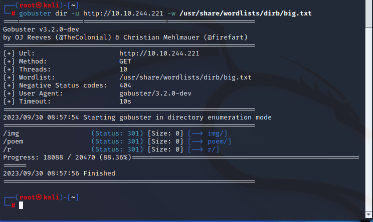

Hmm. Some interesting directory.

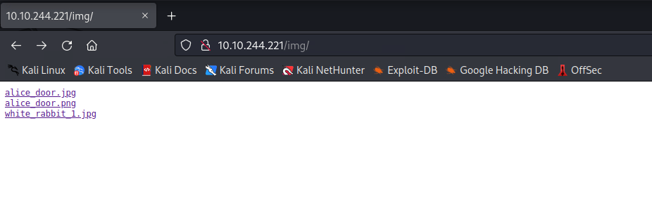

Some jpg. Maybe some steg?

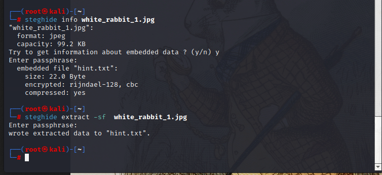

No password though.

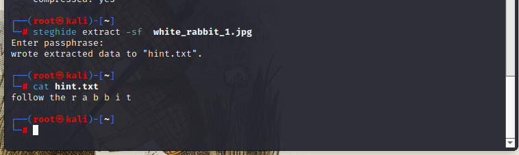

Remember there are still two jpg not displayed. So must be other directory not found by buster.

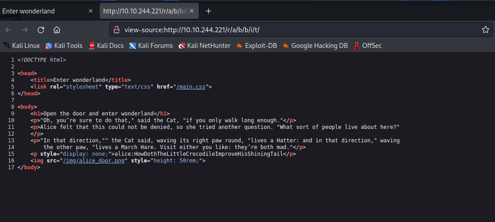

Seems like we get the ssh password. Quite long.

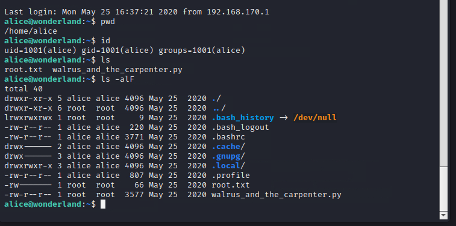

Alright. Having the root flag in user home although we do not have such permission. The python file is suspicious.

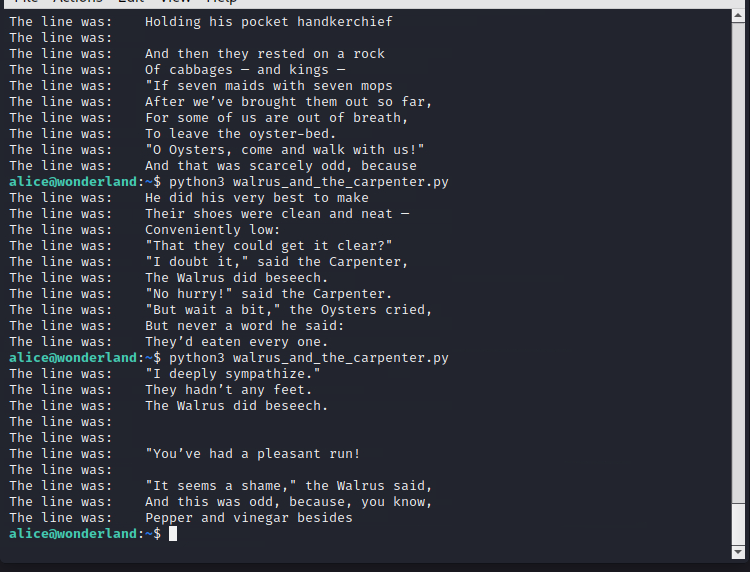

Seems like really random though.

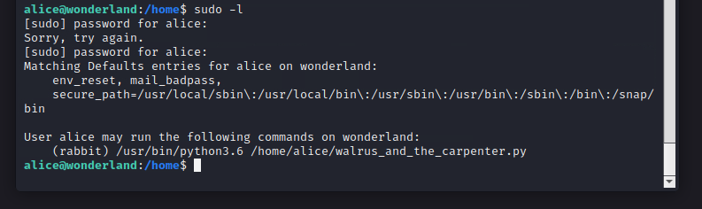

But we can sudo the rabbit. Although we do not have file permission.

Look into the source code, the file import random library, so we can assume whether we can fake the lib in our home folder. It works.

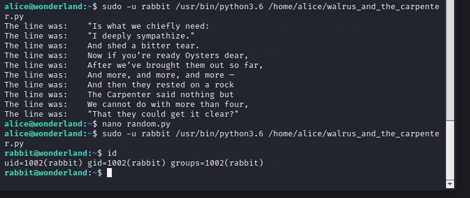

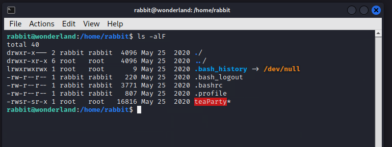

Now we have a executable with s permission.

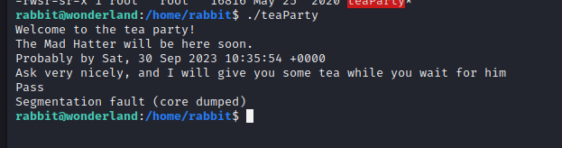

Maybe we should change the time? But it require privilege.

Direct view the file. The core dumped is intended.

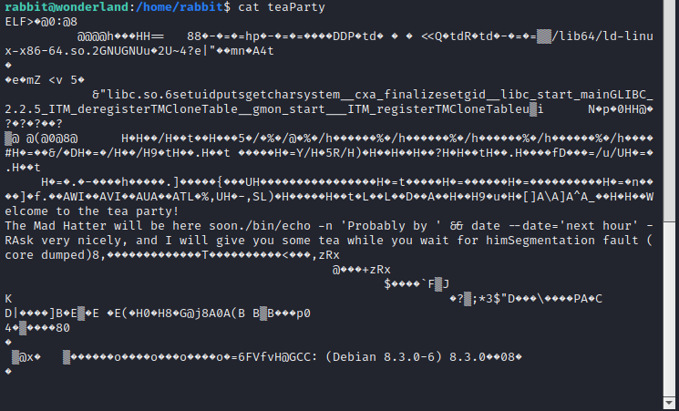

It used /bin/echo for echo but just date for date. So let us change the PATH.

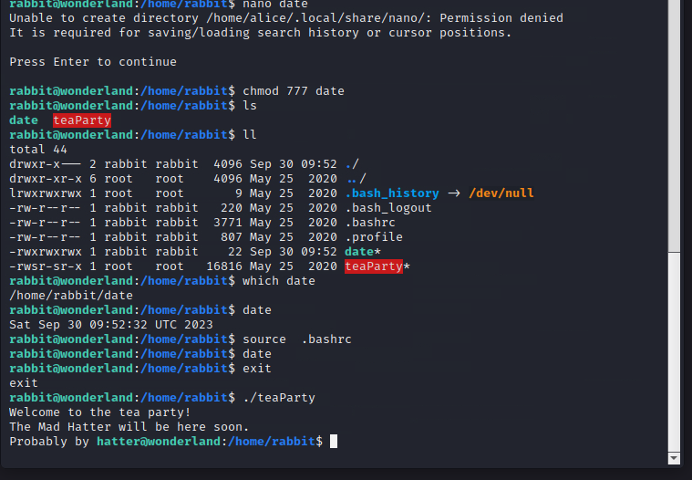

Get the hatter.

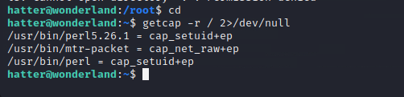

The perl have uid cap.

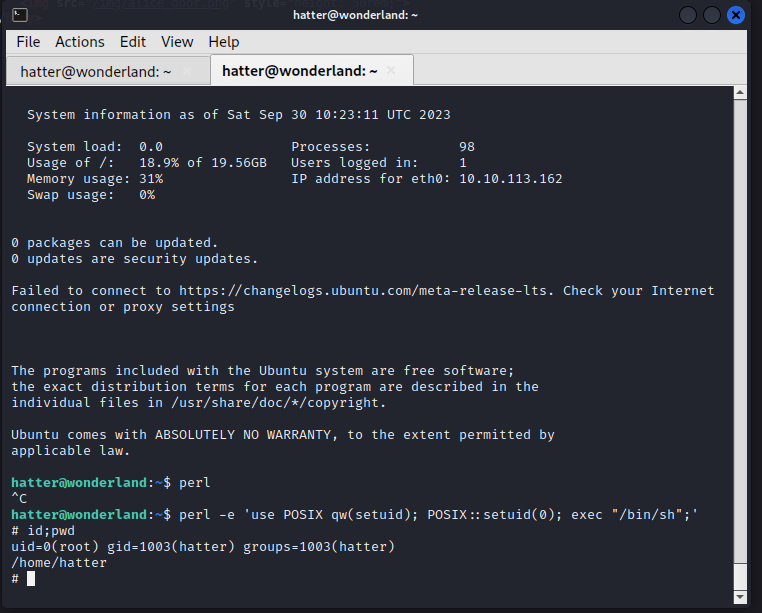

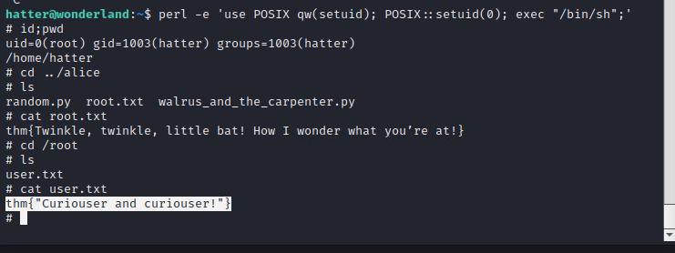

Interesting reversed.

