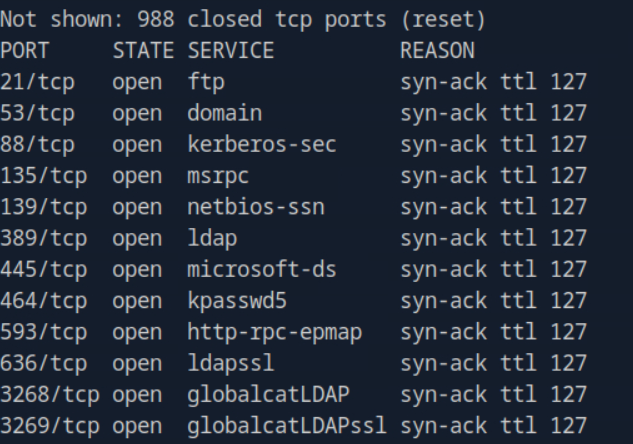
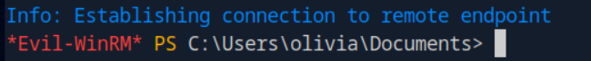
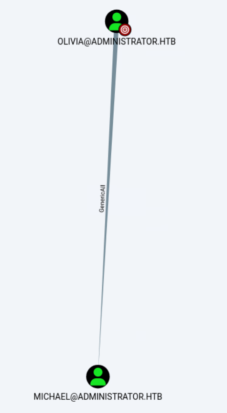
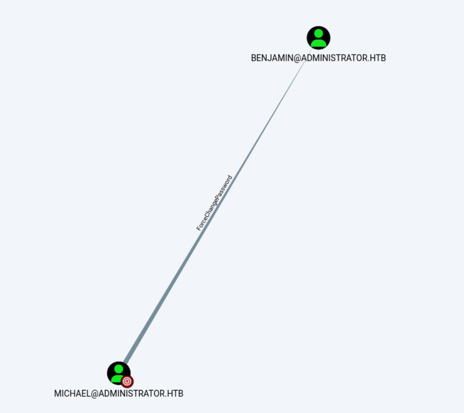
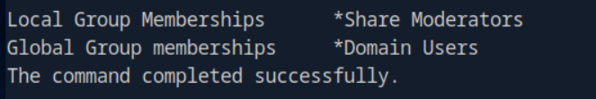
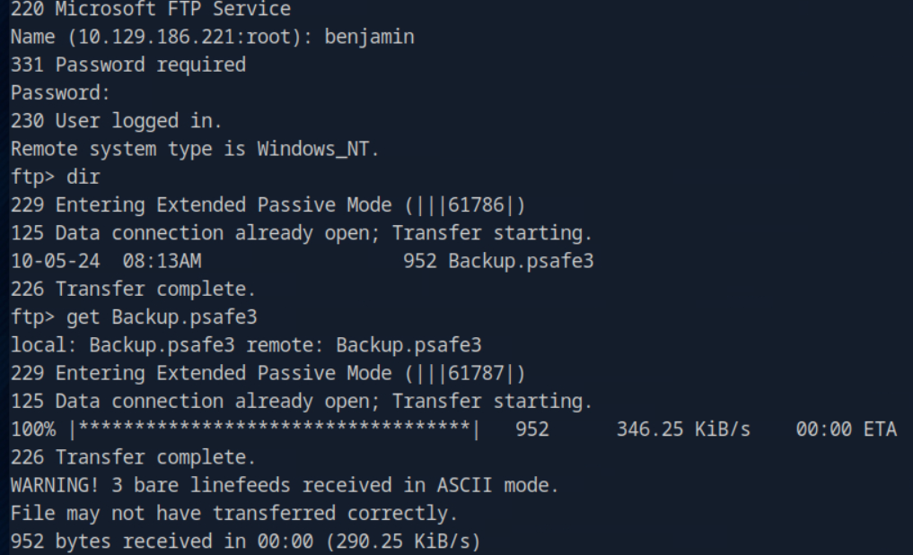
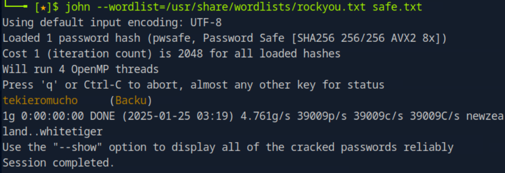
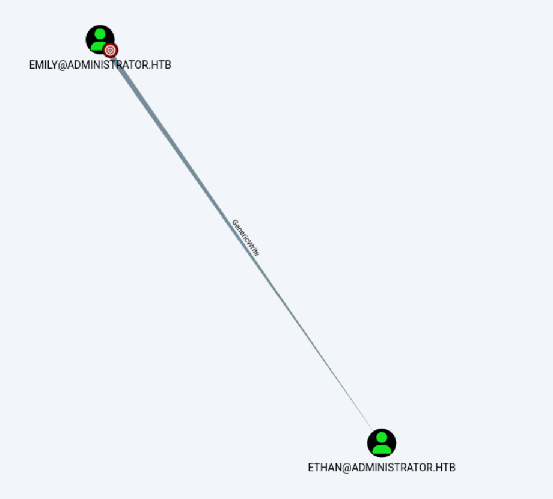
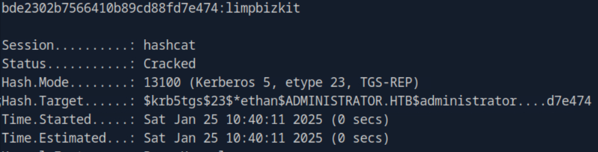
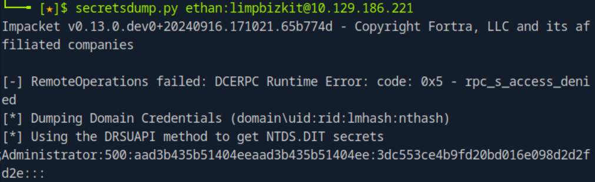

Creds cannot login FTP or SMB. But WinRM available.

Using Bloodhound, Olivia can write at Micheal. So change the password directly.

Michael can force change Benjamin.

Benjamin have share moderator role, which means maybe we can visit the FTP or SMB.

Seems like a backup of database?

We can get emily creds inside the passwordsafe.

GenericWrite on Ethan, which have DCSync over the domain.

