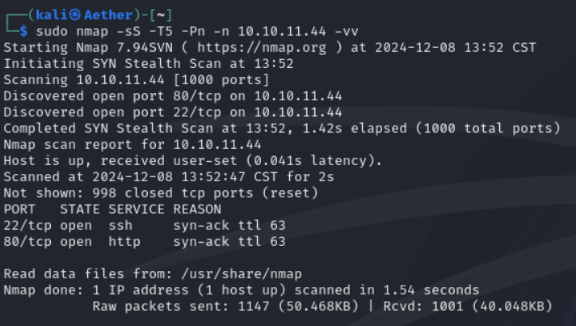

Check the web server first.

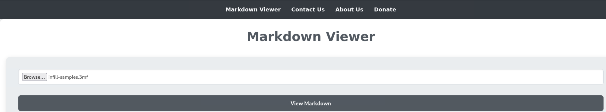

Looks like we can upload files. Hope it do not check and give us where the file located.

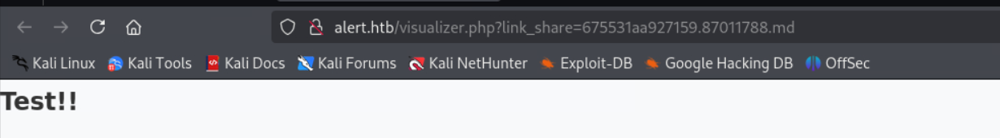

We can even share it. Hmm, suspicious. The link_share parameter possibly give us the filename.

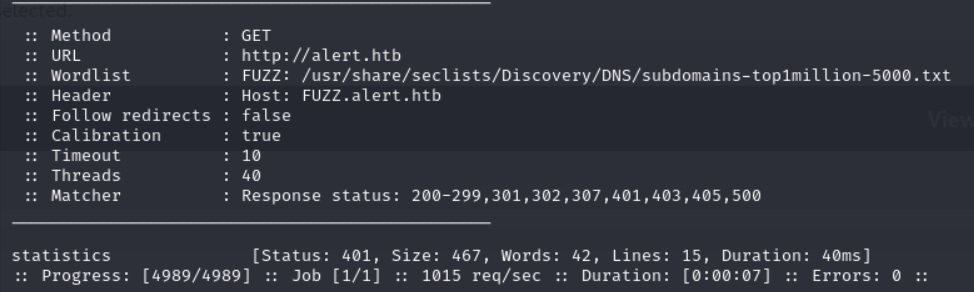

We can find another subdomain. But it requires basic auth.

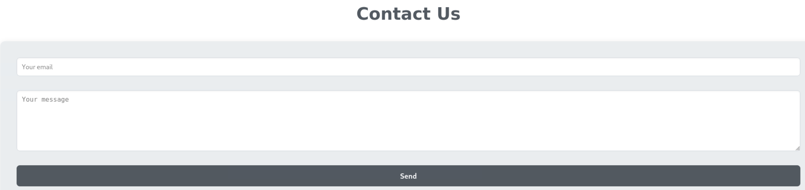

Maybe we can send payload to admin via this form. 

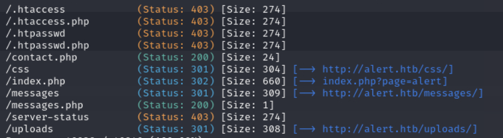

The messages.php is interesting. I suddenly realized we can let the admins send the messages page to us via XSS.

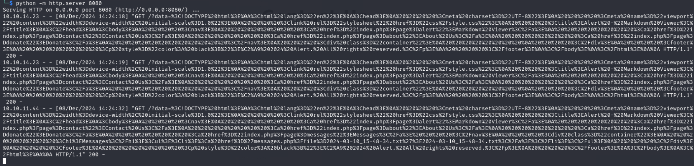

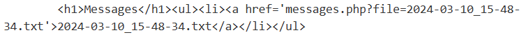

Looks like it accepts file parameter to load local file. LFI may work here. Currently we need the .htpasswd for another site.

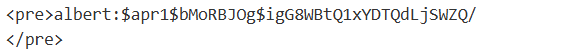

Time for cracking hash.

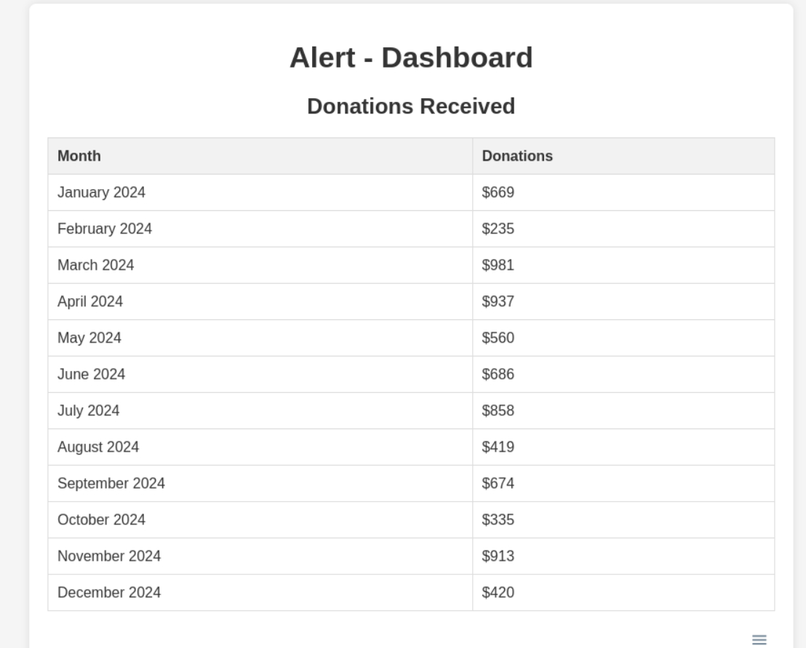

The page is purely static. So maybe the creds work for SSH.

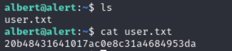

Find nothing valuable on the machine except the website monitor.

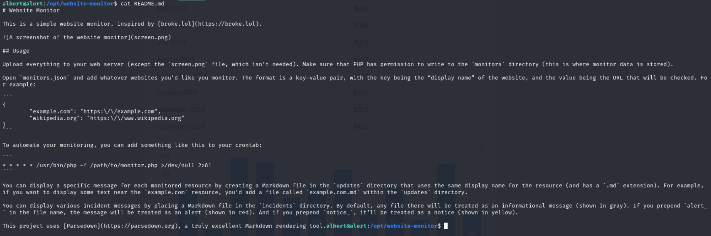

But it seems running on root, so we place our shell in it.

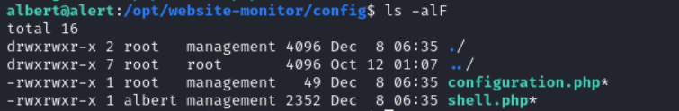

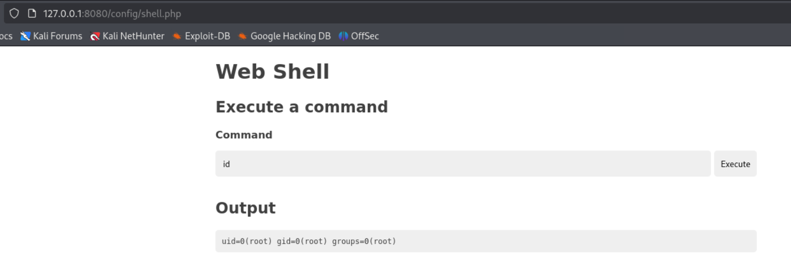

S