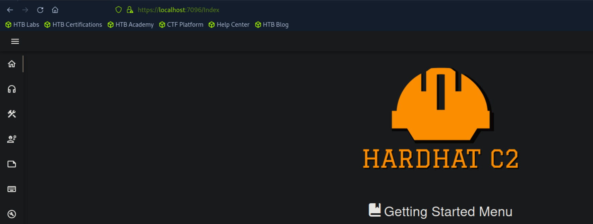

Though label as Medium, should be Hard at least.

The 8000 port have directory listing.

Looks like we have to deal with Havoc, and try to communicate with the backend WS. Since no SSL, should be easier to craft one.

Time for finding CVEs.

Checking one of the author's GitHub, there's a [SSRF](https://github.com/chebuya/Havoc-C2-SSRF-poc/blob/main/exploit.py). It works, but we need to get it visit the WS locally.

And another one [here](https://github.com/IncludeSecurity/c2-vulnerabilities/tree/main/havoc_auth_rce), which talk about hardcoded passwords. Hmm, we have some above.

So the problem is how to combine those two together.

The shell is very fragile, so write the public key to it.

Another framework? Maybe another unexposed port.

By [default](https://github.com/DragoQCC/HardHatC2/blob/master/TeamServer/appsettings.json), Hardhat's JWT key is hardcoded. So we can craft a token for us to login.

Inside the Hardhat, we can execute command on the machine.

Not root, but still better.

sudo on iptables. With [this](https://www.shielder.com/blog/2024/09/a-journey-from-sudo-iptables-to-local-privilege-escalation/), again write the public key to root user.

