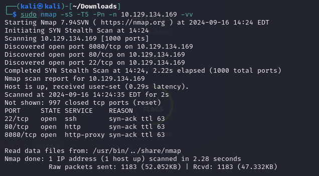

Scan shows two web ports and one ssh.

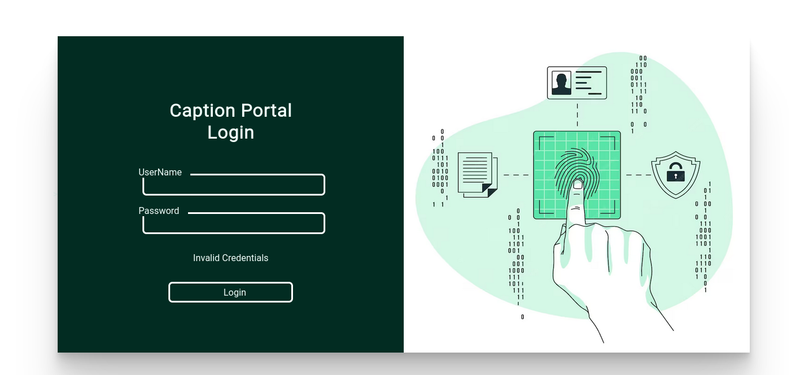

For the 80 port, we lack the credential to login. Common credential do not work. 

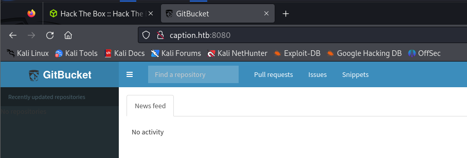

For the 8080, looks like we have a git repository. This time, we can login with root/root.

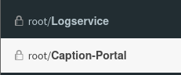

It gives us access to two repo. For the second one, maybe we can find hardcoded creds in it.

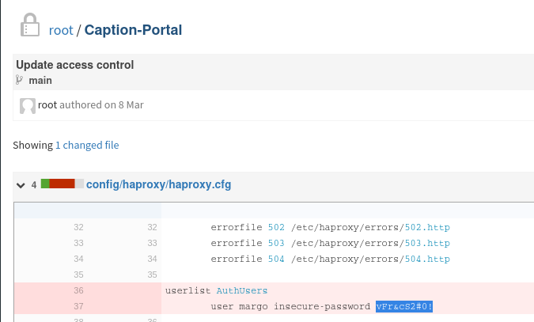

And we found it in previous commit. However, it seems useless at current stage.

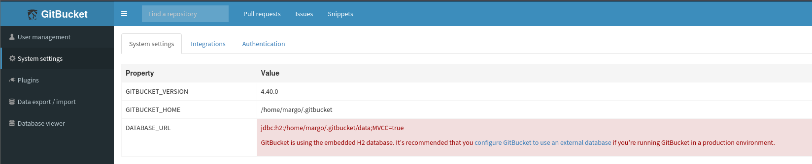

Check the admin panel, looks like we can use the H2 database at the web.

Search the web, we can find this [post](https://gist.github.com/h4ckninja/22b8e2d2f4c29e94121718a43ba97eed).

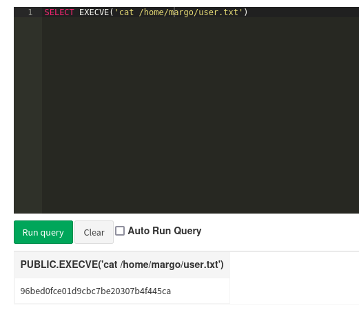

User get.

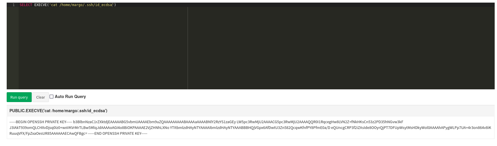

It use ECDSA instead of RSA.

The machine have another user called ruth.

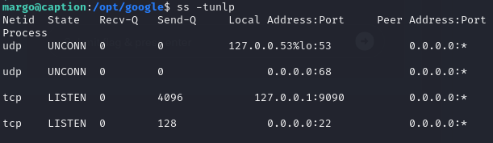

The server have 9090 port in use. Very suspicious.

Back to git repo, Apache Thrift actually using the 9090 port. Seems like a point to exploit.

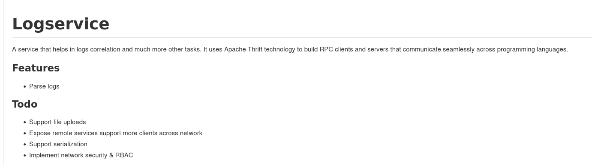

From the function, there maybe a point. It will execute the logs variable. We will try to control it.

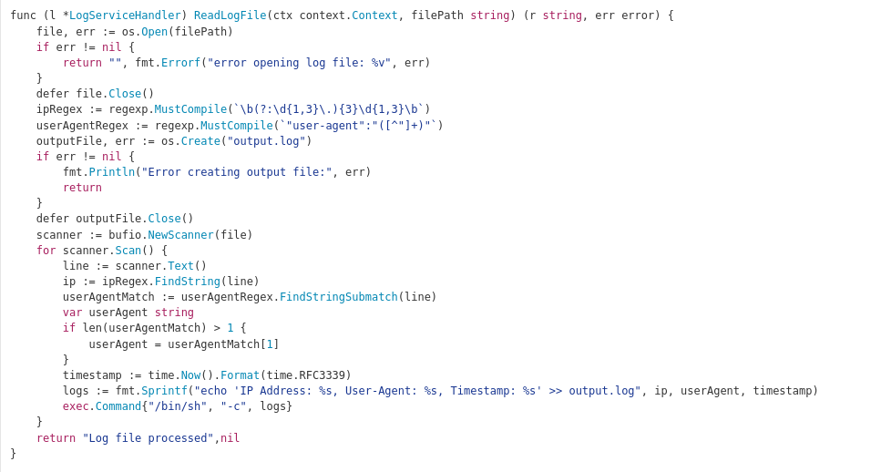

Just crafted a log file like above to run another command. Then we use a standard client file to communicate with the 9090 port to make it run.

And it works.