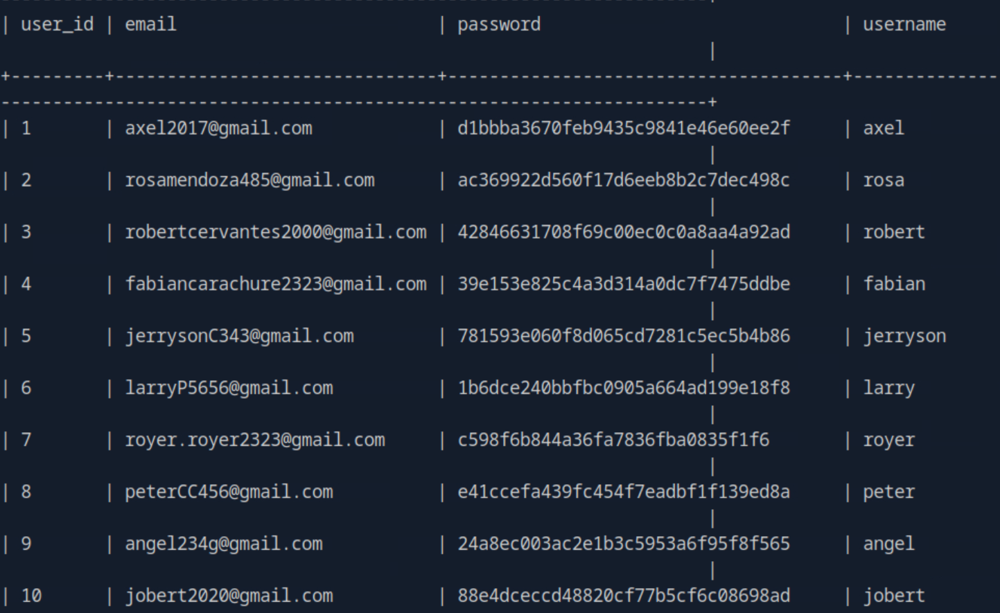

Can register/login, but nothing interesting.

Time for git-dumper.

Now we have the source code for the site.

The admin is axel. Try to looking for password.

First query is not prepared, maybe we can inject on the cat_name parameter later.

Username are directly retrieved from session, and we do know admin will check the website. Looks like a XSS.

Use sqlmap to dump the user table. The password looks like MD5 hash.

The axel one is uncrackable. But we can login as rosa.

Though no sudo, adm group grant us privilege to read logs.

Then switch to axel.

Port 3000 open.

Seems like we need to send our exploit using email.

Though we cannot see any other repo in Gitea. This version have a stored XSS.

The README do not give further information.

The index.php hard-coded the password which can login as root.

