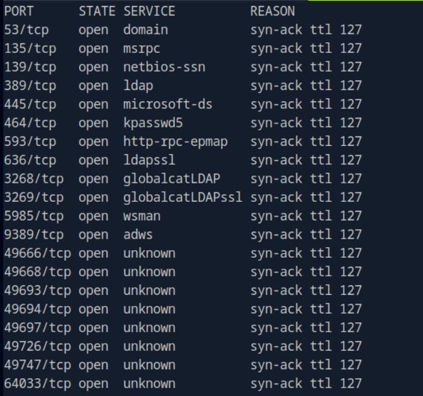
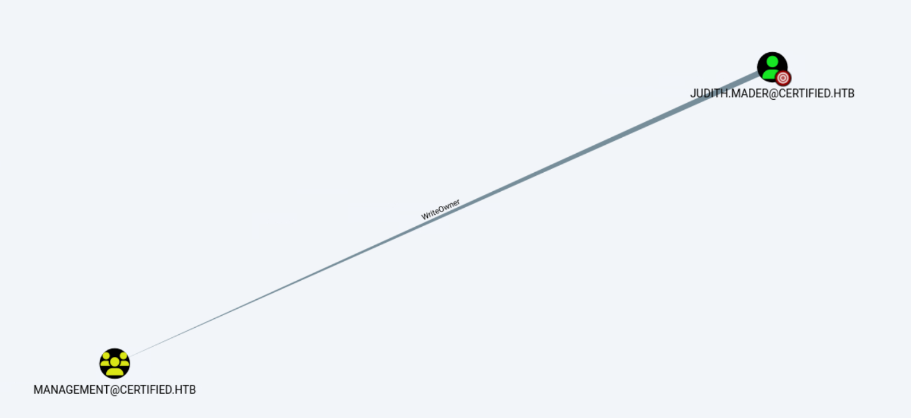
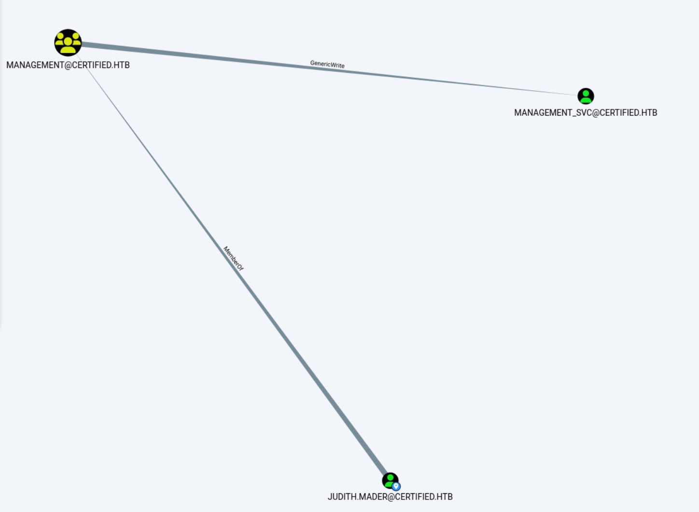
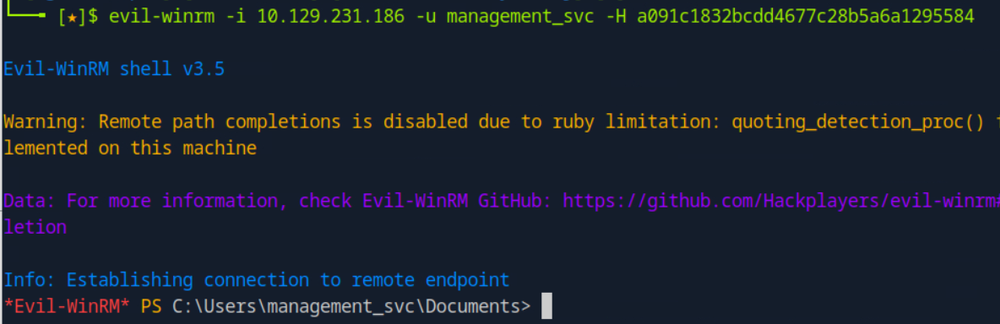
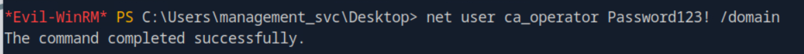
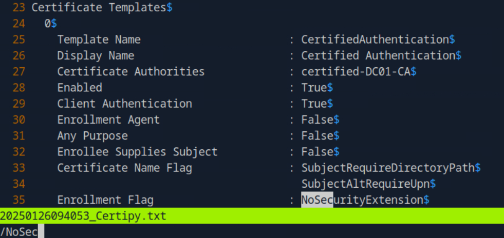
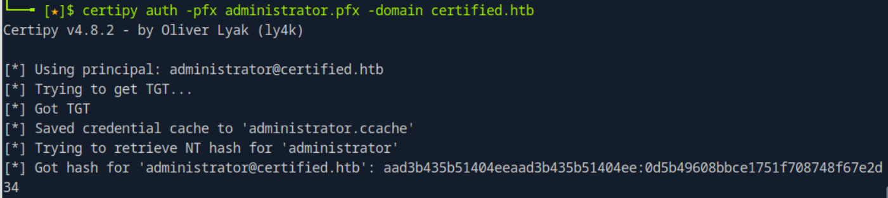

The given creds do not have WinRM access. Have to use nxc for enumeration.

Judith can rewrite the owner of management group. The group name itself means some privilege.

 

Now we can GenericWrite on management_svc. Kerberoast failed since the user have strong password. So we need to use Shadow Creds.

PTH to WinRM.

Since GenericAll, we can change the password directly.

Obviously from its username, we need to dig out the CS.

We can find a template vulnerable to ESC9.

