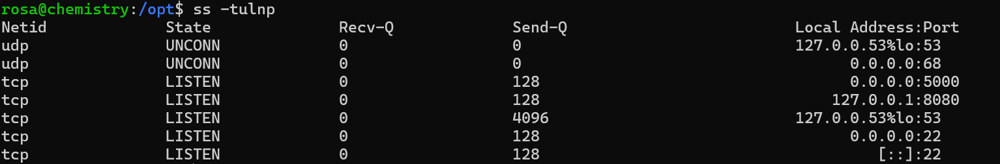
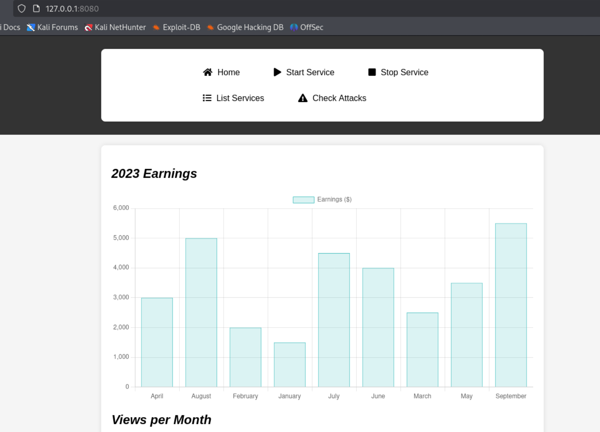

Only SSH in top 1000. Have to do a full scan.

Also another web port at 5000.

Seems like we can upload CIF. Try some default password first.

No luck. So just register a new one and login. 

Then I find [this](https://github.com/advisories/GHSA-vgv8-5cpj-qj2f). Exploit to make a rev shell.

Given by the length, it should be MD5. We do not need to crack it ourself.

Now we can SSH into the machine. No sudo, no SUID.

But I found another website. Through no permission to the folder, maybe we can still visit it.

A static site. Thus we need to find exploit on the framework.

Python 3.9 is a little bit old, hope we can find something.

[Here](https://github.com/z3rObyte/CVE-2024-23334-PoC). It's about path traversal. We can read root flag directly.

