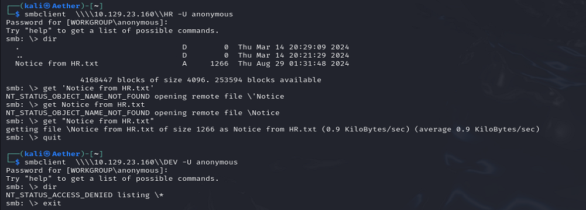

No web port open. Maybe we can try anonymous SMB first.

HR and DEV.

The HR kindly give us the default password while the DEV refuse.

Now we lack the username. We may try to brute it.

Now let us check who do not change their password.

And just in case we find it.

Another creds get. And based on the full port scan, the 5985 port also opens.

Oh. BackupPrivilege.

We can make robocopy work in backup mode to bypass the ACL.

