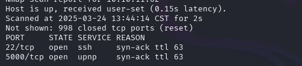

Interesting 5000 port.

Online IDE. Maybe we can use it to execute command on that machine?

Some blacklist thing I think.

After some digging, the db is SQLAlchemy object. And we can extract pairs of creds in it.

Then we can SSH into the system.

Looks like we can edit the task.json to backup things we need.

Since martin can sudo as root, basically we can backup root's file as well. But the script has built-in detection. 

However can be evade by append another directory then ../. The script will replace it but we can do that twice.

