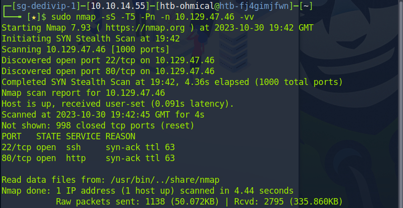

22 and 80.

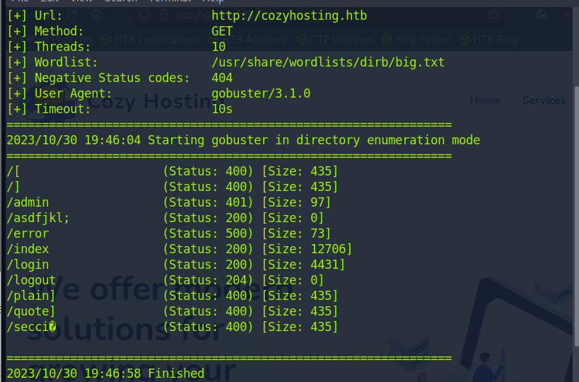

No anything valuable. We need password to login.

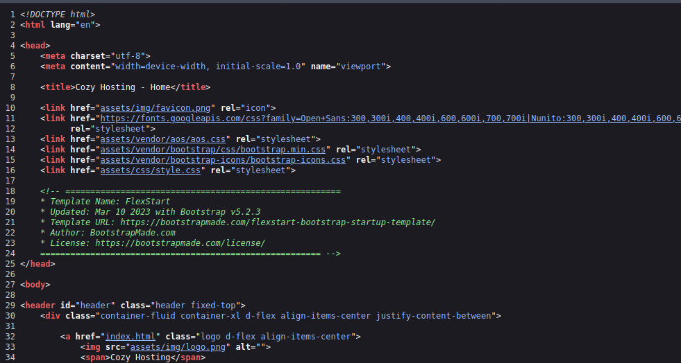

The source reveals the website is made by bootstrap. Hope we can google something out.

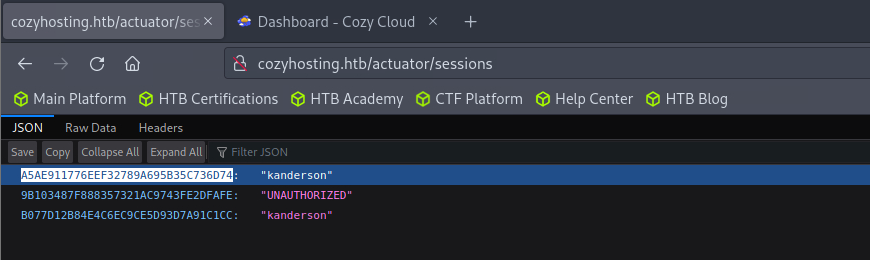

By later Enum, we can find this site. Looks like cookie.

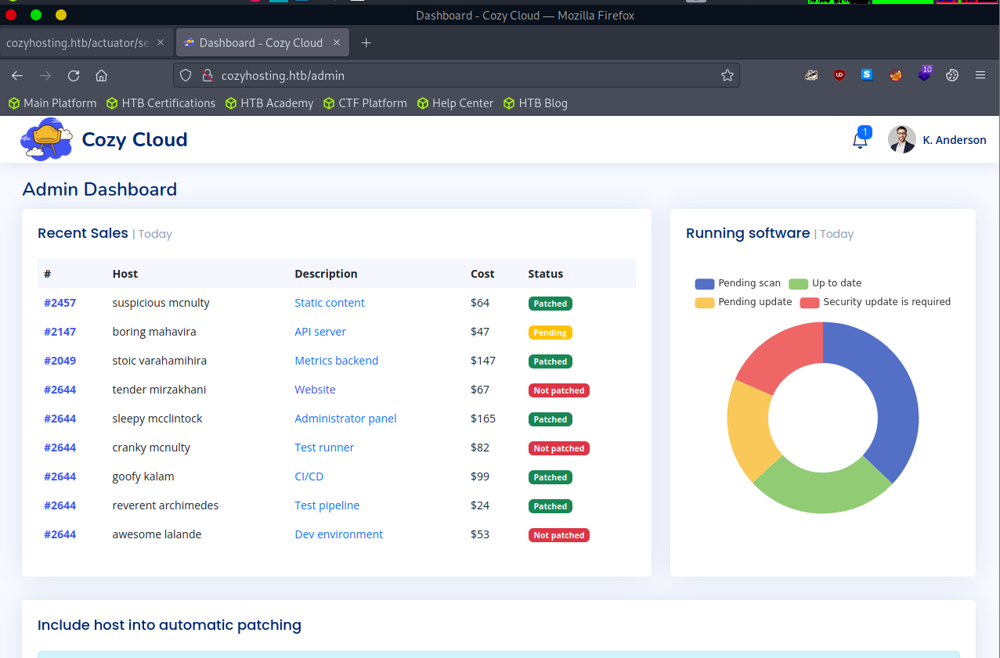

We are able to login now.

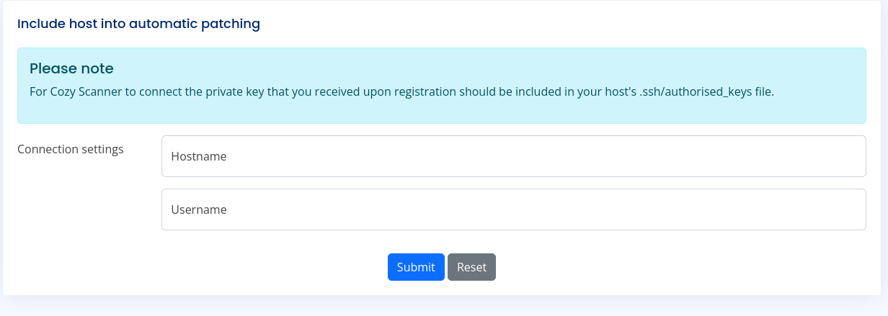

Looks like we can submit something. Hope the command is run on the target server.

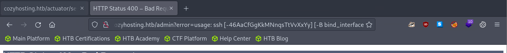

If leave the username blank intentionally, we will notice that the returned address is the usage of the ssh command, which means the command is executed on the target machine.

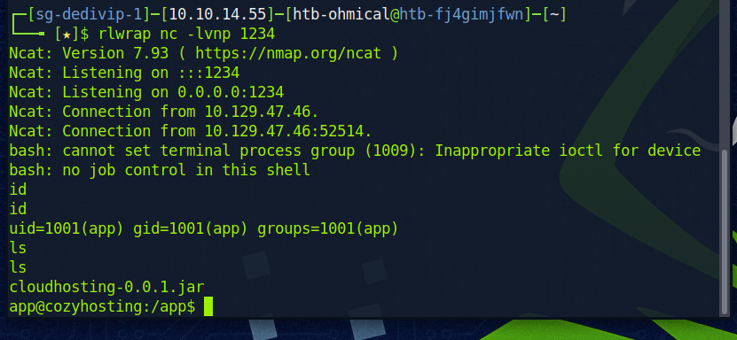

Once we have the shell, we can see a very large .jar file.

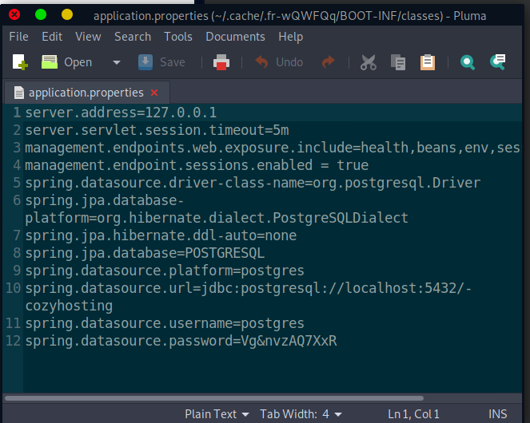

By examining it, we can get the database password. However by our initial recon, it cannot be accessed from outside.

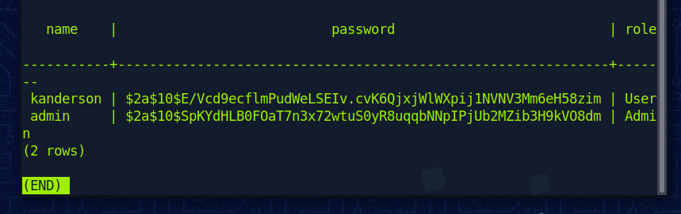

We can get the hash of admin. Hope it is also for the ssh.

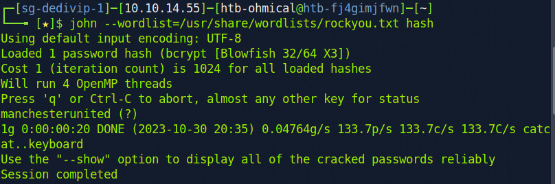

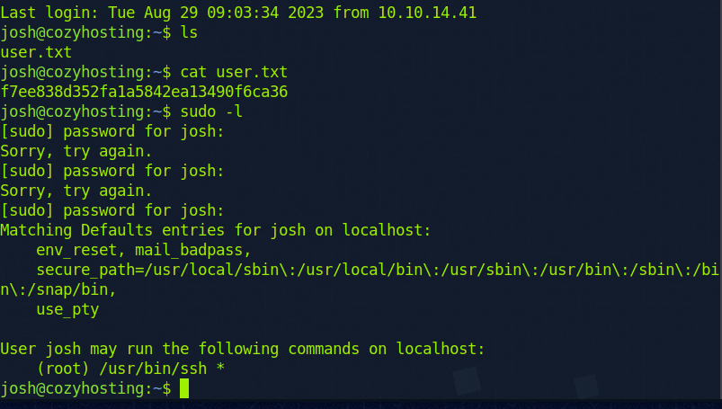

Done.

