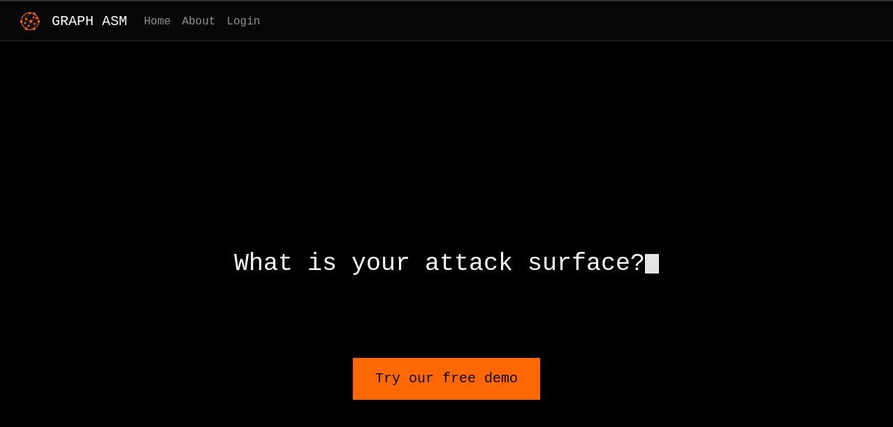
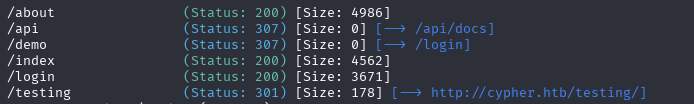
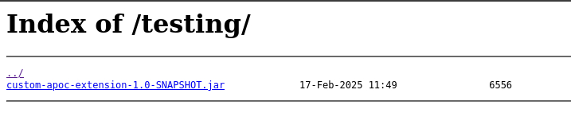
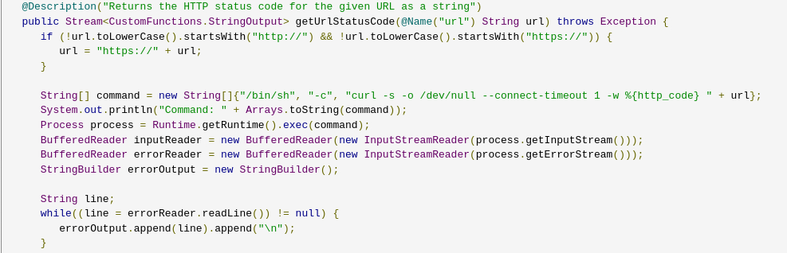
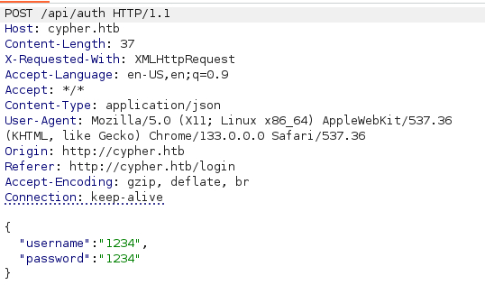
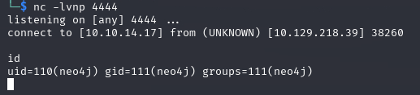
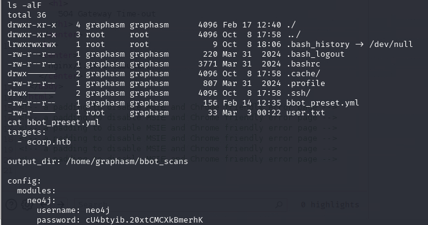
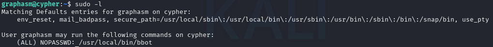

Only login not signup.

But it have a API endpoint. Though no docs.

We can find a JAR at another path. Decompile it.

One of the code contains command execution. Looks like point for injection.

The only possible point of inject is login page.

We assume both the user/pass will be pass for query.

The password can be used to login as graphasm.

BBOT is a scanner. I would hope it can do command execution or at least read arbitrary files.

The `-cy` switch allows to select a file contains YARA rules. And we can use debug mode to print the content out for us.

