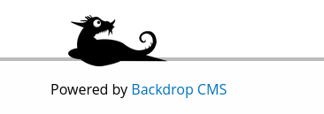

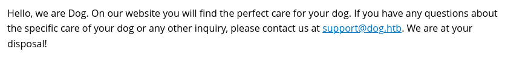

We can find a Authenticated CVE of that CMS.

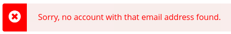

Hmm. That's quite strange.

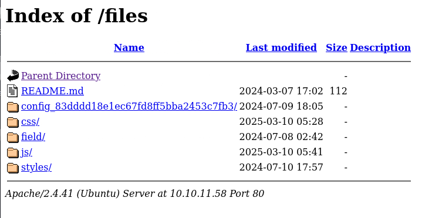

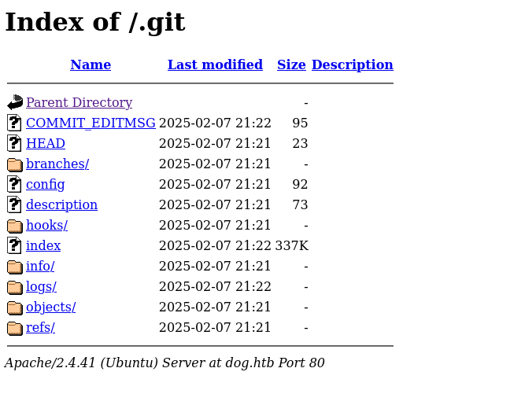

They have directory listing enabled.

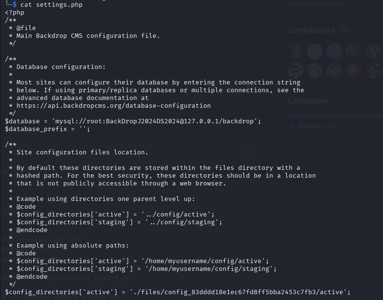

Password get. Now we need to find a user.

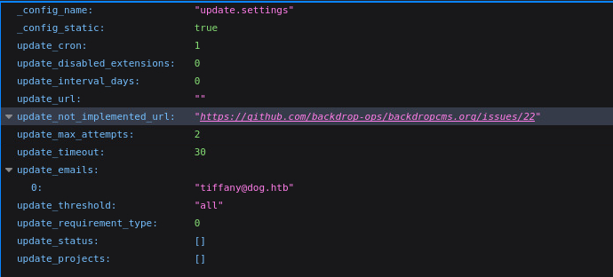

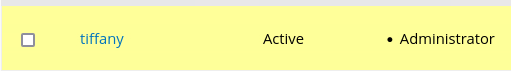

Now we can use the CVE above.

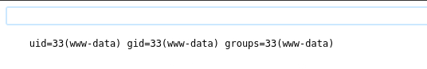

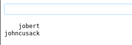

Hope they reuse password again. (For the second one)

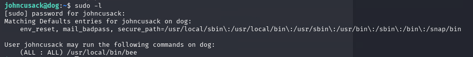

The bee will execute php for us.

