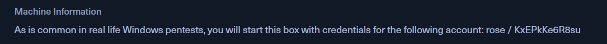
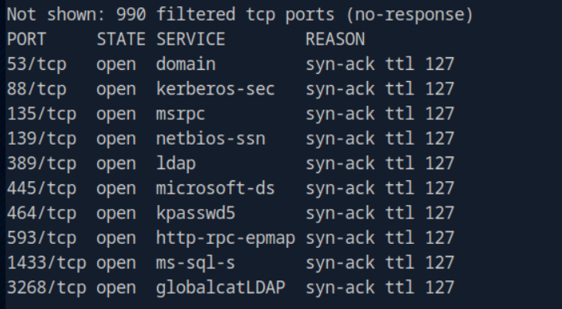
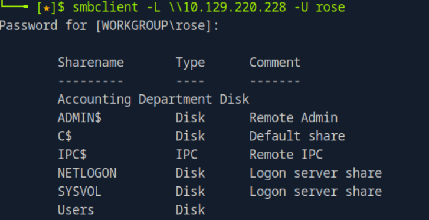
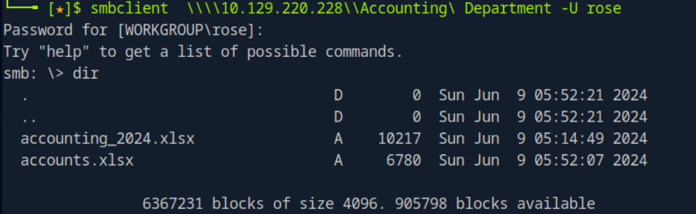
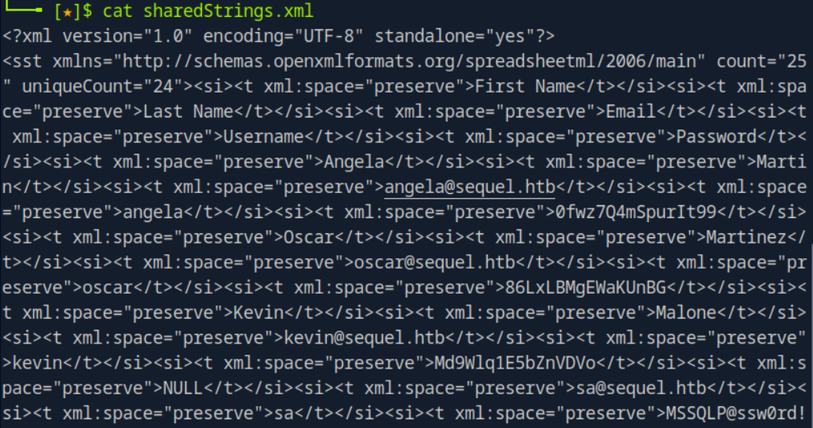
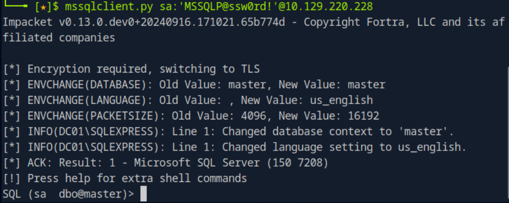
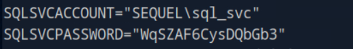
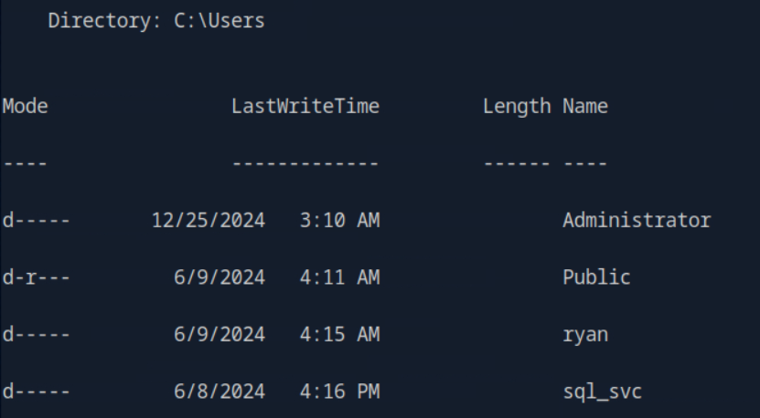

Have user permission to start.

Start with SMB.

The first one is interesting. Try to look for some files.

Two Excel.

Some password inside.

And we can login as SA. Time for xp_cmdshell.

Inside the SQLServer config, we find another pair of creds.

Best chance that ryan and sql_svc share same password. Get the user now.

Escalation requires ADCS, which I don't know much.