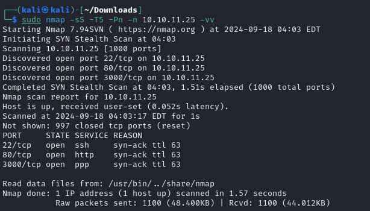

Normal 22,80 with a strange 3000 port.

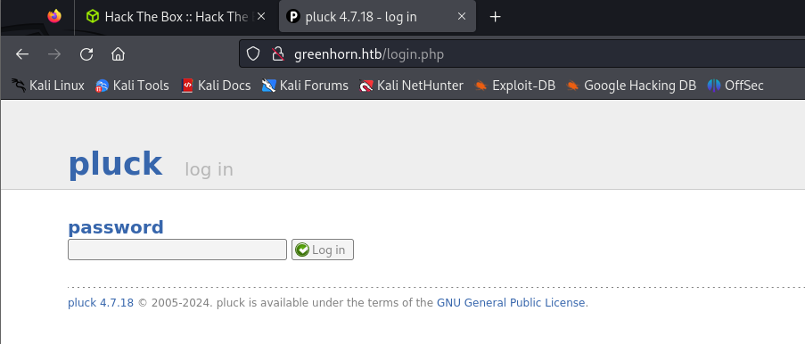

The website kindly provides its version. And we find [this](https://github.com/Rai2en/CVE-2023-50564_Pluck-v4.7.18_PoC).

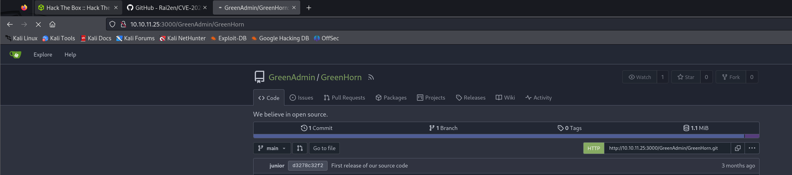

For the 3000 port, it is the source code of the website. Should not hard to find relative credentials.

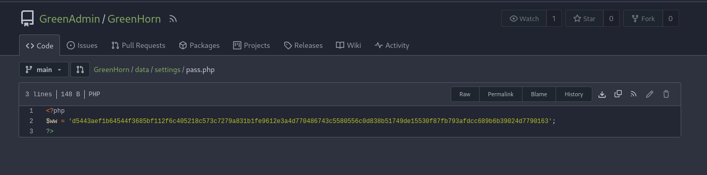

We can find the SHA512 password. Maybe we can try to crack it.

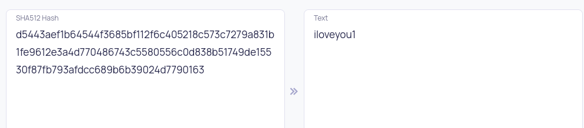

Okay. Now we can use the RCE above.

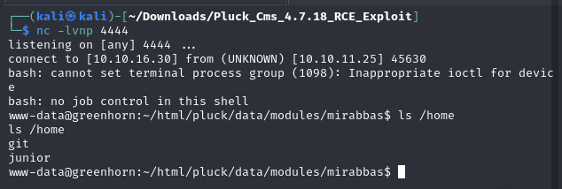

Notice the junior user is also in git. Maybe we can reuse the password here.

It works. Then we just grab his ssh key.

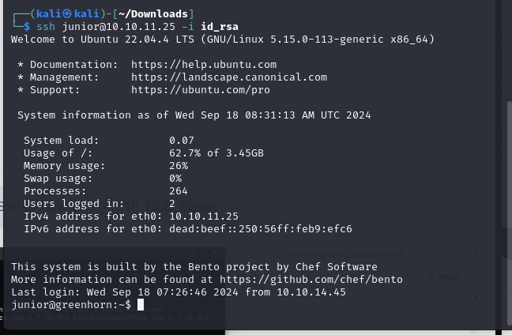

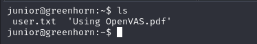

While we get user, there is another interesting PDF file.

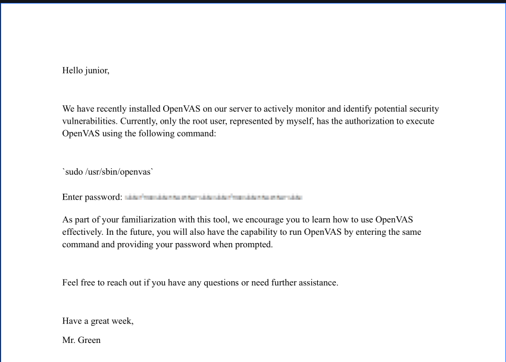

The junior have not sudo at the moment. So we need to reveal the password of green. I believe it's for the root.

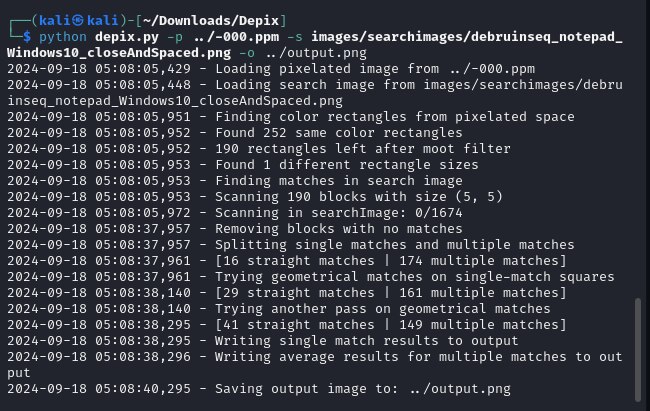

Using the famous depix, then we get.

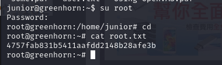

