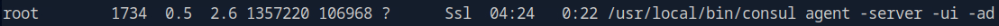

Port 22 and 80.

Both login and register do not work at site. 

So there's a API endpoint.

We can get the version of the backend.

After add api to the host, we can login into the main site.

We can get another subdomain.

Try some default creds but do not work.

The filename parameter looks promising for a LFI.

This pair of creds allow us to login the survey site.

We can find a RCE exploit on [GitHub](https://github.com/N4s1rl1/Limesurvey-6.6.4-RCE.git).

Get shell as www-root.

Retrieve the db password from config.php. Then SSH into the machine as Ron.

The server have Consul running at port 8500.

We can find another RCE [here](https://www.exploit-db.com/exploits/51117).

