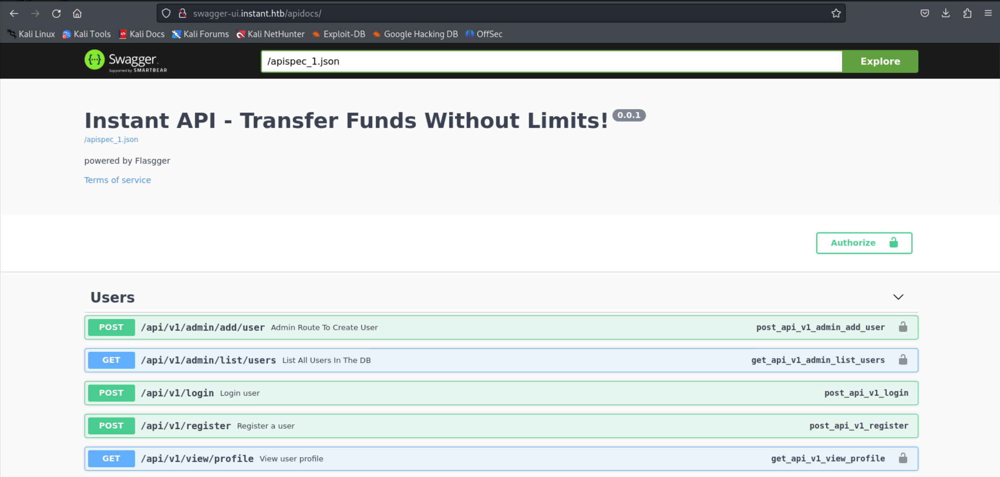

Standard Web and SSH.

A apk file? I do not familiar with android file, so I will proceed to dig more now.

However with no luck, we need to do something to the apk.

Luckily, we can decompile it easily. Time for finding.

Under the res folder, we can find two subdomains. 

The swagger one provide the API document, while the v1 looks like the endpoint.

The website can send request on behalf of us.

It give us a token, but do not have the admin privilege. We need to find it elsewhere. Maybe still in the apk.

Now we have the privilege. Hope we can exploit LFI on logs.

 

It works. Then we grab its SSH key and login.

We can find a backup of PuTTY, which I think contains SSH credentials. However it was encrypted someway.

Then I find [it](https://github.com/VoidSec/SolarPuttyDecrypt).

Looks like it's password-protected. But there's no other information on the machine. So probably we need to brute force.

Since using the WSL, I can directly interact with the exe. And it did solve the password.

