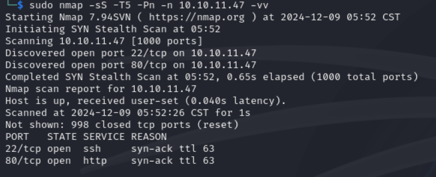

Check the web. 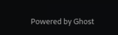Hmm. Maybe some CVE would work. But we need to know the version first.

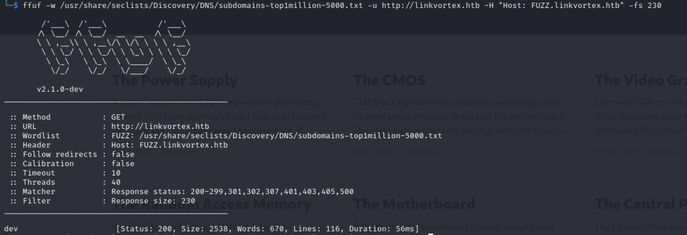

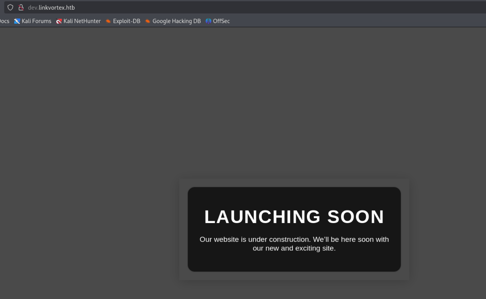

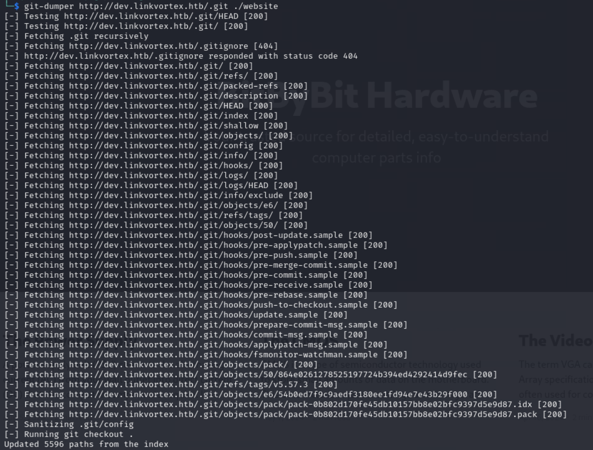

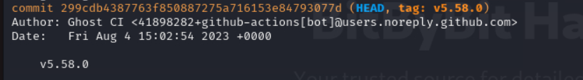

So we know it's Ghost 5.58. Then we can find [this](https://github.com/0xyassine/CVE-2023-40028). Now we need to find the admin creds.

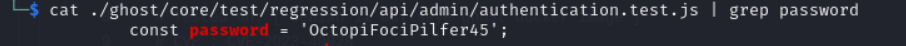

It's really hard to find it.

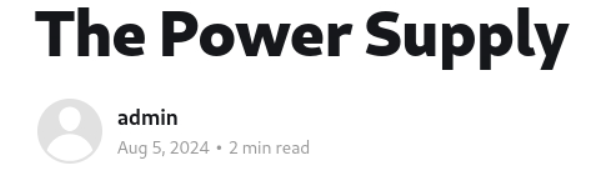

Guess the username would be either admin or admin@domain

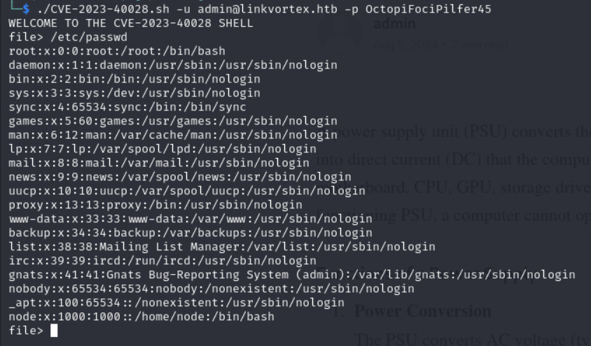

But we still need to find another interesting file.

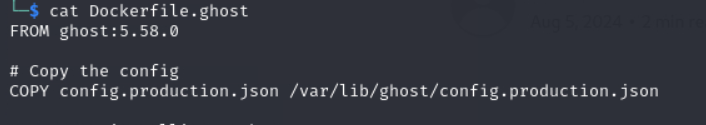

Via the Docker file, there's a production config.

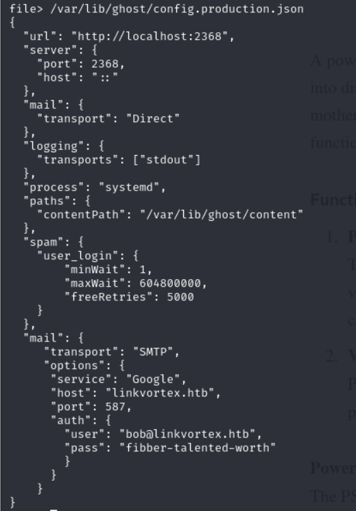

Time for SSH.

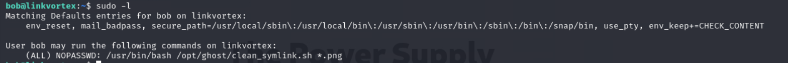

env_keep. Then of course we exploit it.

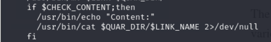

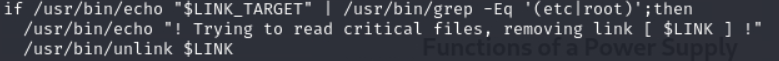

It has a filter for root, but seems like we can bypass it using two links. i.e. Chained Link.

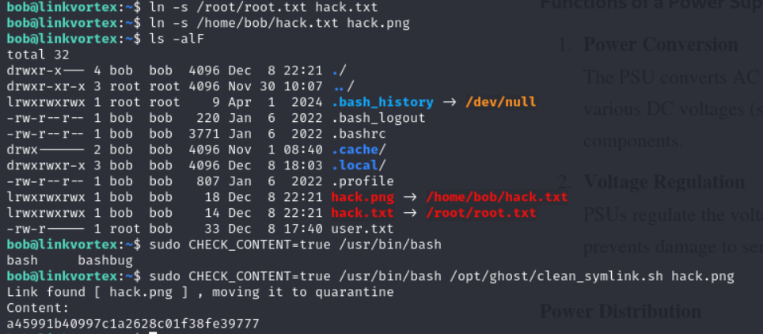

