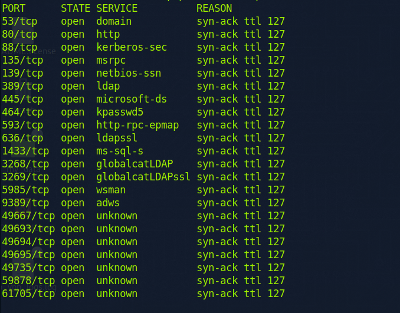
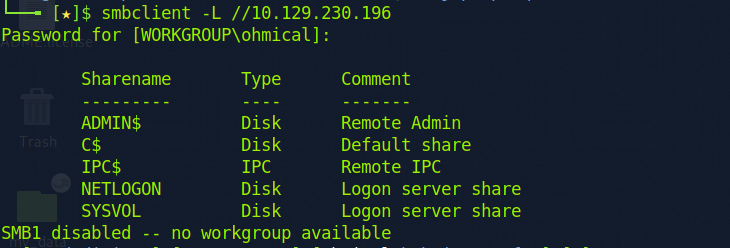
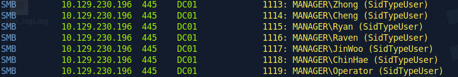
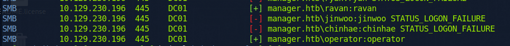
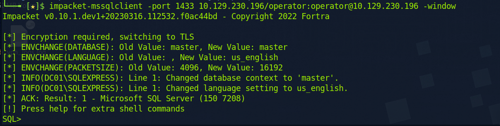
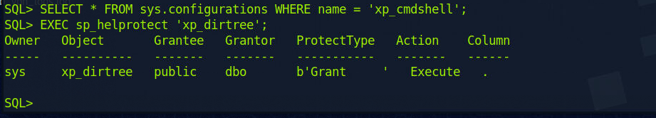
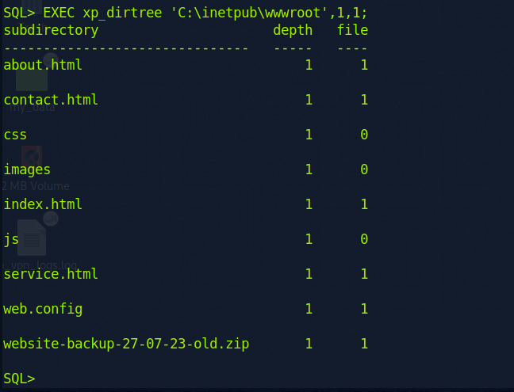
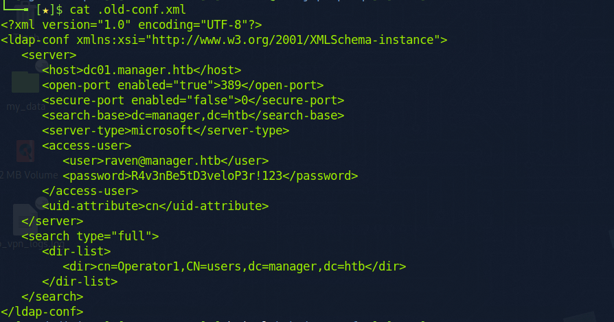
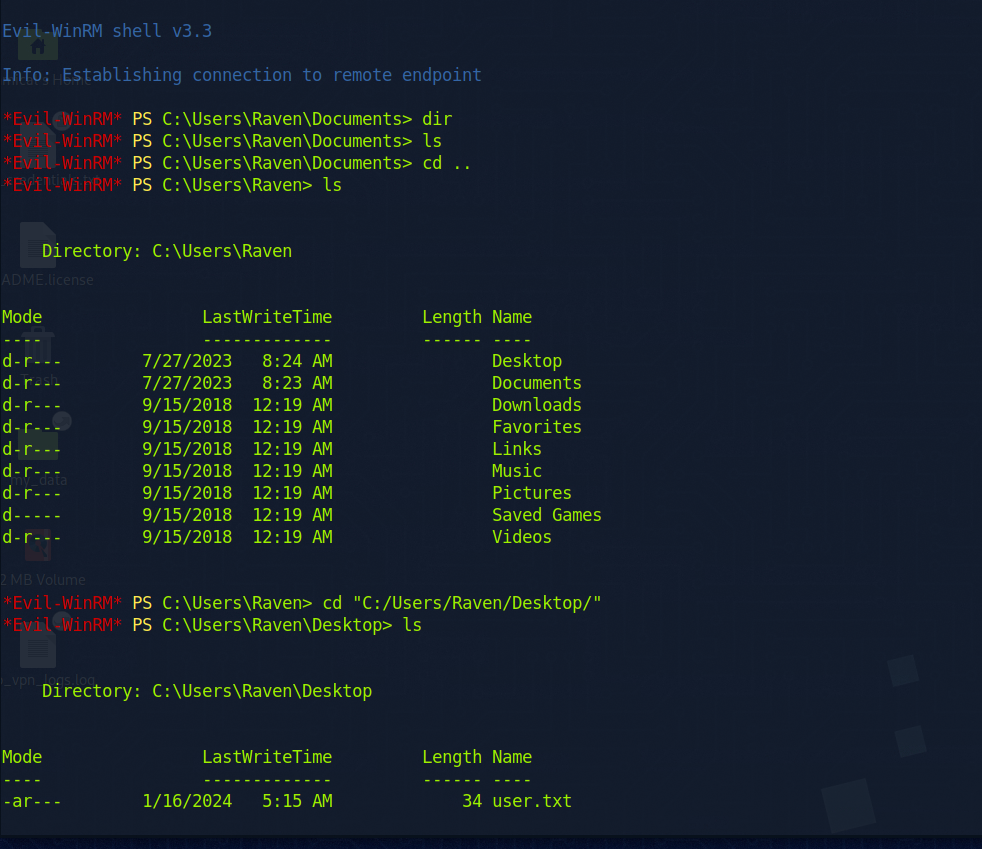
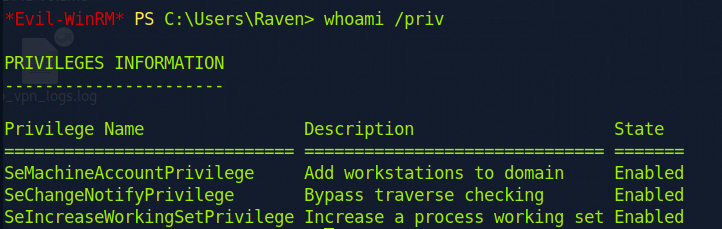

Looks like a DC.

Start with SMB. 

We can list it anonymously. But looks like nothing valuable.

However we can try to brute the rid.

We can several user. Try to crack it with normal password.

We get two users now. Since the SMB do not have valuable info, we should try other service that can login with above creds.

The operator can log into SQL. Try to find more creds.

Alright. I can find no more info in the db.

Although no xp_cmdshell, we can list folder. Remember we have 80 port open.

A backup zip. That's enough.

Another creds.

 

Get the user flag. 

The raven user have few permission. Even the public folder.

While the first privilege looks very abnormal. However it doesn't work.

After search the Net, the exploit is about AD Certificate. How do they know?

Refer to [this](https://book.hacktricks.xyz/windows-hardening/active-directory-methodology/ad-certificates/domain-escalation#vulnerable-certificate-authority-access-control-esc7)