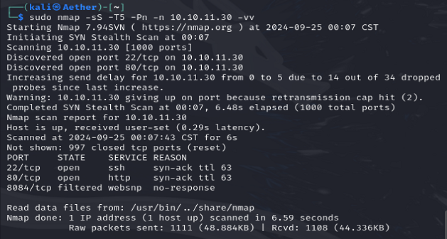
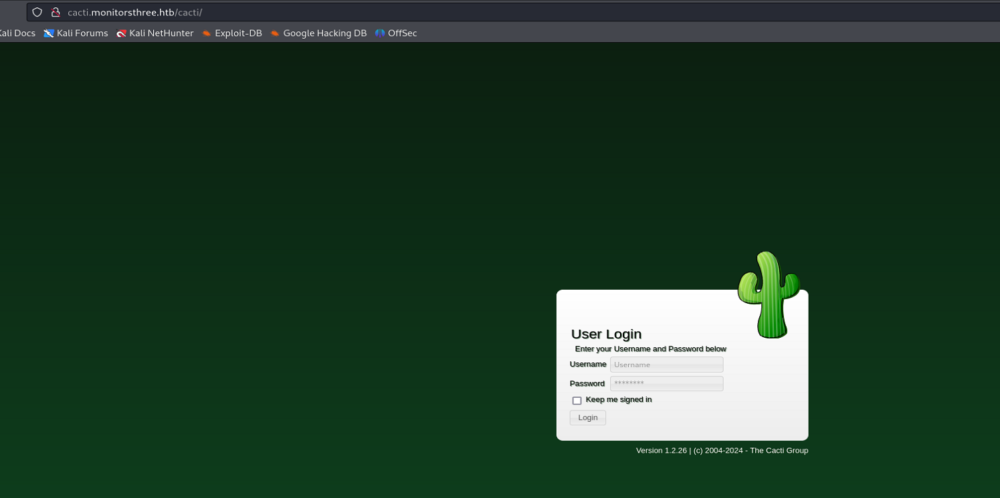
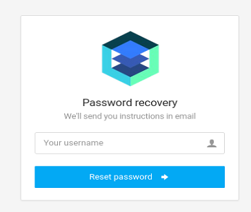
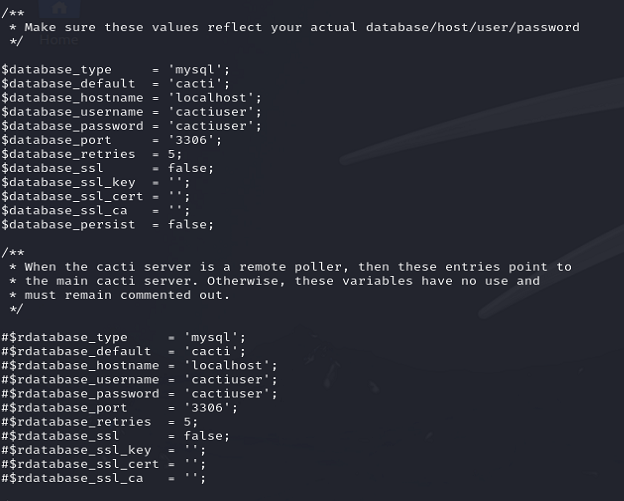
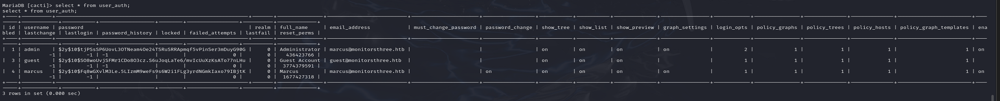

Strange 8084 port. But it's filtered.

The web have a login panel. Tried several popular creds but do not work.

By doing vhost search, we can find cacti.

Yet again it prompted for creds. But since it have provide its version, look for exp first. We can find [this](https://github.com/thisisveryfunny/CVE-2024-25641-RCE-Automated-Exploit-Cacti-1.2.26?tab=readme-ov-file), but it's a authenticated RCE.

We have to back to the reset password pages.

It will reflect whether user are valid. I think it would a little bit chance we can SQL injection it.

After obtaining the shell, we can get the database.

marcus is one of the user on the machine. Hope we can crack it.

Skip at present.
