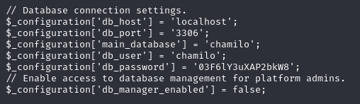

Scan shows only 2 ports open. Consider it's a easy box, will do full port scan later.

Looks like very normal. Do a detail search then.

After fuzz, we can find another subdomain at lms. Require credential to login. Try several default but do not work. 

Consider the footnote's copyright is 2024, it should be a recent version.

And luckily we can find [this](https://github.com/m3m0o/chamilo-lms-unauthenticated-big-upload-rce-poc).

Then we have a basic shell.

We can find a config file in the parent folder, which includes database password. Since it is a easy one, maybe we can try it on another user.

It works.

The user have sudo on a shell file.

Unfortunately, we cannot edit it directly.

Looks like this script is use to change the permission of a file, but has some restriction to the location.

I started to wonder whether file link will work.

It works.

