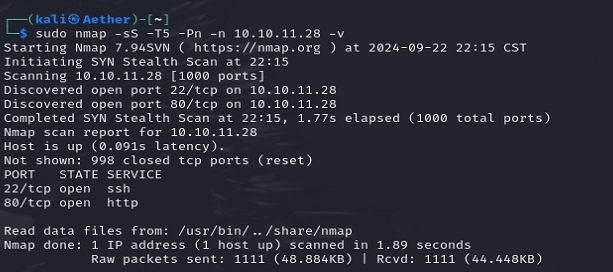

Standard 2 ports. (No more ports after -p-)

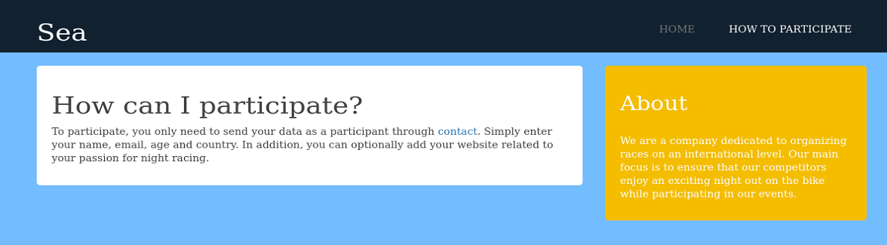

Apart from the contact form, nothing valuable.

Since it's registration, there must be someone viewing. So it's a good chance to steal cookie. But we need to know what the CMS is.

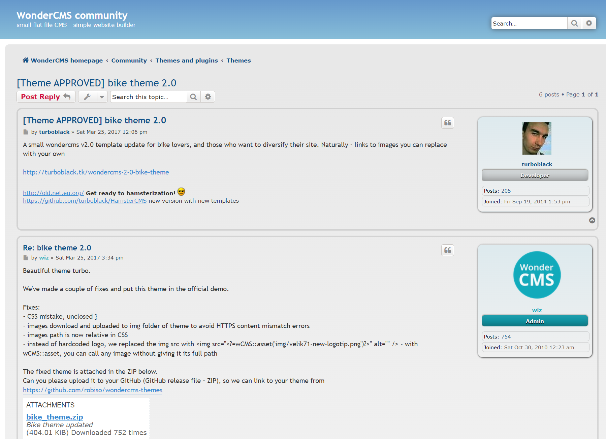

By searching the bikes theme on google, we can know it is WonderCMS.

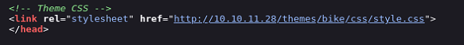

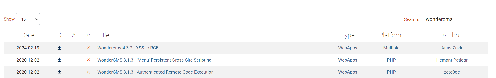

It is already 2024, other are too old. And the XSS are very close to our form above.

Once we get www-root, we can find another database creds. (There's a \ before /)

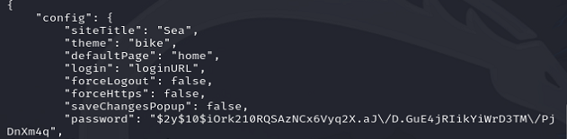

Simply crack it with hashcat, then we get the password for amay.

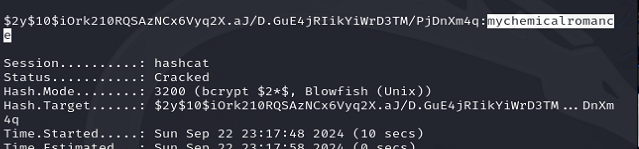

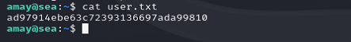

Amay do not have sudo, so I watch for other process and network.

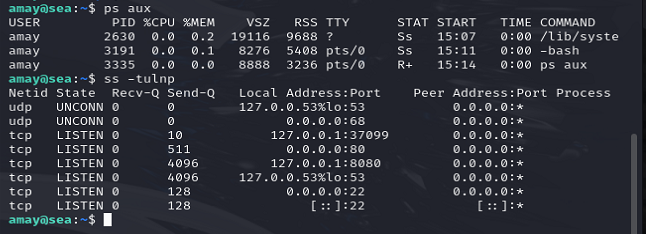

The 8080 port opened. 

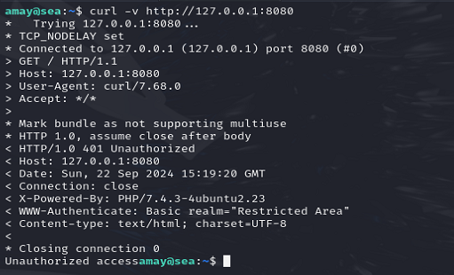

A HTTP server. Then we need to tunnel it. We can login with amay's creds.

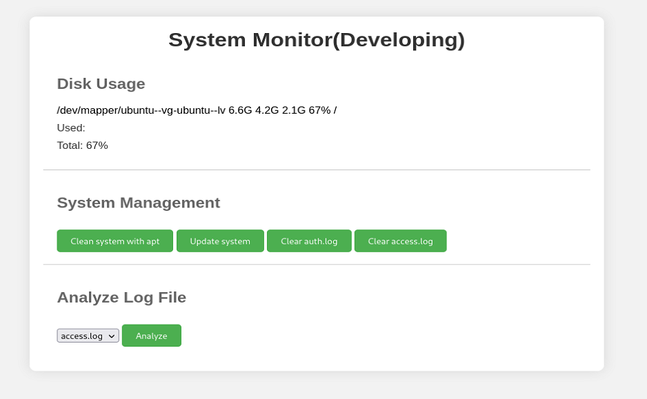

Looks like we can exec command using this panel.

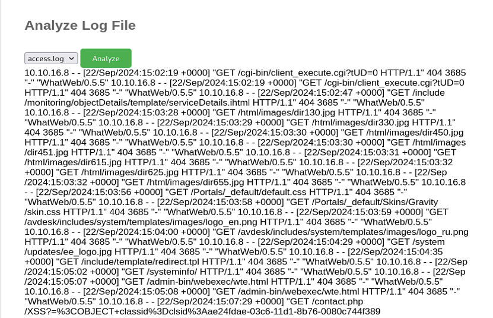

The below part can return the contents. Maybe we can alter the request?

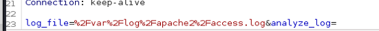

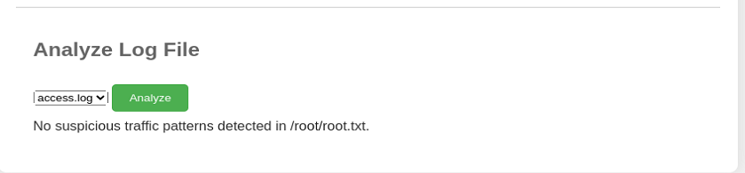

Hmm. Seems like it will detect the file content. But it is only single command?

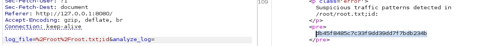

Then we get it.

