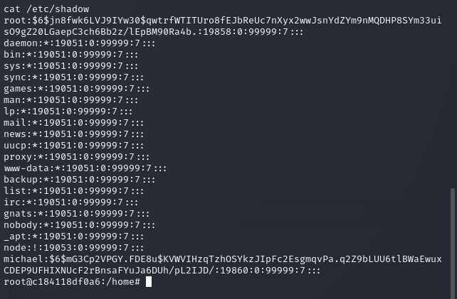

Full port scan shows 3 ports open.

FTP do not accept anonymous login.

On the website, it points to another service called sqlpad.

Looks like very suspicious to vulnerability.

It kindly provides its version. And indeed we find it for CVE-2022-0944.

We can get root on a strange hostname, most probably docker.

Two user exist. But nothing in their folder.

Only hash for user michael. Maybe we can john it.

Wow. Insane Clown >

With the credential, we can ssh into the machine and get user flag.

The user do not have any sudo rights nor suid.

Find Chrome on the opt folder. It is not normal.

Hmm. Looks like the 8080 do not open for external. We also have several high ports.

Curl the 8080 port, it is froxlor. One of the service of website. But we lack the credential.

Check the currently running process, john is running chrome with debugging port. We only have 3 high ports, so just brute force it.

By attaching to the debugger, we can login the system. It is using version 2.1.8, no vulnerability to exploit.

This section looks quite promising, it will exec command on restart.

Just let us read the root flag directly.

