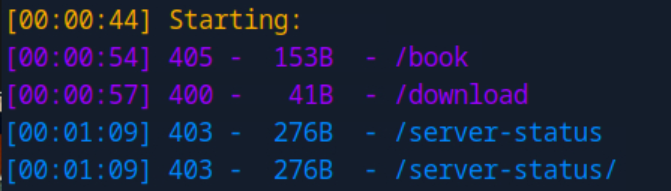

Looks like a website for booking trips.

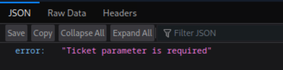

`/download` endpoint require a parameter.

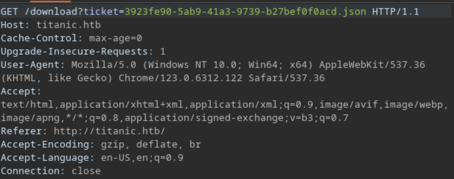

Maybe LFI here.

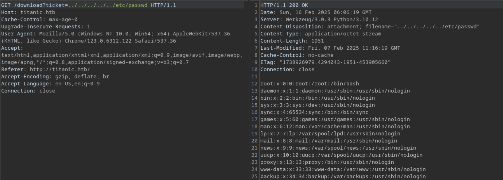

User flag is easy to obtain. Then time for digging creds for SSH.

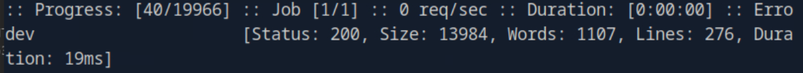

Also a `dev` subdomain.

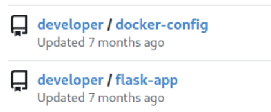

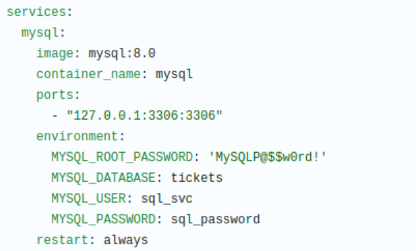

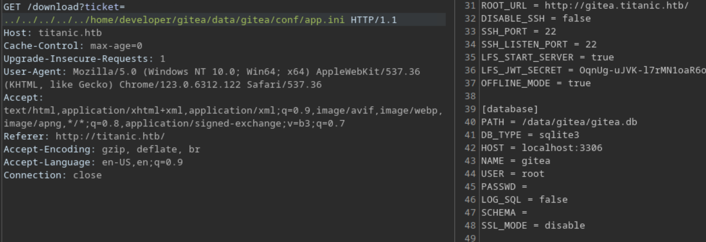

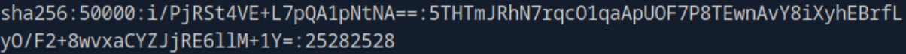

We can crack one password from the DB and into SSH.

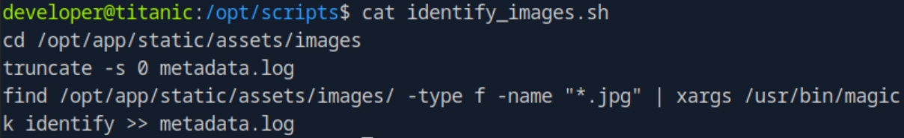

A script in the `/opt` use magick. Maybe we can find some exploit.

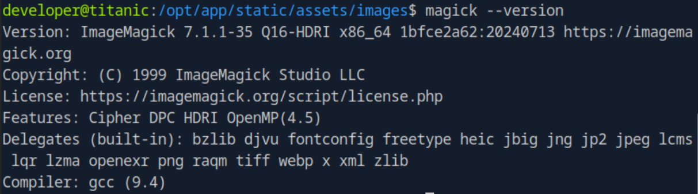

Then [here](https://github.com/ImageMagick/ImageMagick/security/advisories/GHSA-8rxc-922v-phg8).

