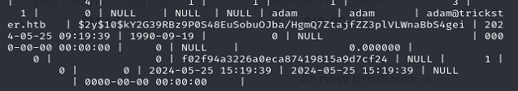

Again 2 ports only.

The contact have a form, and the shop points to another site. Shop first.

Cannot find the version. Never mind, check exploit first.

Not so useful. Maybe we need to find more.

Well, we can find a git repo behind the shop. Just dump it and check it locally.

Hmm. Quite strange folder name. And no more git record.

But it's valid. Popular creds do not work. Now we know it's 8.1.5. Proceed to exp. Then we can find [it](https://github.com/aelmokhtar/CVE-2024-34716).

At the time I play this box, the above exp have been updated by others. Much easier than the OG one.

Now we in.

At the config file, we can find the database creds.

Sadly none of them matched, so we need to inside the database.

Two user's hash available on employee/customer table.

By the name, we should check on james first.

A container running. Looks like we need to escape soon.

Really docker.

Do some sweep and we find another port.

A website. Then we need to proxy it. We can login using james creds again.

It match [this](https://www.exploit-db.com/exploits/52027). But the script requires internet connection so we have to do our own.

Two backup zip. No unzip on the machine, we have to take it locally.

In one of the brotli file. Switch to adam and we have sudo now.

We have 2.6.1, so it match with [this](https://www.exploit-db.com/exploits/51983).

Done.

