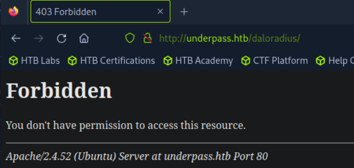

Only 22 / 80 Open.

Bust the website for both dir / vhost, get nothing valuable.

Well, it's SNMP.

It did exist on the server. But we need to find entry point.

Using default creds, we can login at the /operator one.

Only 1 user with their hash. Looks like MD5, easily crackable.

We can have a mosh server running at root, then just connect to it.

