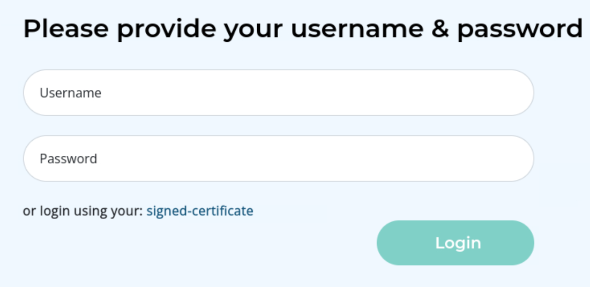

Normal Windows DC with web open.

We can login with cert. It's not usual, so it must be the entry point.

We can register two types of account. The professor one require additional confirmation.

(The password policy is too strict for such environment)

So we can request cert once signed in.

The upper-right side have a button for export profile, which generates a PDF.

Maybe we can whether command injection available for this producer.

Then I find [this](https://github.com/c53elyas/CVE-2023-33733).

Get the shell as WAO.

Seems like the password for WAO user. 

I would like to check the db file for another creds.

Looks like the nya is next target. But we only have PBKDF2 hash. It's considered secure, so there should be another way to elevate.

There's a script which tells the existence of other VMs. But I do not have access to another script.

Later I was told the WAO user actually have powerful privileges.

We can direct to SYSTEM using potato. Well, it's much more unintended.

For future use:

`Administrator:500:aad3b435b51404eeaad3b435b51404ee:e63413bab01a0b8820983496c0be3a9a:::`

