The given credentials cannot used to SMB or RPC. Use LDAP.

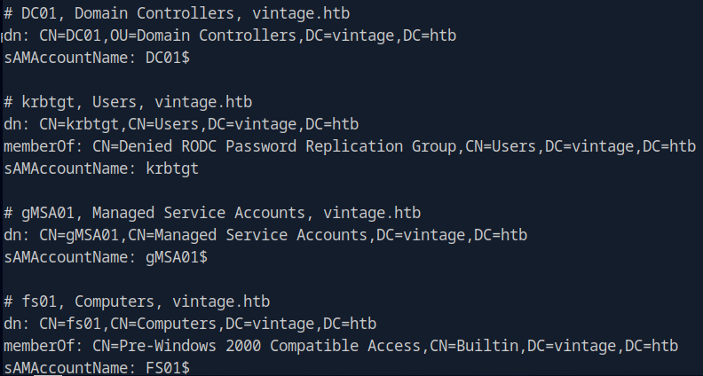

A computer other than DC. Maybe we can log into.

According to Bloodhound, FS01 can read password of MSA. Also member of Pre Windows 2000, which means password maybe the name itself.

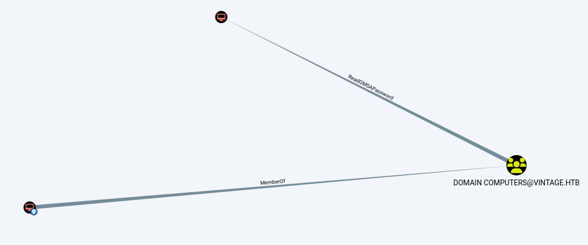

MSA have Generic Write of another group, which Generic All to other SVC account.

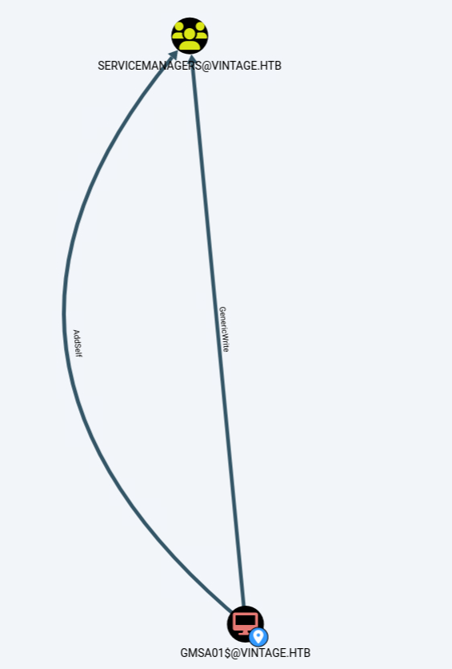

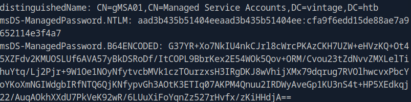

Of the three SVC accounts, only the SQL disabled and password changed.

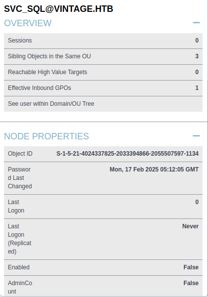

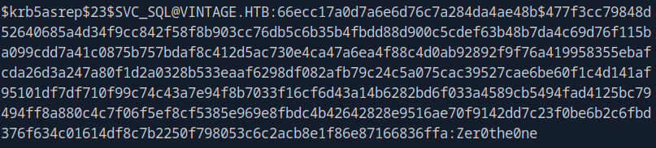

Can be cracked by PREAUTH.

Also password for another user. Log into WinRM.

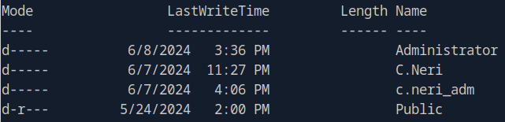

Seems like we need to get access to Neri's Admin, a member of delegate admin.

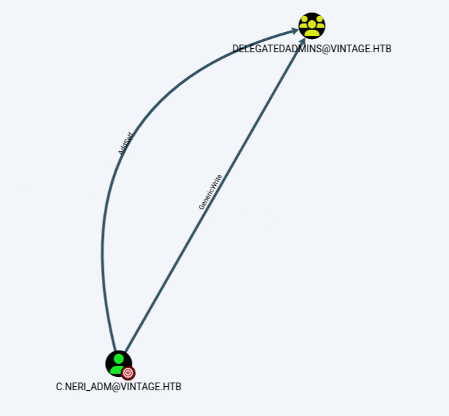

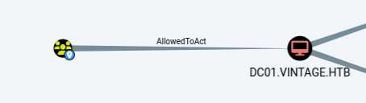

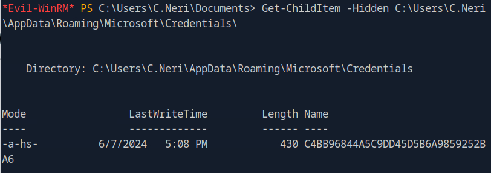

We can also retrieve the MasterKey at Protect folder.

Then we need to exploit S4U2. Use C.Neri to set SPN, Adm to promote to delegate.

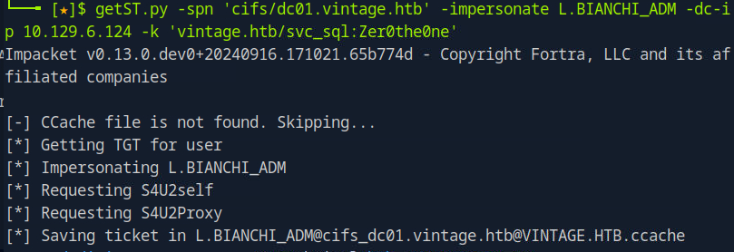

`Administrator:500:aad3b435b51404eeaad3b435b51404ee:468c7497513f8243b59980f2240a10de:::`

