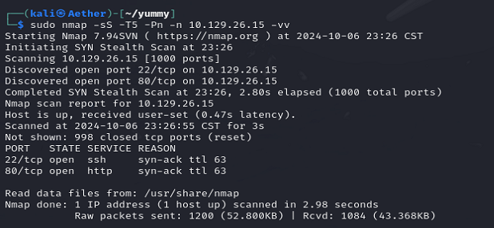

Only those two.

We can easily create a new account on the website and make some reservation.

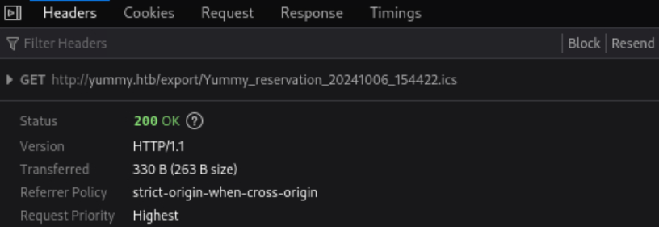

When we try to export the ICS. Looks like it is a LFI.

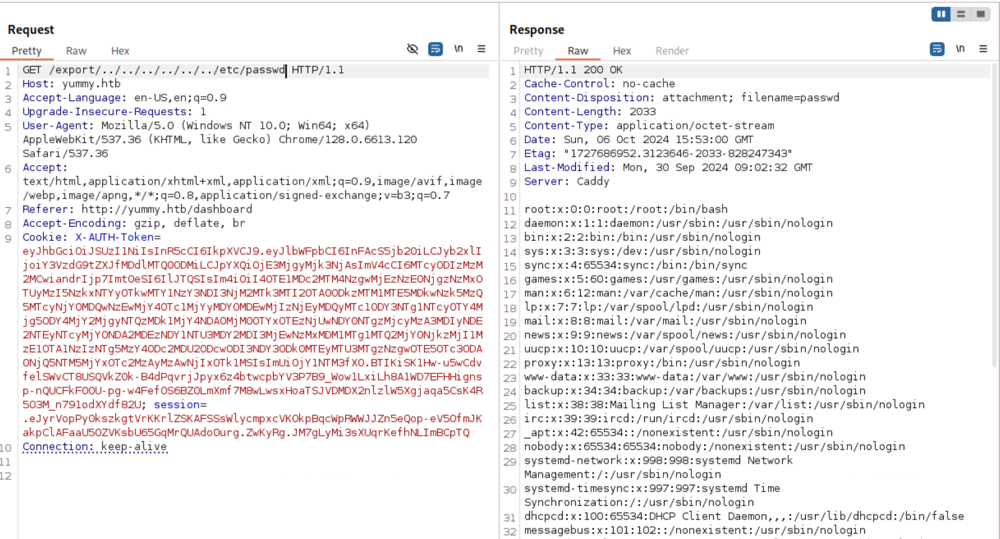

So our next step is to browse for some useful files.

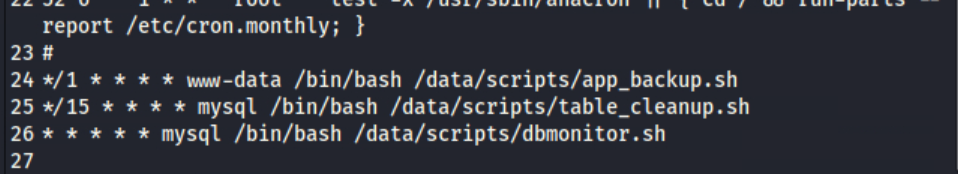

From the crontab, we can find three scripts.

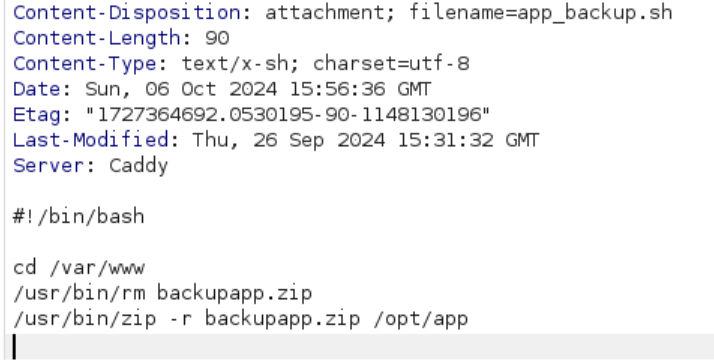

First we know where the backup zip.

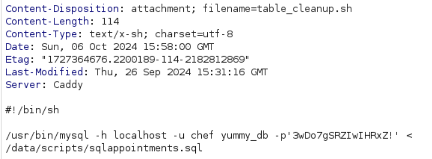

Then the db creds. The last script do not give information.

We can start to check the code of the website.

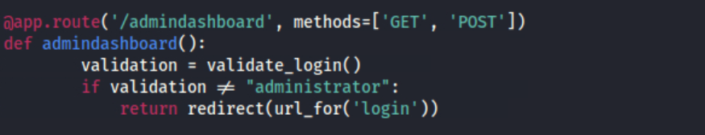

There's a admin dashboard. And according to the html, it can directly interact with SQL. But we require another account to login.

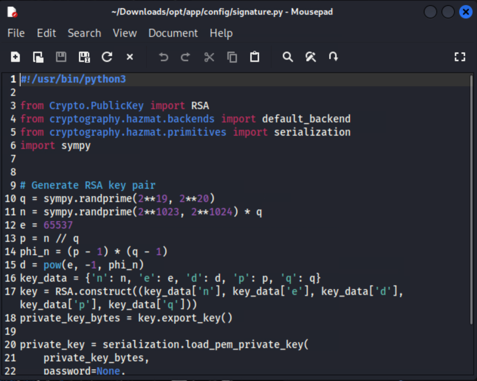

The source code also provides their way to create key pair. Maybe we need to break the JWT?

The prime q seems a little bit smaller, which means the n can be factorize.

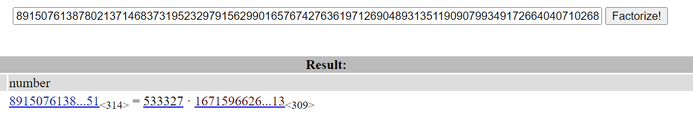

So by obtain both of them, we can craft the admin jwt on our own. 

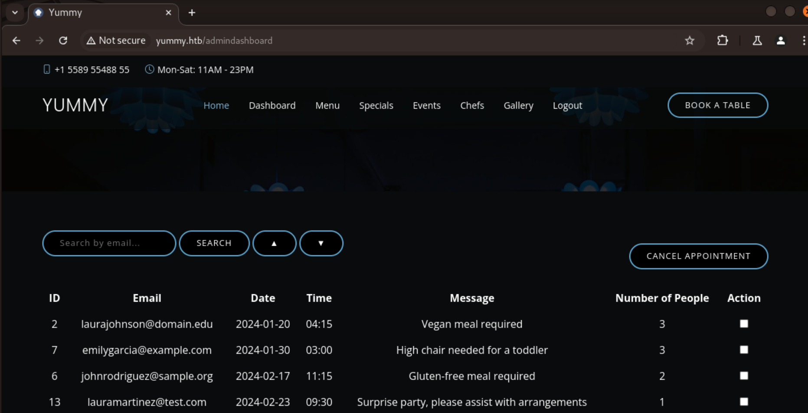

Finally we in.

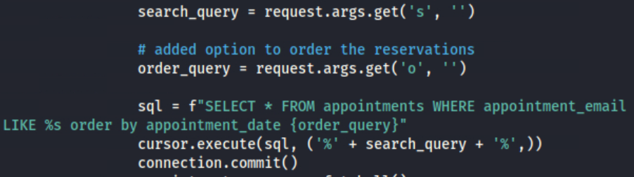

It's vulnerable to injection.

Once get a shell, there's a .hg not included in the backup zip which contains the user creds.

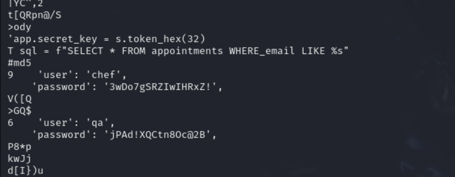

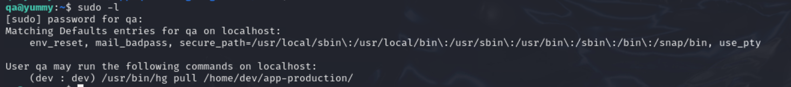

The user can run as dev while using hg. Refer to [this](https://wiki.mercurial-scm.org/Hook), such program always have some kind of hooks.

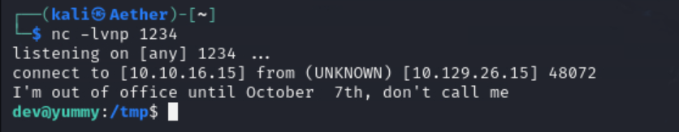

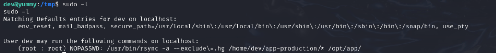

We know that rsync can change owner at sync. So why not let it make a root-owned SUID enabled shell for us.

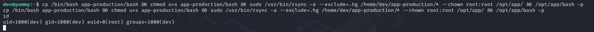

