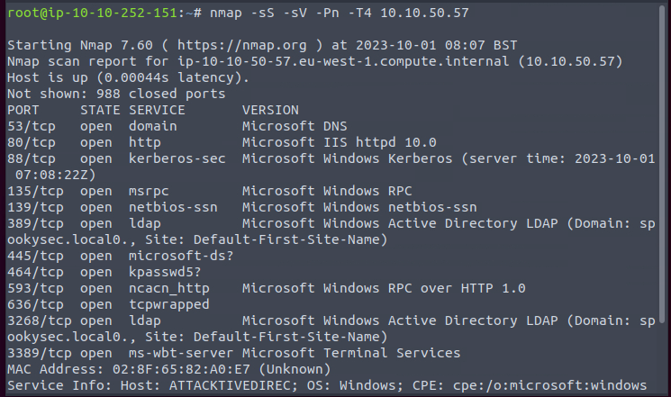
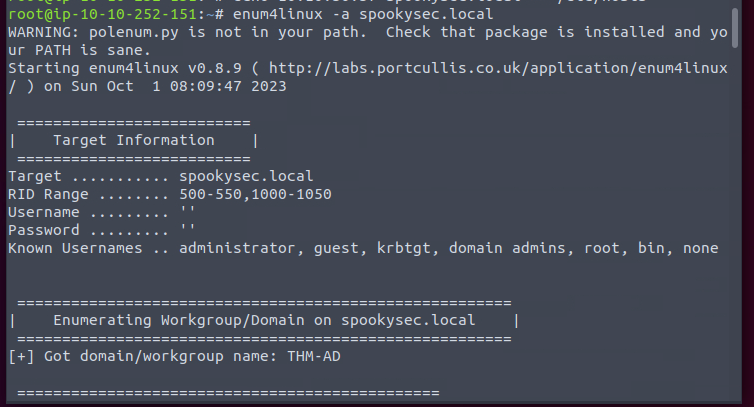
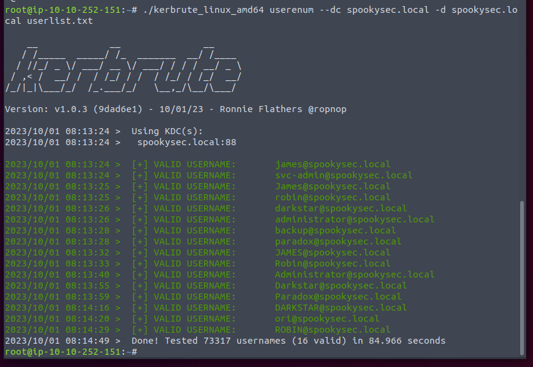
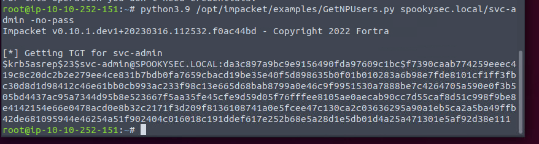
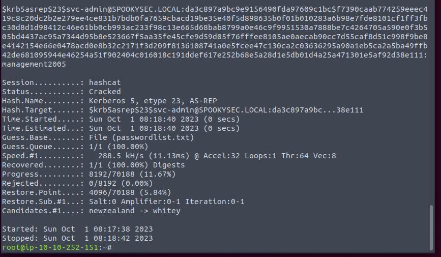
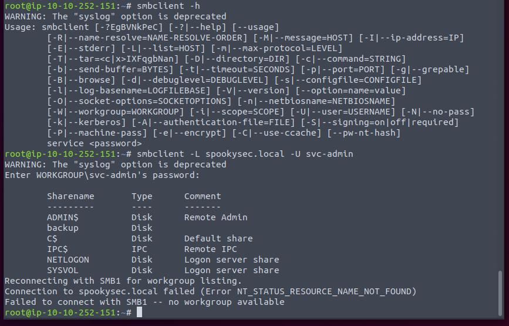
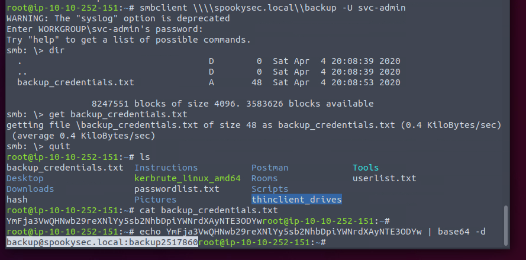
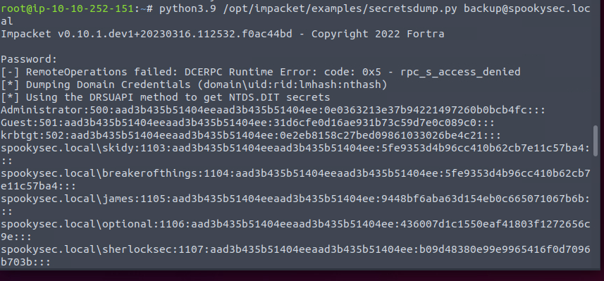
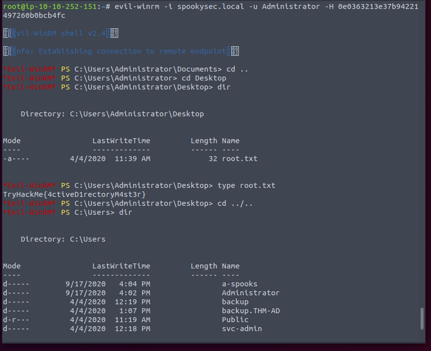

Lots of ports open.

Enumerate the user in Domain.

Get the ticket. Then crack it.

There is a backup folder. Normally it would contains some sensitive info.

We get another credential.

Dump the admin hash.

PTH.