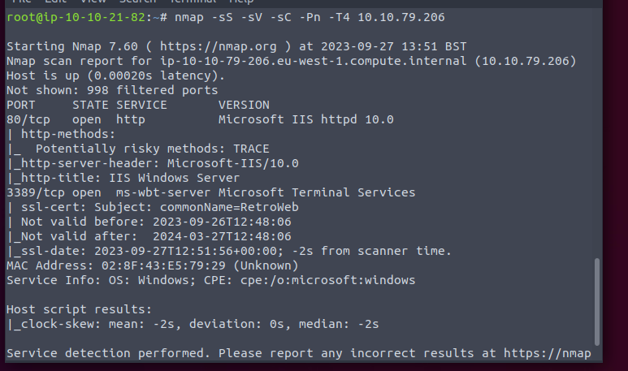
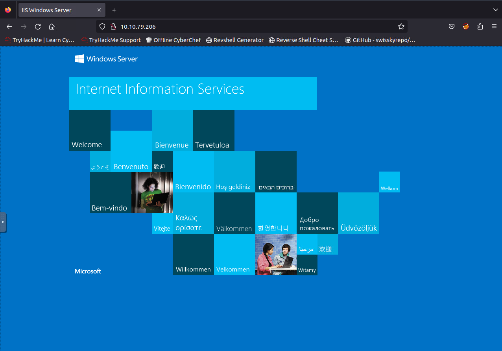
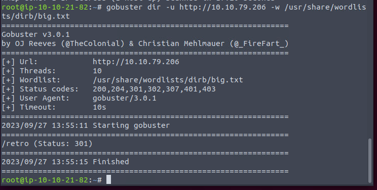
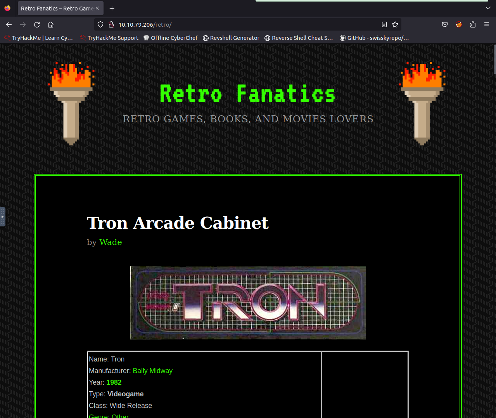
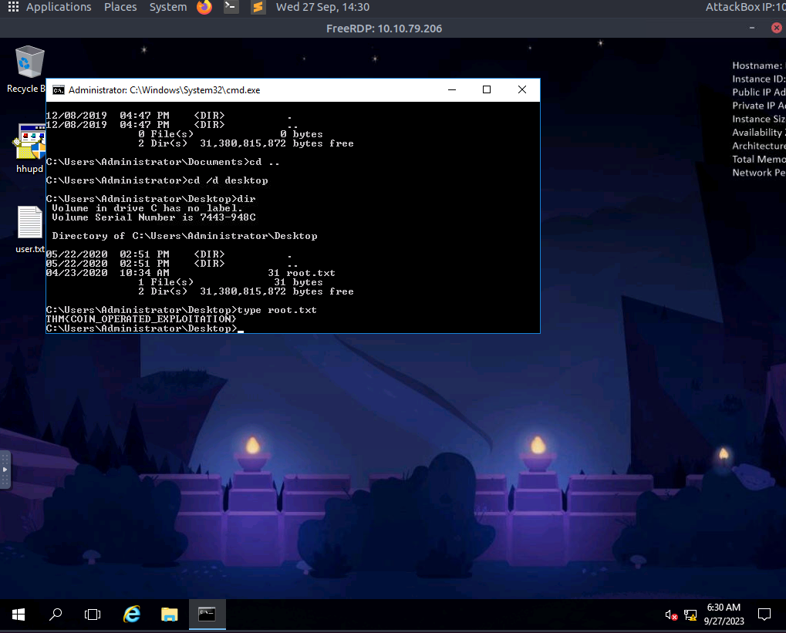

Nmap first

Standard start page. Bust it.

Only one result.

Seems like a personal blog.

The password is in the comment. RDP it and get the flag.

The machine do not work as intended. There is no browser history. Nervermind, the hint already tells.

Just exploit the UAC to get the root shell. 

[Doc](https://www.offsec.com/metasploit-unleashed/meterpreter-service/)