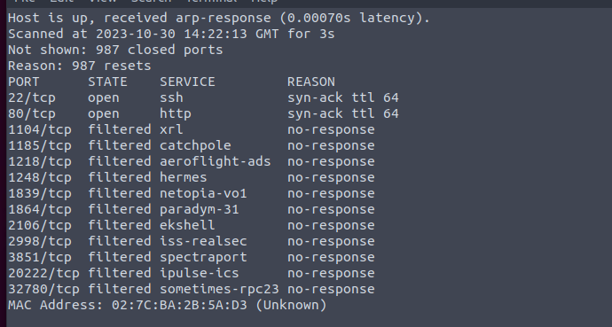

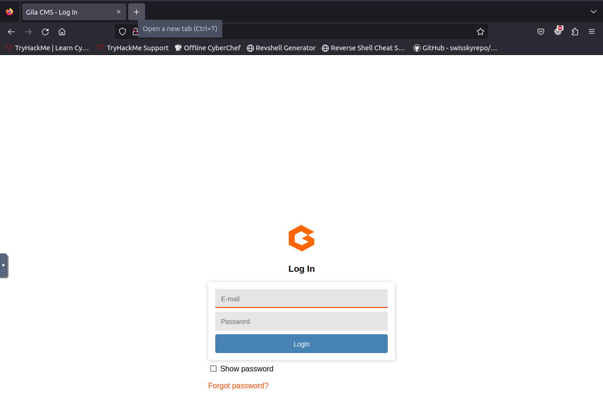

According to info, we do not need to brute. So password must be left somewhere.

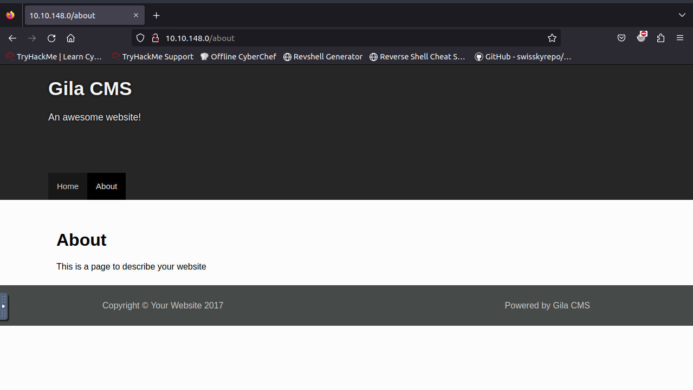

Looks like default info on the web.

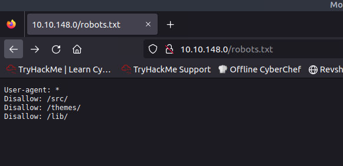

All blocked.

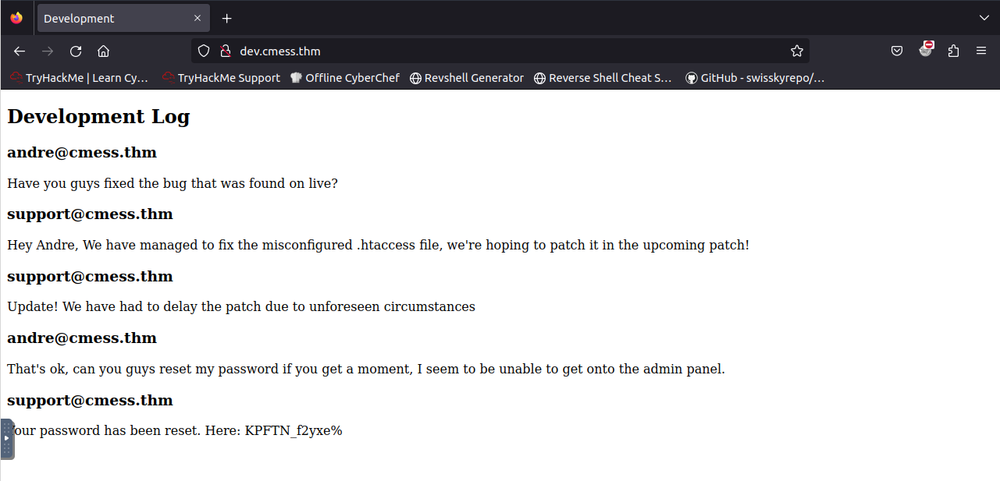

Well. Subdomains. Now we get the credentials for the CMS.

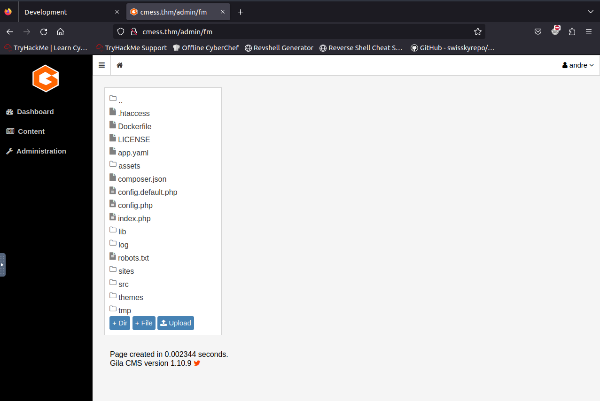

Looks like we can upload the shell.

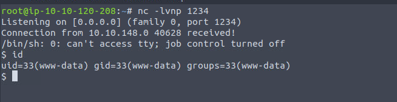

Yeah.

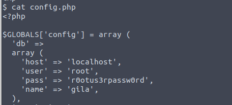

At least the database creds. Let us try whether we can use it for shell. No.

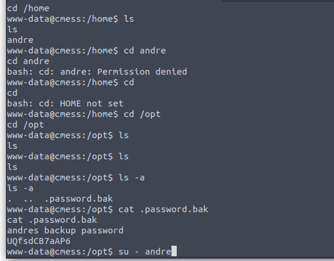

Switch to user.

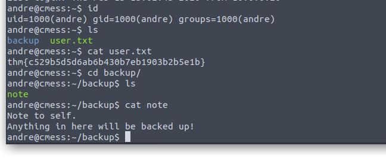

Backup? Sounds like cronjob.

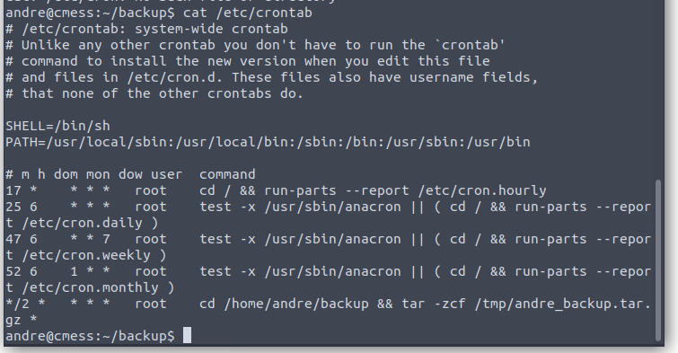

Run as root. So it is clear now. We can use somekind called wildcard attack to the tar.

