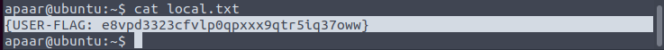

FTP allow anonymous login.

Seems like to tell us that some command will be filtered.

Oh. /secret.

Alright. A web shell.

Indeed some command are blocked. Although ls is blocked, we can use find. But all command I can think of to view the content of file are blocked.

(Later I found that we can use backslash \ to avoid the detection)

They did block many vulnerable command though. But now we can bypass using \\.

Now we get the shell access.

The user can sudo a script.

Seems like the `$msg` will be executed.

Then I found nothing vulnerable to escalation.

But the www folder have another folder called files looks like another website. Most probably in higher ports which do not reveal in early scan.

The code is very easily SQL injectable.

While another file give a hint.

Looks like a normal pic.

Well. The steg do not require password. But the zip ask. So time for john.

The file tells about the user/pass. Two == at the end means base64.

Alright. Now switch to another user again.

The user is in docker group means complete control for all containers.

This should be rated medium though.
